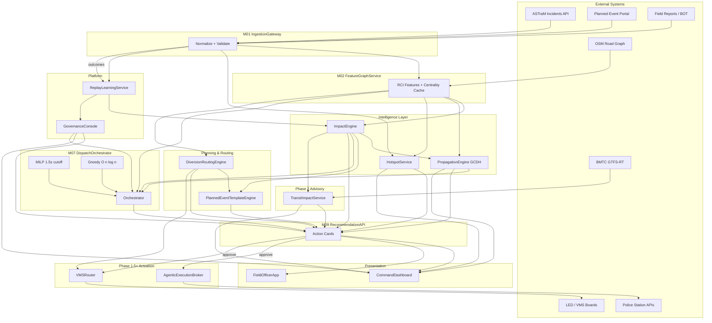

# Grid Unlocked — Implementation Modules Document

**Author:** Ashwary Gupta (Roll No: 23115017)  
**Version:** 1.0 (Implementation Context Edition)  
**Date:** June 2026  
**System:** Grid Unlocked — Intelligent Event-Driven Traffic Management  
**Parent Context:** ASTraM (Actionable Intelligence for Sustainable Traffic Management), Bengaluru Traffic Police  
**Primary Reference:** PRD v3.0 (`PRD_Event_Driven_Traffic.md`)  
**Research Reference:** `TRAFFIC_ANALYSIS_IDEA_PLAN.md` Sections 3–9  

---

## 0. Document Meta

### 0.1 Purpose

This document translates PRD v3.0 and the ASTraM research corpus into **buildable module contracts**. Each of the 16 modules has explicit responsibility boundaries, public interfaces (endpoints and events only — no file paths), latency budgets, degradation behavior, and test ownership. Engineers, hackathon judges, and TMC operators can use this as the authoritative implementation map without reading the full research plan.

### 0.2 Audience

Hackathon builders (§7, M01–M09/M13–M16); backend/ML (§5–§6); TMC ops (§4, M14–M15); QA (§9).

### 0.3 Corpus Grounding

| Source | Records / Facts Used |
|--------|----------------------|
| ASTraM anonymized export | 8,173 incidents; 17 cause classes; 22 corridors; 54 police stations |
| Closure base rate | 8.3% (`requires_road_closure`) |
| Planned closure rate | 36.2% planned vs 6.6% unplanned (5.5× ratio) |
| ICT censoring | 61.6% of records lack `closed_datetime` — survival models mandatory |
| Priority signal | 99–100% High on named corridors; 0% High on Non-corridor — structural, not severity |
| Reporting bias | 14:00–17:59 IST trough (384 events) vs true evening congestion peak 17:00–21:00 |

### 0.4 Document Conventions

- **MVP** = required for hackathon demo with real logic (not placeholder).
- **Phase 1.5** = post-hackathon; approval-gated agentic execution.
- **Phase 2** = micro-transit and calibrated cascade priors.
- **Phase 3** = optional STGCN after telemetry SLO compliance.
- **SLA** = P95 unless noted; all times in milliseconds unless stated.
- **Provenance** = `MILP` | `GREEDY_FALLBACK` on every dispatch recommendation.

### 0.5 Version History

| Version | Date | Change |
|---------|------|--------|
| 1.0 | June 2026 | Initial Implementation Context Edition — 16 modules, PRD v3.0 alignment |

---

## 1. System Context & Build Philosophy

### 1.1 Positioning Relative to ASTraM

Grid Unlocked is an **additive intelligence plane** around ASTraM. ASTraM remains the system-of-record for incidents, field reporting (BOT), and citizen-facing congestion alerts. Grid Unlocked adds:

1. **Predictive scoring** — closure probability, ICT quantiles, corridor impact (RCI).
2. **Prescriptive optimization** — non-blocking MILP dispatch with deterministic greedy fallback.
3. **Explainable propagation** — Graph-Centrality Decay Heuristic (GCDH), not STGCN in Phase 1/2.
4. **Human-supervised actuation** — agentic station dispatch and VMS routing only after commander approval.
5. **Governed learning** — 80/20 replay buffer, 94% accuracy gate, shadow mode before promotion.

No ASTraM schema replacement is introduced in v3.0. All writes back to operational systems go through explicit integration adapters with audit logs.

### 1.2 Build Philosophy (SOLID / KISS / YAGNI)

| Principle | Implementation Rule |
|-----------|---------------------|
| **SOLID** | One module = one reason to change. Propagation is model-agnostic behind `PropagationEngine` interface. MILP and greedy are separate strategies behind `DispatchOrchestrator`. |
| **KISS** | LightGBM + Cox PH for impact; GCDH for ripple maps; OR-Tools MILP with hard cutoff. No STGCN until telemetry SLO exists. |
| **YAGNI** | No city-wide signal control, no citizen app, no cross-city generalization in v3.0. |
| **Contract-first** | Every cross-module call has a latency budget and a Tier 1/2/3 degradation path. |
| **Non-blocking dispatch** | Recommendation API never waits beyond 1.8 s P95; MILP killed at 1.5 s. |
| **Shadow before actuation** | Recommendations run parallel to live ops until governance promotion. |

### 1.3 End-to-End Value Chain

```
Sense (ASTraM + portal + field) → Enrich (features + graph) → Score (impact + propagation)
→ Optimize (dispatch + diversion) → Present (dashboard + field app) → Approve (human)
→ Act (agentic APIs + VMS) [Phase 1.5+] → Learn (replay buffer + retrain)
```

### 1.4 Operational Personas

| Persona | Primary Modules | Success Criteria |
|---------|-----------------|------------------|
| Traffic Commander | M09, M14, M15 | Action cards within SLA; provenance visible; tier status clear |
| Field Officer / Dispatcher | M16, M07, M08 | Assignment packet <5 s; fallback never empty |
| Event Coordinator | M06, M08, M12 | 72-hour impact package; diversion scenarios |
| Platform Admin / Analyst | M13, M14 | Shadow metrics; 80/20 buffer reports; cascade drill results |

### 1.5 Technology Posture

Modules communicate via REST (sync), WebSocket (dashboard), and event bus (async). Acceptable stack: FastAPI, Redis, PostgreSQL+PostGIS, OR-Tools, LightGBM/lifelines, MLflow. Containerized deployment assumed.

---

## 2. Module Inventory

### 2.1 Module Registry

| ID | Module | Layer | Phase | Upstream Dependencies | Downstream Consumers | SLA (P95) |
|----|--------|-------|-------|----------------------|---------------------|-----------|
| M01 | IngestionGateway | Ingestion | MVP | ASTraM API, Planned Event Portal, Field Reports | M02, M05, M13 | Ingest ACK ≤350 ms |
| M02 | FeatureGraphService | Features | MVP | M01, OSM graph (static) | M03, M04, M05, M07 | Feature read ≤50 ms |
| M03 | ImpactEngine | ML / Scoring | MVP | M02 | M04, M07, M09, M06 | Score ≤200 ms |
| M04 | PropagationEngine | ML / Graph | MVP | M02, M03 | M07, M09, M15 | Propagation ≤150 ms |
| M05 | HotspotService | Analytics | MVP | M01, M02 | M09, M15 | Hotspot query ≤100 ms |
| M06 | PlannedEventTemplateEngine | Planning | MVP | M01, M03, M08 | M09, M15 | Package ≤10 s |
| M07 | DispatchOrchestrator | Optimization | MVP | M02, M03, M04 | M09, M10, M16 | Decision ≤1.8 s; MILP cutoff 1.5 s |
| M08 | DiversionRoutingEngine | Routing | MVP | M02 (graph), M03 | M06, M09, M11 | Atlas lookup ≤80 ms |
| M09 | RecommendationAPI | API / Facade | MVP | M03–M08, M14 | M15, M16, M10 | Action card ≤350 ms ingest path |
| M10 | AgenticExecutionBroker | Actuation | 1.5 | M09 (post-approval) | Station APIs, audit | Handoff ≤200 ms |
| M11 | VMSRouter | Actuation | 1.5 | M09, M08 | LED/VMS webhooks | Fanout ≤500 ms |
| M12 | TransitImpactService | Advisory | 2 | M03, BMTC GTFS-RT | M09, M15 | Index compute ≤2 s |
| M13 | ReplayLearningService | ML Ops | MVP | M01 outcomes, M14 gates | M03, M14 | Weekly batch; gate eval <30 min |
| M14 | GovernanceConsole | Platform | MVP | All modules (health) | M09, M13, M15 | Tier eval ≤1 s |
| M15 | CommandDashboard | UI | MVP | M09, M14, M05 | Commanders | Live delta ≤5 s |
| M16 | FieldOfficerApp | UI | MVP | M09, M07, M14 | Field officers | Packet render ≤3 s |

### 2.2 Interface Map (Producer → Consumer)

| Producer | Event / Endpoint Contract | Consumer | Payload Highlights |
|----------|---------------------------|----------|-------------------|
| M01 | `EventNormalized` | M02, M05, M13 | `event_id`, `cause`, `corridor`, `lat/lon`, `is_planned`, timestamps |
| M01 | `GET /events/{id}` | M09, M15 | Full normalized event record |
| M02 | `GET /features/{event_id}` | M03, M04, M07 | RCI components, centrality, temporal vector, corridor×cause priors |
| M02 | `GET /graph/centrality/{node_id}` | M04, M07, M08 | Betweenness, edge weights |
| M03 | `POST /impact/score` | M04, M07, M09, M06 | `p_closure`, `ict_p20/p50/p80`, `rci`, `severity_band` |
| M04 | `POST /propagation/ripple` | M07, M09, M15 | Per-node `risk_t`, hop distance, marginal cutoff |
| M05 | `GET /hotspots?horizon=` | M09, M15 | Observed + predicted clusters, H3 cells |
| M06 | `POST /planned/package` | M09, M15 | 72h checklist, staffing, barricades, diversion refs |
| M07 | `POST /dispatch/recommend` | M09, M16 | Assignments, `source: MILP\|GREEDY_FALLBACK`, latency_ms |
| M08 | `GET /diversions/atlas/{junction_id}` | M06, M09, M11 | Top-k paths, cyclic gridlock flags |
| M09 | `GET /recommendations/{event_id}` | M15, M16, M10 | Unified action card + evidence + provenance |
| M09 | `POST /recommendations/{id}/approve` | M10, M11 | Approval token, commander_id, override codes |
| M10 | `POST /execute/dispatch` | Station APIs | Unit dispatch, barricade reservation IDs |
| M11 | `POST /vms/push` | VMS endpoints | Route text, board_id, retry policy |
| M12 | `GET /transit/impact/{event_id}` | M09, M15 | Passenger delay index, overloaded routes |
| M13 | `POST /learning/retrain` | M03 (model registry) | Buffer manifest, accuracy metrics, promotion decision |
| M14 | `GET /governance/tier` | All modules | `tier: 1\|2\|3`, feature flags, shadow_mode |
| M14 | `POST /governance/override-tier` | M15 | Manual tier transition with audit |
| M15 | WebSocket `dashboard.delta` | Browser clients | Event cards, map layers, tier badge |
| M16 | `GET /field/packet/{assignment_id}` | Mobile clients | Route, hazards, ICT quantiles, navigation deep link |

### 2.3 Data Entities (Summary)

`NormalizedEvent` (M01), `FeatureVector` (M02), `ImpactScore` (M03), `PropagationMap` (M04), `HotspotCluster` (M05), `PlannedEventPackage` (M06), `DispatchRecommendation` (M07), `DiversionRoute` (M08), `ActionCard` + `ApprovalRecord` (M09), `ExecutionAudit` (M10), `VMSDelivery` (M11), `TransitImpactIndex` (M12), `ReplayBufferManifest` (M13), `GovernanceState` (M14). Immutable audit retention: dispatch/approval/execution 7 years; operational caches 24h–90d per entity TTL in module specs.

### 2.4 Layer Topology

Presentation (M15, M16) → Facade (M09) → Optimization (M07, M08) + Planning (M06) → Intelligence (M03–M05) → Features (M02) → Ingestion (M01); Platform (M13, M14); Actuation (M10, M11); Advisory (M12).

---

## 3. Dependency & Data-Flow Diagram



### 3.1 Critical Path Latency Budget

Ingest 80 ms → features 40 ms → impact 150 ms → GCDH 100 ms → dispatch ≤1,800 ms → card assembly 50 ms. PRD ≤350 ms applies to scoring path (steps 1–4 + skeleton); full dispatch via WebSocket within 1.8 s.

### 3.2 Async Boundaries

Sync: M01 ACK, M02 read, M09 skeleton, M14 tier, M16 packet. Async: M07 dispatch push, M13 retrain, M15 WebSocket, M11 VMS retry, M10 station dispatch.

---

## 4. Phase Alignment

### 4.1 Phase Matrix

| Capability | MVP | 1.5 | 2 | 3 |
|------------|-----|-----|---|---|
| Ingest | M01 live | Webhook harden | SLO monitor | Multi-source |
| Propagation | GCDH | Calibrated λ | Cascade priors | STGCN optional |
| Dispatch | MILP+greedy | OR-Tools tune | Multi-incident | RL warm-start |
| Actuation | M10–M12 stub | Live M10/M11 | M12 BMTC | MDT |
| Learning | 80/20 + 94% gate | Auto promote | Monsoon retrain | Annual model |

### 4.2 Hackathon Demo Scope (Summary)

**Working with real logic:** M01–M09, M13–M16  
**Stubbed (UI flow + mock APIs):** M10 AgenticExecutionBroker, M11 VMSRouter, M12 TransitImpactService  

See §7 for detailed cut list.

### 4.3 STGCN Deferral Rationale

STGCN requires continuous speed telemetry not guaranteed in Phase 1/2. GCDH provides explainable ripple maps using static OSM graph + betweenness without per-segment speed streams. STGCN permitted only in Phase 3 after sustained telemetry SLO compliance (≥95% segment coverage, ≤5 min staleness P95).

### 4.4 Promotion Ladder

```
Deploy → Shadow Mode (M14) → Tier 1 full ops → Enable recommendation influence
→ Meet agentic reliability thresholds → Enable M10/M11 → Phase 2 transit advisory
→ Telemetry SLO met → Evaluate STGCN in shadow → Phase 3 optional
```

---

## 5. Cross-Cutting Contracts

### 5.1 PRD v3.0 Runtime Contract Map

| PRD Contract | Budget | Owning Module(s) | Enforcement Mechanism |
|--------------|--------|------------------|----------------------|
| Event ingest → action-card candidate | ≤350 ms P95 | M01, M02, M03, M09 | Async ingestion; cached features; partial card before dispatch |
| Dispatch optimization total | ≤1.8 s P95 | M07 | Dual-tier orchestrator; deadline watcher |
| MILP solver window | **1.5 s hard cutoff** | M07 | Process kill / cancel token; no late overwrite |
| Greedy fallback | ≤120 ms P95 | M07 | Heap partial sort O(n log n) |
| Dashboard live update | ≤5 s | M15 | WebSocket delta push |
| Planned event package | ≤10 s | M06 | Pre-indexed templates + corridor graph |
| Agentic handoff post-approval | ≤200 ms | M10 | Fire-and-forget command queue |
| VMS webhook delivery | ≤500 ms initial | M11 | Async retry + DLQ |
| Replay 80/20 compliance | 100% | M13 | Manifest validation before train |
| Classification accuracy gate | ≥94% | M13, M14 | Block promotion on fail |
| Shadow mode | Until promoted | M14, M09 | `shadow_mode=true` disables actuation |
| Tier 1/2/3 degradation | Always armed | M14 | Health probes → auto transition |

### 5.2 Degradation Tier Definitions

| Tier | Trigger (any of) | System Behavior | Modules Affected |
|------|------------------|-----------------|------------------|
| **Tier 1 — Full** | All health checks green | MILP primary + greedy fallback + live scoring + dynamic routing | All MVP modules at full capability |
| **Tier 2 — Constrained** | M03 model timeout; M02 cache partial miss; external API degraded | Offline diversion atlas; fallback-only dispatch; rule-based impact priors; reduced propagation hops | M03→rule priors; M07→greedy only; M04→2-hop GCDH |
| **Tier 3 — Continuity** | M01 ingest failure; database unavailable; multi-module outage | Static BTP SOP templates; manual command mode; audit-only logging; no automated recommendations | M09 serves templates; M07 disabled; M15 shows manual mode banner |

Tier transitions are **automatic** with **manual override** from M14 GovernanceConsole. Every transition logs: `from_tier`, `to_tier`, `trigger`, `timestamp`, `operator_id` (if manual).

### 5.3 Replay Buffer Policy (Cross-Module)

| Rule | Value | Owner |
|------|-------|-------|
| New incident share | 80% recently closed | M13 |
| Anchor share | 20% stratified historical | M13 |
| Stratification dimensions | corridor, cause, peak/off-peak, planned/unplanned | M13 |
| Accuracy gate | ≥94% on governance-approved validation slice | M13 + M14 |
| Anchor regression tolerance | No degradation beyond configured ε on anchor benchmark | M14 blocks promotion |
| Anti-catastrophic-forgetting | Anchor slice must remain stable or improve vs prior model | M13 eval pipeline |

### 5.4 Shadow Mode Contract

| Behavior | Detail |
|----------|--------|
| Parallel run | AI recommendation computed alongside live operator decision |
| UI display | Commander sees AI card + counterfactual; operator choice recorded |
| Actuation block | M10, M11 reject all calls unless `shadow_mode=false` AND approval present |
| Promotion gate | Shadow parity metrics over agreed window; zero critical regressions |
| Metric capture | `shadow_recommendation`, `operator_action`, `delta`, `override_reason_code` |

### 5.5 Provenance & Audit

Every `DispatchRecommendation` MUST include:

```json
{
  "source": "MILP | GREEDY_FALLBACK",
  "solver_ms": 1234,
  "tier_at_decision": 1,
  "model_versions": { "closure": "v3.2.1", "ict": "v2.1.0" },
  "tie_breaker_applied": false
}
```

### 5.6 Simulated Cascade Testing (Nightly)

Owned by M14 orchestration, executed against M07+M09:

- Multi-corridor blocked edges injected
- Conflicting station load scenarios
- API degradation + delayed telemetry simulation
- Forced MILP timeout → greedy handoff verification

Expected: stable fallback dispatch, bounded latency, no starvation of high-RCI incidents.

### 5.7 Identity, RBAC, and Override Codes

| Role | Permissions |
|------|-------------|
| Commander | Approve recommendations, override tier (with reason), view shadow metrics |
| Dispatcher | View assignments, acknowledge field packets |
| Analyst | View replay manifests, promotion checklists |
| Admin | Tier override, shadow mode toggle, model promotion sign-off |
| Field Officer | Closure reporting, resource-used capture for M13 |

Standard override reason codes: `EXPERIENCE_OVERRIDE`, `LOCAL_INTEL`, `EQUIPMENT_UNAVAILABLE`, `POLITICAL_SENSITIVITY`, `MODEL_DISAGREE`, `OTHER` (free text required).

---

## 6. Per-Module Implementation Specs

---

### M01 — IngestionGateway

#### Problem Statement

ASTraM, the planned-event portal, and field officer reports arrive in heterogeneous schemas with inconsistent timestamps, missing zones (57.9%), and reporting-time bias (14:00–17:59 IST under-logging). Without strict normalization, downstream ML features and dispatch optimization receive inconsistent inputs, causing silent scoring errors and audit gaps.

#### Solution

M01 is the single ingress point that validates, normalizes, and publishes `NormalizedEvent` records to the event bus. It enforces Bengaluru bounding box (lat 12.8–13.3, lon 77.3–77.8), 17-class cause vocabulary, 22-corridor mapping, and drops `test_demo` records. Reporting lag (`created_date - start_datetime`) is computed and attached for M02 bias correction.

#### User Stories

1. As a platform engineer, I need every ASTraM webhook payload validated against a versioned schema so corrupt records never reach the feature store.
2. As an analyst, I need `is_planned` and `event_cause` normalized to training vocabulary so models do not encounter unseen labels at runtime.
3. As a dispatcher, I need new unplanned events visible to scoring within 350 ms of ASTraM creation.
4. As a governance admin, I need ingest health metrics (lag, error rate, schema violations) exposed for tier decisions.
5. As a learning pipeline owner, I need closed-event outcomes forwarded to M13 with actual `closed_datetime` and closure flags.
6. As a field officer, I need BOT submissions merged with the same normalization rules as ASTraM events.
7. As an event coordinator, I need planned portal submissions to carry `end_datetime` filtered to <72 h duration to exclude anomalous defaults.

#### Implementation Decisions

**Responsibility boundary:** Ingestion and normalization only. No scoring, no dispatch, no UI. ASTraM remains system-of-record; M01 mirrors, does not replace.

**Public interface contract:**
- `POST /ingest/astram` — webhook receiver for ASTraM incident creates/updates
- `POST /ingest/planned` — planned event portal submissions
- `POST /ingest/field` — field officer supplemental reports
- `GET /events/{event_id}` — normalized event by ID
- `GET /health/ingest` — lag P95, error count, last successful batch
- Event: `EventNormalized` — published on successful validation
- Event: `EventClosed` — published when status transitions to closed with outcome fields

**Core algorithms:**
- Schema validation via declarative rules (required: lat/lon, cause, start_datetime)
- Zone imputation: lat/lon → BBMP polygon join when `zone` null (recovers ~4,700 records)
- Junction reverse-geocode from OSM registry when `junction` null
- Deduplication: `event_id` idempotent upsert
- Anomaly flags: `closed_datetime < start_datetime`, coordinates outside bbox, `end_datetime` >72 h for planned

**Storage/read models:**
- Primary: `normalized_events` table (PostgreSQL), indexed by `event_id`, `corridor`, `status`, `start_datetime`
- Read model: `active_events` materialized view for M05/M07 hot path
- Dead letter: `ingest_rejects` with raw payload + violation reason

**Dependencies:** ASTraM API/webhook, Planned Event Portal, BOT field feed, BBMP zone polygons (static), OSM junction registry (static)

**Latency contract:** Ingest ACK ≤350 ms P95; async enrichment handoff to M02 ≤50 ms after ACK

**Degradation behavior:**
- *Tier 1:* Full webhook + portal + field ingestion
- *Tier 2:* ASTraM-only; portal queued; CSV batch replay for field
- *Tier 3:* Read-only from last successful snapshot; `EventClosed` buffered locally for audit replay

**Phase scope:** MVP — full implementation. Phase 1.5 — webhook signature verification, rate limiting. Phase 2 — BMTC incident cross-reference (advisory only).

#### Testing Decisions

- Contract tests: 100 sample ASTraM payloads → expected `NormalizedEvent` shape
- Idempotency: duplicate webhook delivery produces single record
- Bbox rejection: out-of-city coordinates → dead letter, no downstream publish
- Lag computation: `reporting_lag_minutes` matches manual calculation on 50 fixtures
- Throughput: 50 concurrent ingests sustain ≤350 ms P95
- Tier 3 drill: ingest disabled → M09 receives stale snapshot flag

#### Out of Scope

- Feature engineering (M02)
- Model inference
- Direct ASTraM schema migration
- Citizen app ingestion

#### Further Notes

Instrument `assigned_to_police_id`, barricade count, and diversion-used fields on closure even though 98.4% of historical assignments are missing — these become training labels for Phase 3 resource models.

---

### M02 — FeatureGraphService

#### Problem Statement

Impact, propagation, and dispatch modules need low-latency access to RCI components, graph centrality, cyclical temporal encodings, reporting-bias corrections, and corridor×cause historical priors. Recomputing these per request adds 200–400 ms and duplicates OSM graph logic across modules.

#### Solution

M02 maintains a shared feature cache and static graph index. On `EventNormalized`, it assembles a `FeatureVector` combining: cyclical temporal features (hour_sin/cos, dow_sin/cos), **14:00–18:00 IST bias correction weights**, betweenness centrality from OSM, RCI input components, and rolling corridor×cause historical rates. Online store (Redis) serves hot path; offline store (PostgreSQL+PostGIS) serves batch retrain.

#### User Stories

1. As the Impact Engine, I need a single `GET /features/{event_id}` call returning all model inputs within 50 ms on cache hit.
2. As a data scientist, I need corridor×cause closure rates and median resolution times versioned and reproducible for training.
3. As the Propagation Engine, I need `GET /graph/centrality/{node_id}` returning betweenness and edge weights for GCDH.
4. As an analyst, I need reporting-bias weights applied so 14:00–18:00 IST events are up-weighted to correct under-logging.
5. As the Dispatch Orchestrator, I need `CorridorCentrality` and `RCI` precomputed for greedy fallback scoring.
6. As a hotspot service, I need H3 cell assignments (res7 and res9) for spatial aggregation.
7. As a governance admin, I need feature freshness timestamps to detect stale cache during tier evaluation.
8. As a model trainer, I need identical feature definitions offline and online to prevent training-serving skew.

#### Implementation Decisions

**Responsibility boundary:** Feature computation and graph statics only. No model inference (M03), no routing (M08).

**Public interface contract:**
- `GET /features/{event_id}` — full `FeatureVector` for an event
- `GET /features/batch` — POST body with event_id list
- `GET /graph/centrality/{node_id}` — betweenness, degree, edge list with weights
- `GET /graph/neighbors/{node_id}?hops=3` — bounded subgraph for GCDH
- `GET /priors/corridor-cause/{corridor}/{cause}` — historical closure rate, median ICT
- Event consumer: `EventNormalized` → trigger feature materialization

**Core algorithms:**

*RCI (Road Congestion Impact index) components:*
```
RCI = w1 * p_closure_prior + w2 * log_ict_prior + w3 * betweenness_norm
    + w4 * cause_severity_rank + w5 * is_named_corridor + w6 * simultaneous_events_2km
```
Weights calibrated on training set; `p_closure_prior` from corridor×cause table.

*Cyclical temporal encoding:*
```
hour_sin = sin(2π × hour_ist / 24)
hour_cos = cos(2π × hour_ist / 24)
dow_sin  = sin(2π × dow / 7)
dow_cos  = cos(2π × dow / 7)
```

*14:00–18:00 IST bias correction:*
Historical logged events show only 384 records in 14:00–17:59 vs 1,329 in 07:00–09:59 despite true evening peak traffic 17:00–21:00. Apply per-hour inverse reporting probability weights:
```
weight(hour_ist) = global_hour_rate / logged_hour_rate
# Elevated weights for hours 14, 15, 16, 17, 18 (typically 2.5–4.0×)
```
Used in training sample weights (M13) and live RCI adjustment during evening window.

*Betweenness centrality:* Computed on Bengaluru OSM drivable graph via NetworkX; cached per road segment node. ORR and Bellary Road segments rank highest.

*Corridor×cause historical features:*
- `corridor_cause_closure_rate_30d` — rolling 30-day P(closure)
- `corridor_cause_median_ict_7d` — rolling 7-day median clearance
- `cause_median_resolution_global` — all-time cause prior (vehicle_breakdown 0.7h, pot_holes 32.1h)
- `same_cause_corridor_7d` — recurrence count

**Storage/read models:**
- Redis: `feature:{event_id}` TTL 24h; `centrality:{node_id}` TTL 30d
- PostgreSQL: `corridor_cause_priors`, `hour_bias_weights`, `osm_graph_edges`
- PostGIS: spatial joins for zone imputation, H3 cell lookup

**Dependencies:** M01 `EventNormalized`, OSM graph extract (quarterly refresh), historical event corpus for priors

**Latency contract:** Feature read ≤50 ms P95 on cache hit; ≤200 ms on cache miss (compute + store)

**Degradation behavior:**
- *Tier 1:* Full feature vector with live rolling priors
- *Tier 2:* Static priors from last daily snapshot; skip mBERT embeddings (use keyword NLP only)
- *Tier 3:* Cause×corridor lookup table only (Phase 0 baselines); no graph queries

**Phase scope:** MVP — full temporal, spatial, RCI, centrality, bias weights. Phase 2 — `speed_ratio_corridor` from TomTom. Phase 3 — continuous telemetry features.

#### Testing Decisions

- Training-serving skew: identical event → offline batch vs online API → feature diff < ε
- Bias weights: hour 16 weight > hour 10 weight; documented expected ratios
- Centrality: ORR segment betweenness > residential segment (top-20 validation)
- Cache hit rate: >90% under steady-state replay
- Corridor×cause: Mysore Road × vehicle_breakdown prior matches EDA median 0.7h ± tolerance

#### Out of Scope

- LightGBM inference (M03)
- GCDH propagation iteration (M04)
- k-shortest paths (M08)

#### Further Notes

Priority is **structural not severity**: `is_named_corridor` is a feature; do not treat raw ASTraM `priority` as independent severity signal for named corridors (99–100% are High by dispatch rule).

---

### M03 — ImpactEngine

#### Problem Statement

Commanders lack calibrated estimates of closure probability and resolution time bands at incident creation. With 8.3% closure base rate, 61.6% censored ICT records, and bimodal duration (vehicle_breakdown 0.7h vs pot_holes 32.1h), naive regression drops critical information and misallocates resources.

#### Solution

M03 serves two model families: (1) **LightGBM closure classifier** with `scale_pos_weight=11` and calibrated probabilities; (2) **Cox Proportional Hazards / Accelerated Failure Time survival models** for ICT handling right-censored data, outputting **P20/P50/P80 quantile bands** (via survival curve inversion or quantile regression heads). Outputs unified `ImpactScore` including RCI and structural priority flag.

#### User Stories

1. As a commander, I need P(closure) with calibration so I can stage barricades when P > 0.35.
2. As a field officer, I need ICT P20/P50/P80 bands on my assignment packet for planning.
3. As a dispatcher, I need severity bands (Green/Yellow/Orange/Red) derived from composite impact score.
4. As an analyst, I need SHAP explanations on every prediction for interpretability acceptance.
5. As the Dispatch Orchestrator, I need RCI and cascade risk inputs within 200 ms.
6. As a planned event coordinator, I need elevated closure prior for `is_planned=true` (36.2% closure rate).
7. As a governance admin, I need model version stamped on every score for shadow comparison.
8. As a learning pipeline, I need scored events logged with features for replay buffer inclusion.

#### Implementation Decisions

**Responsibility boundary:** Inference only. Training orchestration in M13. Features from M02. No dispatch logic.

**Public interface contract:**
- `POST /impact/score` — body: `{ event_id }` or inline feature vector; returns `ImpactScore`
- `POST /impact/score/batch` — up to 50 events
- `GET /impact/explain/{event_id}` — SHAP top-5 features
- `GET /models/versions` — active closure + ICT model versions

**Core algorithms:**

*Closure classifier (LightGBM):*
- Target: `requires_road_closure` (8.3% positive)
- Features: M02 vector + NLP keyword flags + `is_planned` + corridor×cause priors
- `scale_pos_weight=11`; calibrated via isotonic regression on validation fold
- Alert threshold: P(closure) > 0.35 → staging recommendation
- Target accuracy: **94%** on governance-approved operational slice (with precision-recall tradeoff documented)

*ICT survival (Cox PH primary, AFT secondary):*
- 61.6% censored (no `closed_datetime`) — Cox PH uses partial likelihood
- Output: survival curve S(t) → invert for P20/P50/P80 hours
- AFT (Weibull/Log-normal) for direct quantile output when PH assumptions fail anchor slice
- Fast-resolving causes (<2h): vehicle_breakdown, accident — MAE target <30 min on uncensored subset
- Slow-resolving: pot_holes, water_logging — wide P80 bands communicated explicitly

*RCI aggregation:* Uses M02 RCI formula with live `p_closure` replacing prior.

*Structural priority:* `priority_structural = is_named_corridor` (not raw ASTraM priority field for severity).

**Storage/read models:**
- Model artifacts in MLflow registry (M13 promotes)
- `impact_scores` append-only log: event_id, version, scores, timestamp
- In-memory model cache with warm reload on promotion

**Dependencies:** M02 FeatureGraphService, M13 model registry, M14 tier flags (rule-based fallback in Tier 2/3)

**Latency contract:** ≤200 ms P95 per score; batch 50 events ≤1 s

**Degradation behavior:**
- *Tier 1:* Full LightGBM + Cox PH
- *Tier 2:* Rule-based priors: `is_planned` → 0.36 closure prior; cause median ICT lookup; no SHAP
- *Tier 3:* Static BTP SOP templates by cause (vip_movement always stage barricades)

**Phase scope:** MVP — LightGBM + Cox PH + quantile bands. Phase 2 — weather-conditioned priors. Phase 3 — speed-ratio adjustment.

#### Testing Decisions

- Censoring: Cox model trained on synthetic censored data recovers true hazard
- Calibration: reliability diagram on closure model; ECE < 0.05
- Quantile coverage: P80 bands contain ≥78% of held-out actual ICT (Geotab quantile benchmark)
- Rare causes: vip_movement (n=20) triggers rule escalation regardless of model output
- Tier 2 fallback: model service down → rule priors within 50 ms
- 94% gate: promotion blocked when validation slice accuracy 93.2%

#### Out of Scope

- Spatial propagation (M04)
- Officer count recommendation (M06 templates)
- NLP embedding training (features precomputed in M02)

#### Further Notes

Planned events are 5.7% of volume but 36.2% closure rate — a single `is_planned` flag captures disproportionate operational value. mBERT description embeddings deferred to Tier 1 only when embedding service healthy.

---

### M04 — PropagationEngine

#### Problem Statement

Incident impact ripples through the road network, but STGCN requires continuous speed telemetry unavailable in Phase 1/2. Premature graph deep models risk false confidence and instability. Commanders still need explainable cascade risk maps for escalation before neighboring corridors collapse.

#### Solution

M04 implements **Graph-Centrality Decay Heuristic (GCDH)** exclusively in Phase 1/2. Risk propagates from the incident corridor node across OSM edges with centrality-amplified exponential decay. STGCN is **not used** until Phase 3 telemetry SLO compliance.

#### User Stories

1. As a commander, I need a ripple map showing which junctions will be affected within 3 hops.
2. As a dispatcher, I need `CascadeRisk` scalar for greedy fallback ranking (M07).
3. As an analyst, I need propagation parameters (lambda, k, epsilon) logged for reproducibility.
4. As a dashboard user, I need risk layers on the corridor map updated when incident severity changes.
5. As a governance admin, I need GCDH explainability: "risk reached node X via edge Y at hop 2."
6. As a stress tester, I need propagation to complete within 150 ms for 3-hop neighborhood.
7. As a Phase 3 planner, I need `PropagationEngine` interface swappable to STGCN without M07 changes.

#### Implementation Decisions

**Responsibility boundary:** Spatial risk propagation only. Impact scoring (M03) provides seed risk. No routing.

**Public interface contract:**
- `POST /propagation/ripple` — `{ event_id, seed_rci, max_hops?, epsilon? }` → `PropagationMap`
- `GET /propagation/active` — all active incident ripple maps
- `GET /propagation/config` — current lambda, k, epsilon defaults

**Core algorithms:**

**GCDH formula (authoritative):**
```
risk_{t+1}(v) = Σ_u risk_t(u) × edge_weight(u,v) × exp(-λ × hop_distance) × (1 + k × betweenness(v))
```

| Parameter | Default | Meaning |
|-----------|---------|---------|
| `λ` (lambda) | 0.35 | Hop decay rate |
| `k` | 0.15 | Centrality amplification |
| `epsilon` | 0.02 | Stop when marginal propagated risk < ε |
| `edge_weight` | OSM lane-count normalized capacity | Higher capacity edges transmit more risk |
| `max_hops` | 5 | Hard cap for latency |

Algorithm steps:
1. Map event lat/lon → nearest graph node (incident corridor node)
2. Initialize `risk_t(seed) = RCI` from M03
3. BFS/DFS hop expansion applying GCDH update until epsilon or max_hops
4. `CascadeRisk` = max(risk) over nodes within 2 km OR sum of top-5 node risks
5. Return node list with risk, hop, parent edge for explainability

**Storage/read models:**
- Ephemeral: in-memory `PropagationMap` per active event (Redis, TTL = event active duration)
- Config: `gcdh_params` versioned table
- No persistent storage required for MVP beyond audit log

**Dependencies:** M02 graph/centrality, M03 `ImpactScore.rci`, M14 tier (Tier 2: max_hops=2)

**Latency contract:** ≤150 ms P95 for 3-hop propagation on Bengaluru graph

**Degradation behavior:**
- *Tier 1:* Full GCDH up to 5 hops
- *Tier 2:* 2-hop GCDH with static lambda; no live RCI refresh
- *Tier 3:* Single-node seed only (no propagation); `CascadeRisk = RCI`

**Phase scope:** MVP + Phase 2 — GCDH with calibrated lambda/k from historical cascade rates. Phase 3 — optional STGCN behind same interface after telemetry SLO gate.

#### Testing Decisions

- Monotonic decay: risk at hop 3 ≤ risk at hop 2 for same path
- Centrality amplification: high-betweenness ORR node receives more risk than leaf node at same hop
- Epsilon cutoff: propagation terminates; no infinite loops
- Latency: 100 concurrent ripple requests ≤150 ms P95
- Interface swap: mock STGCN adapter passes same contract tests (Phase 3 prep)
- Explainability: every node traceable to parent edge

#### Out of Scope

- STGCN training/inference in MVP and Phase 2
- Diversion path computation (M08)
- Real-time speed fusion

#### Further Notes

Phase 2 adds calibrated cascade priors: `corridor_cascade_rate` from historical P(secondary event within 2 km in 2 h) adjusts seed RCI multiplier. Hawkes process evaluation deferred until 12+ months data.

---

### M05 — HotspotService

#### Problem Statement

TMC needs both **observed** hotspots (where incidents cluster now) and **predicted** hotspots (where Poisson intensity models expect load). Without unified hotspot API, dashboard and recommendation layers duplicate H3 aggregation and DBSCAN logic.

#### Solution

M05 combines unsupervised spatial clustering (DBSCAN/HDBSCAN on H3 res7 cells) for observed hotspots with Poisson GLM / LightGBM Poisson regression for predicted intensity by corridor×hour×dow. Exposes map layers for M15 and risk context for M09.

#### User Stories

1. As a commander, I need a real-time map of top-10 active hotspot clusters.
2. As a shift supervisor, I need predicted event load for the next 4-hour block by zone.
3. As an analyst, I need hotspot persistence scores (30-day junction frequency).
4. As the Recommendation API, I need `simultaneous_events_2km` context for impact scoring.
5. As a patrol planner, I need beat boundaries aligned to H3 clusters.
6. As a dashboard user, I need observed vs predicted hotspots visually distinct.
7. As a stress tester, I need anomaly detection (3σ CUSUM) on zone event rate spikes.

#### Implementation Decisions

**Responsibility boundary:** Hotspot detection and forecast only. Not full anomaly response workflow.

**Public interface contract:**
- `GET /hotspots/observed` — current DBSCAN clusters with H3 cells, density, cause entropy
- `GET /hotspots/predicted?horizon_hours=4` — Poisson intensity forecast by corridor/zone
- `GET /hotspots/anomalies` — CUSUM alerts last 24 h
- `GET /hotspots/cell/{h3_res7}` — cell history summary

**Core algorithms:**
- Observed: DBSCAN on (lat, lon) weighted by event count; H3 res7 (~1.2 km) aggregation
- Predicted: Poisson GLM `E[count] ~ corridor + hour_sin/cos + dow + is_weekend` with bias weights from M02
- Anomaly: rolling 30-min zone rate vs baseline; alert at ≥3σ
- Known validation: top-10 clusters should include Bellandur flyover zone (12.969, 77.701, 65 historical events)

**Storage/read models:**
- `hotspot_clusters` refreshed every 5 min
- `poisson_forecast_cache` refreshed every 6 h
- Redis geo index for 2 km radius queries

**Dependencies:** M01 active events, M02 H3 and temporal features, M14 tier

**Latency contract:** Observed query ≤100 ms P95; predicted ≤200 ms (cached)

**Degradation behavior:**
- *Tier 1:* Observed + predicted + anomaly
- *Tier 2:* Observed only; static 24 h forecast from last cache
- *Tier 3:* Hardcoded top-10 historical BTP black spots list

**Phase scope:** MVP full. Phase 2 — weather covariate in Poisson model.

#### Testing Decisions

- Silhouette score >0.4 on held-out spatial split
- Poisson calibration: predicted vs actual count per 4 h block MAPE <25%
- 2 km query: correct count vs brute-force on test fixture
- Anomaly: synthetic IPL-match-day spike detected within 30 min

#### Out of Scope

- Dispatch optimization
- GCDH propagation
- Infrastructure intervention planning

#### Further Notes

Aligns with readme.md goals: "Real time hotspot" and "Predicted hotspots" on map layer.

---

### M06 — PlannedEventTemplateEngine

#### Problem Statement

Planned events (5.7% of volume, 36.2% closure rate) need 24–72 hour preparation packages: staffing, barricades, diversions, and compliance checklists. Manual per-event briefings do not scale for construction (311/467 planned), processions, and VIP movements (60% closure rate).

#### Solution

M06 matches incoming planned events to historical templates by cause×corridor×duration class, enriches with M03 impact scores and M08 diversion scenarios, and emits a `PlannedEventPackage` within 10 s using pre-indexed templates and corridor graph.

#### User Stories

1. As an event coordinator, I need registration to return an impact envelope and resource checklist within 10 s.
2. As a commander, I need a 72-hour briefing card with staffing, barricades, and top-3 diversions.
3. As a compliance officer, I need permit-aligned checklist items auto-generated.
4. As an analyst, I need 3 similar historical analog events with actual outcomes attached.
5. As a dispatcher, I need deployment lead time (`deployment_lead_time_hours`) per event type.
6. As a VIP coordinator, I need hard escalation: vip_movement always stages barricades regardless of ML output.
7. As a dashboard user, I need planned events on a 72-hour timeline view.

#### Implementation Decisions

**Responsibility boundary:** Planned event package generation. Not unplanned incident scoring.

**Public interface contract:**
- `POST /planned/package` — `{ event_id }` or planned event payload → `PlannedEventPackage`
- `GET /planned/upcoming?hours=72` — list of packages for timeline
- `GET /templates/{cause}` — raw template definition

**Core algorithms:**
- Template matching: nearest neighbor on (cause, corridor, dow, hour_ist, estimated_duration)
- Rule-based staffing prior (from research §9.2): construction 3–8 officers, vip_movement 8–20, procession 6–15
- Barricade count: road type × closure type matrix (dual carriageway full closure = 8 barricades)
- Diversion refs: lookup M08 atlas for nearest junction
- Impact overlay: M03 `p_closure`, ICT P50, severity band 1–5 ordinal

**Storage/read models:**
- `planned_templates` — 5 cause types minimum for MVP (construction, public_event, procession, vip_movement, protest)
- `planned_packages` — generated artifacts per event
- Pre-indexed corridor graph for 10 s SLA

**Dependencies:** M01 planned ingest, M03 impact, M08 diversion atlas, M14 tier

**Latency contract:** Package generation ≤10 s P95; cached template lookup ≤500 ms

**Degradation behavior:**
- *Tier 1:* Full ML-enriched package
- *Tier 2:* Rule-only templates without live M03 (use cause×corridor priors)
- *Tier 3:* Static PDF-equivalent SOP checklist per cause

**Phase scope:** MVP — 5 template types. Phase 2 — BBMP permit integration.

#### Testing Decisions

- VIP hard rule: vip_movement package always includes barricade staging
- 10 s SLA under 20 concurrent package requests
- Analog retrieval: construction on Mysore Road returns historically similar events
- Template coverage: all 5 MVP causes produce non-empty checklist

#### Out of Scope

- Permit approval workflow
- Automatic resource reservation (M10 Phase 1.5)

#### Further Notes

Construction dominates planned corpus (66.6%). Template depth for construction is highest priority for hackathon demo narrative.

---

### M07 — DispatchOrchestrator

#### Problem Statement

Dispatch optimization that blocks on solver completion risks delayed response under concurrent incidents. BTP needs guaranteed recommendations within 1.8 s P95 with deterministic behavior when MILP overruns.

#### Solution

M07 implements **non-blocking dual-tier dispatch**: start MILP with **1.5 s hard cutoff**; on timeout/infeasibility/exception, execute **O(n log n) greedy fallback** immediately. Return provenance `MILP | GREEDY_FALLBACK`. Never hold commander UI beyond contract. Late MILP completions do not overwrite issued fallback decisions.

#### User Stories

1. As a commander, I need recommendations labeled `MILP` or `GREEDY_FALLBACK` with latency stamp.
2. As a dispatcher, I need mandatory timeout-safe dispatch cards during solver overruns.
3. As a dispatcher, I need unit ranking reflecting RCI and centrality, not only nearest distance.
4. As an admin, I need deterministic tie-breaking: station ID, then unit ID.
5. As a stress tester, I need stable fallback under forced 1.5 s+ MILP runs.
6. As a field officer, I need assignment within seconds including route and hazard profile.
7. As a governance admin, I need no starvation of newly arriving high-RCI incidents during cascade drills.
8. As an auditor, I need immutable `DispatchRecommendation` with solver_ms and tier_at_decision.

#### Implementation Decisions

**Responsibility boundary:** Unit-to-incident assignment optimization. Not route planning (M08) or station API calls (M10).

**Public interface contract:**
- `POST /dispatch/recommend` — `{ event_id, active_incidents?, available_units? }` → `DispatchRecommendation`
- `GET /dispatch/status/{recommendation_id}` — async completion status if partial
- Event: `DispatchCompleted` — includes provenance

**Core algorithms:**

*Primary — MILP (OR-Tools / PuLP):*
- **Objective:** minimize weighted travel time + uncovered risk
```
min Σ_{i,j} x_{ij} × (travel_time_{ij} + α × uncovered_risk_i)
```
- **Constraints:** each incident covered ≥1 unit; each unit ≤1 incident; station capacity; shift windows; equipment compatibility (heavy tow for heavy vehicle); standby minimums per zone
- **Hard cutoff:** 1.5 s — cancel solver thread; emit GREEDY_FALLBACK if no feasible solution

*Fallback — Greedy O(n log n):*
```
score(unit, incident) = α × ETA(unit, incident) + β × RCI(incident)
                      + γ × CorridorCentrality(incident) + δ × CascadeRisk(incident)
```
- Rank all (unit, incident) pairs via min-heap / partial sort
- **Tie-breakers (deterministic):** station_id ASC, unit_id ASC
- Default weights: α=1.0, β=0.4, γ=0.25, δ=0.35 (tunable via M14 config)

*Non-blocking guarantee:*
1. Return GREEDY_FALLBACK within 120 ms P95 if MILP not done by 1.5 s
2. If MILP completes before 1.5 s with feasible solution, return MILP result
3. Late MILP results logged but **not** published if fallback already issued (idempotent recommendation_id)

**Storage/read models:**
- `dispatch_recommendations` immutable audit table
- In-memory unit availability from station roster API (cached 60 s)
- Travel time matrix: OSM shortest path precomputed station→corridor centroids

**Dependencies:** M02 features (RCI, centrality), M03 ImpactScore, M04 CascadeRisk, M14 tier, station roster feed

**Latency contract:** Total ≤1.8 s P95; MILP cutoff 1.5 s hard; greedy ≤120 ms P95

**Degradation behavior:**
- *Tier 1:* MILP + greedy
- *Tier 2:* Greedy only (MILP disabled)
- *Tier 3:* Nearest-unit rule with RCI sort only; manual override required for multi-incident

**Phase scope:** MVP — full dual-tier. Phase 2 — multi-incident batch re-solve every 30 s.

#### Testing Decisions

- 100× identical input → identical greedy ranking (determinism)
- Forced MILP timeout → GREEDY_FALLBACK within 1.5 s; provenance correct
- Late MILP does not overwrite fallback (race condition test)
- Tie-breaker: equal ETAs → lower station_id wins
- Cascade drill: 5 concurrent high-RCI incidents all receive assignments <1.8 s
- Equipment constraint: heavy breakdown not assigned to patrol car in MILP solution

#### Out of Scope

- Station API execution (M10)
- Barricade placement geometry (M06 templates reference counts only)
- Patrol route optimization (VRP) — future Phase 3

#### Further Notes

~6,000 traffic officers across 54 stations; `police_station` proxy used because `assigned_to_police_id` is 98.4% missing in historical data.

---

### M08 — DiversionRoutingEngine

#### Problem Statement

Manual diversion planning takes 15–30 minutes at TMC. When `requires_road_closure` becomes true, commanders need instant top-k alternatives with cyclic gridlock detection. Experience-driven diversion floods secondary roads beyond capacity.

#### Solution

M08 maintains a **pre-computed diversion atlas** for top-50 closure-prone junctions using Yen's k-shortest paths on OSM graph. At runtime, lookup atlas entry or compute k-shortest paths on demand. **Cyclic gridlock detection** flags routes that re-enter the closed zone or form capacity-infeasible loops.

#### User Stories

1. As a commander, I need top-3 diversion routes within 80 ms for atlas-covered junctions.
2. As an event coordinator, I need alternate route scenario comparison before permit finalization.
3. As a VMS operator (Phase 1.5), I need board-friendly route text derived from path graph.
4. As a dispatcher, I need cyclic gridlock warning before approving a diversion.
5. As a dashboard user, I need diversion polylines on map when P(closure) > 0.5 and peak hour.
6. As an analyst, I need travel time increase estimate per diversion alternative.
7. As a stress tester, I need secondary diversion activation when primary route speed drops below 50% baseline (Phase 2).

#### Implementation Decisions

**Responsibility boundary:** Route alternatives and atlas management. Not VMS delivery (M11) or user equilibrium simulation (Phase 3).

**Public interface contract:**
- `GET /diversions/atlas/{junction_id}` — pre-computed top-k routes
- `POST /diversions/compute` — on-demand k-shortest for uncached junction
- `GET /diversions/scenarios/{event_id}` — ranked alternatives with ETA delta, gridlock flags
- `POST /diversions/validate` — cyclic gridlock check on proposed path

**Core algorithms:**
- Atlas build (offline weekly): Yen's k-shortest paths (k=3) avoiding closure-prone segments; rank by historical corridor load at event hour
- Runtime: atlas lookup O(1); on-demand Dijkstra + Yen for cache miss
- Cyclic gridlock detection: strongly connected component check on diverted flow graph; flag if route re-enters closed edge set or total diverted volume > 70% secondary capacity estimate
- Activation policy: auto-suggest when P(closure) > 0.5 AND `is_peak_hour`

**Storage/read models:**
- `diversion_atlas` — junction_id, k, path polyline, eta_delta, capacity_class
- PostGIS `route_path` geometries
- Weekly refresh job + on-demand invalidation on OSM update

**Dependencies:** M02 OSM graph, M03 closure probability, M14 tier

**Latency contract:** Atlas lookup ≤80 ms P95; on-demand compute ≤2 s (not on critical path)

**Degradation behavior:**
- *Tier 1:* Atlas + on-demand + live rerank (Phase 2 speed)
- *Tier 2:* Atlas only; no on-demand compute
- *Tier 3:* Static top-1 diversion per major corridor from BTP SOP

**Phase scope:** MVP — atlas + k-shortest + gridlock detection. Phase 2 — speed-based rerank. Phase 3 — bi-level UE solver.

#### Testing Decisions

- Atlas coverage: top-50 junctions all return 3 routes
- Gridlock: synthetic loop route flagged `gridlock_cycle_detected=true`
- ETA delta: ranked paths monotonic non-decreasing by rank
- k-shortest: paths are simple and edge-disjoint where possible

#### Out of Scope

- VMS text rendering (M11)
- Public map API push (ASTraM integration Phase 2)
- BMTC route substitution (M12)

#### Further Notes

Aligns with readme.md: "Auto detecting Diversions." VIP and construction corridors prioritized in atlas build order.

---

### M09 — RecommendationAPI

#### Problem Statement

Downstream UIs and actuation brokers need a single facade that assembles impact scores, propagation maps, dispatch assignments, diversion scenarios, and governance state into **action cards** with evidence and provenance. Without M09, every client couples to six modules with inconsistent latency and shadow-mode enforcement.

#### Solution

M09 is the human-in-the-loop facade. It orchestrates parallel calls to M03–M08, respects M14 tier and shadow flags, returns unified `ActionCard` within ingest-path SLA, and gates M10/M11 on explicit commander approval.

#### User Stories

1. As a commander, I need one action card per incident with evidence bundle and model versions.
2. As a dispatcher, I need partial card within 350 ms (scores + propagation) before dispatch completes.
3. As a commander, I need `POST /approve` to trigger agentic execution only when not in shadow mode.
4. As a field officer, I need deep link from card to M16 field packet.
5. As an analyst, I need override reason codes captured on rejection or modification.
6. As a governance admin, I need shadow recommendations stored without actuation side effects.
7. As a dashboard, I need WebSocket subscription for card updates when M07 dispatch completes.
8. As an auditor, I need full evidence: SHAP, analog events, diversion ranks, provenance.

#### Implementation Decisions

**Responsibility boundary:** Aggregation, approval workflow, API facade. No model training, no solver logic.

**Public interface contract:**
- `GET /recommendations/{event_id}` — full or partial `ActionCard`
- `POST /recommendations/{event_id}/refresh` — force recompute
- `POST /recommendations/{id}/approve` — `{ commander_id, override_codes? }` → triggers M10/M11 if enabled
- `POST /recommendations/{id}/reject` — `{ reason_code, notes }`
- `GET /recommendations/queue?severity=min` — prioritized alert queue
- WebSocket: `recommendation.updated` — delta when dispatch completes

**Core algorithms:**
- Parallel fan-out: M03 + M04 + M05 in first 300 ms; M07 async with callback
- Card skeleton at 350 ms: scores, propagation summary, hotspot context, "dispatch pending"
- Card complete at 1.8 s: dispatch assignments + provenance appended
- Approval gate: check `shadow_mode` from M14; if true, log only
- Alert prioritization: CRITICAL if P(closure)>0.7 AND named corridor AND peak hour

**Storage/read models:**
- `action_cards` with status: `partial | complete | approved | rejected | executed`
- `approval_records` immutable
- Link to `DispatchRecommendation`, `ImpactScore`, `PropagationMap` IDs

**Dependencies:** M03–M08, M14, M15 (push), M16 (packet link), M10/M11 (on approve)

**Latency contract:** Skeleton ≤350 ms P95; complete ≤1.8 s P95 (dispatch-bound)

**Degradation behavior:**
- *Tier 1:* Full card with MILP/greedy dispatch
- *Tier 2:* Card without live M03 (rule priors); greedy dispatch only
- *Tier 3:* SOP template card; no dispatch section; manual mode banner

**Phase scope:** MVP — full facade. Phase 1.5 — approval → M10/M11 routing. Phase 2 — M12 transit section appended.

#### Testing Decisions

- 350 ms skeleton contract under load
- Shadow mode: approve call does not invoke M10
- Complete card always includes provenance when M07 succeeds
- Reject captures reason code in M13 feedback pipeline
- Queue ordering: higher RCI incidents first

#### Out of Scope

- Dashboard rendering (M15)
- Model inference internals
- Direct station API calls

#### Further Notes

Central integration point for readme.md "AI Suggestions to control the data." All suggestions are recommendations until approved.

---

### M10 — AgenticExecutionBroker

#### Problem Statement

After commander approval, manual phone dispatch to stations and barricade reservation is slow and error-prone. Phase 1.5 requires programmatic execution with full audit: request payload, response code, replay id — within 200 ms handoff.

#### Solution

M10 consumes approval events from M09 and fires commands to police station APIs and barricade reservation services asynchronously. **Hackathon MVP: stubbed** with mock APIs and UI flow demonstration; real integration Phase 1.5.

#### User Stories

1. As a commander, after approval I need one-click execution dispatching units through station APIs.
2. As an admin, I need barricade reservation IDs linked to the deployment record.
3. As an auditor, I need request/response payloads persisted immutably.
4. As a dispatcher, I need execution status: pending, acknowledged, failed, retrying.
5. As a governance admin, I need execution blocked when `shadow_mode=true`.
6. As a reliability engineer, I need dead-letter queue for failed station calls.
7. As a field officer, I need acknowledgement reflected in M16 within 5 s of station confirm.

#### Implementation Decisions

**Responsibility boundary:** Post-approval command execution only. Not recommendation generation.

**Public interface contract:**
- `POST /execute/dispatch` — internal; triggered by M09 approval
- `GET /execute/status/{execution_id}`
- `POST /execute/retry/{execution_id}` — manual retry (admin)
- `GET /execute/audit?event_id=`
- Mock (MVP): `POST /mock/station/ack` — hackathon demo endpoint

**Core algorithms:**
- Fire-and-forget command queue (Redis Streams / SQS-compatible)
- Idempotent execution keyed by `approval_id`
- Barricade reservation: POST to BTP asset API with event geo + count from M06 package
- Retry: exponential backoff 3 attempts; then DLQ
- 200 ms handoff = enqueue only, not wait for station ACK

**Storage/read models:**
- `execution_audit` immutable
- `execution_queue` with status machine

**Dependencies:** M09 approval, station APIs (Phase 1.5), M14 shadow gate, M06 barricade counts

**Latency contract:** Enqueue ≤200 ms P95; station ACK async (SLA not guaranteed by M10)

**Degradation behavior:**
- *Tier 1:* Live station APIs (Phase 1.5)
- *Tier 2:* Queue commands; retry when API recovers
- *Tier 3:* Audit-only log; manual phone dispatch SOP

**Phase scope:** MVP **stubbed** (mock APIs + UI). Phase 1.5 — production station integration after reliability thresholds.

#### Testing Decisions

- Shadow mode blocks queue publish
- Idempotent double-approve → single execution
- Mock station 500 → DLQ after retries
- Audit log completeness on happy path

#### Out of Scope

- VMS routing (M11)
- Recommendation generation
- Officer mobile UI (M16 displays status only)

#### Further Notes

Promotion gate: agentic execution enabled only after post-approval command reliability thresholds met (PRD §Implementation Decisions).

---

### M11 — VMSRouter

#### Problem Statement

Approved diversion plans must reach LED/VMS boards without manual TMC copy-paste. Phase 1.5 requires webhook orchestration with regional templates, delivery confirmation, retry, and dead-letter handling.

#### Solution

M11 converts M08 diversion graphs to board-friendly text via regional templates and fans out to VMS webhook endpoints. **Hackathon MVP: stubbed** with mock webhook receiver and delivery UI indicator.

#### User Stories

1. As a commander, I need approved diversions auto-pushed to LED boards via VMS webhooks.
2. As a VMS operator, I need route graph converted to ≤3 line board-friendly Kannada/English text.
3. As an admin, I need delivery confirmation with retry and dead-letter queue.
4. As a dispatcher, I need VMS push status on the action card after approval.
5. As a governance admin, I need VMS blocked in shadow mode.
6. As a reliability engineer, I need webhook health in M14 dashboard.
7. As an analyst, I need delivery latency metrics per board region.

#### Implementation Decisions

**Responsibility boundary:** VMS webhook orchestration. Not diversion computation (M08).

**Public interface contract:**
- `POST /vms/push` — internal; `{ diversion_id, board_ids[], template_region }`
- `GET /vms/status/{delivery_id}`
- `POST /vms/retry/{delivery_id}`
- Mock (MVP): `POST /mock/vms/receive` — captures payload for demo

**Core algorithms:**
- Template engine: path → "USE ALT: Hosur Rd → Bannerghata Rd" (max 120 chars)
- Fanout: parallel webhook POST per board_id
- Retry: 3× exponential backoff; DLQ on persistent failure
- Confirmation: parse webhook 200 + `ack_id` from vendor

**Storage/read models:**
- `vms_deliveries` with status, retry_count, dead_letter_flag
- `vms_board_registry` — board_id, endpoint, region template

**Dependencies:** M09 approval, M08 diversion paths, M14 tier/shadow

**Latency contract:** Initial fanout ≤500 ms; confirmation async

**Degradation behavior:**
- *Tier 1:* Live webhooks (Phase 1.5)
- *Tier 2:* Queue for retry; SMS fallback to station (optional integration)
- *Tier 3:* Manual VMS entry SOP; export text to clipboard in M15

**Phase scope:** MVP **stubbed**. Phase 1.5 — production VMS integration.

#### Testing Decisions

- Shadow blocks push
- Template truncates long paths without losing primary alternate
- Retry succeeds on 2nd attempt simulation
- DLQ after 3 failures

#### Out of Scope

- VMS hardware management
- Citizen app notifications (ASTraM scope)

#### Further Notes

Regional templates must support Kannada for field-appropriate board locations per BTP practice.

---

### M12 — TransitImpactService

#### Problem Statement

Corridor closures disproportionately affect BMTC passengers. Commanders lack estimates of delayed passenger count and transfer overload risk for public transport advisories. BMTC GTFS-RT is available (Bengaluru Last Mile Challenge 2025) but not integrated in MVP.

#### Solution

M12 overlays BMTC schedule and real-time AVL with M03 predicted corridor delay to produce a **micro-transit impact index** for command briefings. **Hackathon MVP: stubbed** with mock GTFS-RT and static route-corridor mapping; Phase 2 live integration.

#### User Stories

1. As a commander, I need BMTC passenger-delay estimates for major planned events.
2. As a public relations officer, I need advisory export for BMTC coordination.
3. As an analyst, I need transfer overload risk when diversion routes intersect bus corridors.
4. As a dashboard user, I need transit impact panel on high-severity cards (Phase 2).
5. As an event coordinator, I need predicted delay minutes per affected BMTC route.
6. As a governance admin, I need transit section marked "advisory only" not actuation.

#### Implementation Decisions

**Responsibility boundary:** Transit impact estimation advisory. Not bus rerouting or BMTC control.

**Public interface contract:**
- `GET /transit/impact/{event_id}` — `TransitImpactIndex`
- `GET /transit/routes/affected?corridor=` — route list with passenger estimates
- Mock (MVP): `GET /mock/transit/demo` — canned index for hackathon

**Core algorithms:**
```
passenger_delay_index = Σ_route (avg_occupancy × predicted_delay_minutes × overlap_fraction)
transfer_overload_risk = f(diversions ∩ transfer_hub, headway_reduction)
```
- Route-corridor spatial join: BMTC route polyline ∩ event corridor buffer
- Delay: M03 ICT P50 applied as corridor travel time multiplier
- Occupancy: historical GTFS-RT load factors or default 45 passengers/bus peak

**Storage/read models:**
- `bmtc_route_corridor_map` static
- `transit_impact_cache` per event, TTL 15 min
- GTFS-RT ingest (Phase 2)

**Dependencies:** M03 delay estimates, BMTC GTFS-RT (Phase 2), M08 diversion paths

**Latency contract:** ≤2 s P95 with live GTFS-RT; mock ≤50 ms

**Degradation behavior:**
- *Tier 1:* Live GTFS-RT (Phase 2)
- *Tier 2:* Scheduled timetable only (no real-time)
- *Tier 3:* Static "BMTC may be affected" advisory template

**Phase scope:** MVP **stubbed**. Phase 2 — live BMTC integration.

#### Testing Decisions

- Mock returns consistent index for demo corridor
- Spatial join: Hosur Road event affects known BMTC routes
- Phase 2: GTFS-RT outage → Tier 2 fallback

#### Out of Scope

- BMTC dispatch control
- Namma Metro (optional Phase 3)
- Citizen notification delivery

#### Further Notes

Aligns with PRD v3.0 micro-transit feature and Bengaluru Last Mile Challenge multi-modal architecture.

---

### M13 — ReplayLearningService

#### Problem Statement

Weekly retraining on pure recent data overfits transient anomalies (festival clusters, election spikes, weather drives). Without anchored history and promotion gates, accuracy regresses after high-noise weeks — violating operational trust.

#### Solution

M13 builds replay buffers with **80% newly closed incidents + 20% historical anchor** (stratified by corridor, cause, peak/off-peak, planned/unplanned), retrains M03 models, evaluates against **94% accuracy gate** on governance-approved slice, and blocks promotion on anchor regression.

#### User Stories

1. As an analyst, I need replay buffer composition reports proving 80/20 coverage.
2. As an admin, I need anti-overfitting diagnostics on anchor slice before promotion.
3. As a commander, I need override reason codes feeding learning governance.
4. As an ML engineer, I need automated retrain DAG triggered on drift or weekly schedule.
5. As a governance admin, I need promotion blocked when accuracy <94% or anchor degrades.
6. As a data scientist, I need censored ICT records included via survival loss, not dropped.
7. As a field officer, I need closure with actual resources used producing clean labels.
8. As a platform owner, I need model registry versions linked to every production score.

#### Implementation Decisions

**Responsibility boundary:** Buffer construction, retrain orchestration, evaluation, promotion recommendation. M14 executes promotion gate.

**Public interface contract:**
- `POST /learning/retrain` — trigger job `{ trigger: scheduled|drift|manual }`
- `GET /learning/buffer/manifest/{job_id}` — 80/20 stats, stratification table
- `GET /learning/eval/{job_id}` — accuracy, anchor slice, calibration metrics
- `POST /learning/promote/{model_version}` — requires M14 sign-off
- Event: `ModelPromoted` → M03 reload

**Core algorithms:**

*Buffer construction:*
```
buffer = 0.8 × recent_closed(N weeks) ∪ 0.2 × anchor_sample(stratified)
strata = corridor × cause × peak_flag × is_planned
```
- Recent window: default 4 weeks rolling
- Anchor pool: fixed historical sample refreshed monthly, min 1,500 records
- Sample weights: include M02 14:00–18:00 IST bias weights

*Training:*
- Closure: LightGBM with scale_pos_weight, temporal CV (no shuffle)
- ICT: Cox PH + optional AFT; censored loss for 61.6% missing `closed_datetime`
- Anti-catastrophic-forgetting: anchor slice accuracy must not drop > ε vs incumbent

*Promotion gate:*
- Primary: ≥**94%** accuracy on governance-approved operational validation slice
- Secondary: anchor slice stable or improved
- Tertiary: shadow mode stability (M14) passing

**Storage/read models:**
- `replay_buffer_manifests`
- MLflow experiment tracking
- `model_registry` with staged → production lifecycle
- `override_feedback` from M09 rejections

**Dependencies:** M01 `EventClosed` outcomes, M02 feature definitions, M14 promotion authority, M09 override codes

**Latency contract:** Weekly batch; eval job <30 min; promotion decision async

**Degradation behavior:**
- *Tier 1:* Full automated retrain
- *Tier 2:* Eval only, no promotion
- *Tier 3:* Frozen model; manual retrain after recovery

**Phase scope:** MVP — full buffer policy + gate. Phase 2 — monsoon-season specialized anchor stratum.

#### Testing Decisions

- Every manifest: exactly 80/20 ±0.5% tolerance
- Stratification: all 22 corridors represented in anchor or documented exception
- Promotion blocked: recent accuracy 95% but anchor dropped 3% → reject
- Censoring: model trained with 60% synthetic censoring beats naive drop baseline
- Drift trigger: KS-test on `hour_ist` distribution fires retrain

#### Out of Scope

- Real-time online learning (batch weekly for MVP)
- STGCN training (Phase 3)
- Feature store infrastructure (M02)

#### Further Notes

Aligns with readme.md "Real time data Learning" — implemented as governed batch loop with outcome capture, not uncontrolled online drift.

---

### M14 — GovernanceConsole

#### Problem Statement

Operations rollout without degradation playbook risks command center losing decision continuity during outages. Shadow mode, tier control, and promotion gates require a single governance plane with RBAC and audit.

#### Solution

M14 owns **shadow mode**, **Tier 1/2/3** automatic transitions with manual override, **promotion checklists**, health aggregation, and nightly cascade drill orchestration.

#### User Stories

1. As an admin, I need shadow mode metrics vs production outcomes before enabling active influence.
2. As an admin, I need automatic tier transition logs and manual override controls.
3. As a dispatcher, I need visible degradation tier status on dashboard and field app.
4. As an admin, I need ASTraM ingest, station API, and VMS health in one view.
5. As an analyst, I need simulated cascade drill results with latency and failover outcomes.
6. As a commander, I need confidence that shadow mode prevents automated actuation.
7. As a governance lead, I need promotion checklist completion mandatory before policy switch.
8. As a reliability engineer, I need forced MILP timeout scenarios in nightly drills.

#### Implementation Decisions

**Responsibility boundary:** Platform governance, tier state, shadow flag, promotion gates, health probes, drill orchestration. Not business logic of scoring or dispatch.

**Public interface contract:**
- `GET /governance/tier` — `{ tier: 1|2|3, shadow_mode: bool, flags: {} }`
- `POST /governance/override-tier` — `{ tier, reason, operator_id }`
- `POST /governance/shadow-mode` — `{ enabled: bool }` (admin only)
- `GET /governance/health` — per-module health rollup
- `GET /governance/promotion/checklist/{model_version}`
- `POST /governance/promotion/approve` — sign-off with checklist completion
- `POST /governance/drills/cascade` — trigger or view last drill result

**Core algorithms:**
- Health probes: M01 lag, M03 P95, M07 timeout rate, M02 cache hit, external API status
- Tier auto-transition rules:
  - M03 down → Tier 2
  - M01 + M02 down → Tier 3
  - Recovery hysteresis: 5 min green before upgrade
- Shadow metrics: agreement rate, override rate, critical regression detector
- Cascade drill: inject 5 concurrent ORR closures + forced MILP timeout; score M07+M09

**Storage/read models:**
- `governance_state` singleton with audit log
- `tier_transitions` immutable
- `shadow_metrics_daily`
- `drill_results`

**Dependencies:** Health endpoints from all modules; M13 eval results; M09 shadow comparison data

**Latency contract:** Tier read ≤1 s; probe cycle 30 s

**Degradation behavior:**
- M14 itself is Tier 3 last-resort: embedded tier defaults in M15/M16 clients if M14 unreachable (default Tier 3, shadow true)

**Phase scope:** MVP — full tiers + shadow + manual promotion. Phase 1.5 — automated promotion on checklist pass.

#### Testing Decisions

- Chaos: kill M03 → auto Tier 2 within 60 s
- Manual override logged with operator_id
- Shadow: M10 call rejected when shadow_mode=true
- Drill: forced timeout → 100% GREEDY_FALLBACK with latency <1.8 s
- Promotion: incomplete checklist → 403 on promote

#### Out of Scope

- User identity provider implementation (integrate external IAM)
- ASTraM admin functions outside Grid Unlocked

#### Further Notes

Nightly synthetic drills are PRD v3.0 mandatory SDLC discipline — not optional nice-to-have.

---

### M15 — CommandDashboard

#### Problem Statement

Commanders need a unified TMC live board: active events, alert queue, resource map, forecast panel, tier badge, shadow comparison, and map layers (hotspots, propagation, diversions). readme.md requires "complete product" UI for hackathon.

#### Solution

M15 is the web command dashboard consuming M09 action cards, M05 hotspots, M14 governance state, and WebSocket deltas. Map shows real-time and predicted hotspots, GCDH ripple layers, and diversion polylines.

#### User Stories

1. As a commander, I need active events with severity bands and alert queue sorted by RCI.
2. As a commander, I need map layers: observed hotspots, predicted hotspots, propagation ripples.
3. As a dispatcher, I need resource map showing zone staffing stress.
4. As a commander, I need approve/reject on action card with override reason dialog.
5. As a dispatcher, I need tier badge and degradation banner always visible.
6. As a commander in shadow mode, I need AI recommendation vs my action side-by-side.
7. As an event coordinator, I need 72-hour planned event timeline (M06).
8. As an admin, I need health panel from M14 and drill results tab.

#### Implementation Decisions

**Responsibility boundary:** Commander UI. No server-side business logic beyond presentation state.

**Public interface contract:**
- Web UI routes: `/live`, `/planned`, `/governance`, `/analytics`
- WebSocket: `dashboard.delta` — subscribes to M09, M05, M14 events
- REST proxy to M09, M14, M05, M06 (no direct M07 calls)

**Core algorithms:**
- Client-side map: Kepler.gl or MapLibre with H3 hex layers
- Alert queue sort: RCI × P(closure) × is_peak_hour descending
- Partial card render: skeleton at 350 ms, dispatch section streams in
- Shadow UI: dual column AI vs operator choice

**Storage/read models:**
- Client state only; optional `user_preferences` (map center, filters)

**Dependencies:** M09, M05, M06, M14; stub indicators for M10, M11, M12 in MVP

**Latency contract:** WebSocket delta ≤5 s from upstream event

**Degradation behavior:**
- *Tier 1:* Full dashboard
- *Tier 2:* Hide MILP provenance detail; show greedy only; static forecast
- *Tier 3:* Manual mode layout; SOP template links; audit-only submit

**Phase scope:** MVP — full demo UI. Phase 1.5 — execution status from M10/M11. Phase 2 — M12 transit panel.

#### Testing Decisions

- E2E: new event → map pin + card within 5 s
- Shadow UI: approve button disabled with explanation
- Tier 3: manual mode banner on forced governance state
- WebSocket reconnect after disconnect

#### Out of Scope

- Field officer mobile layout (M16)
- ASTraM native UI replacement
- Citizen-facing app

#### Further Notes

Implements readme.md map requirements: real-time hotspot, predicted hotspots, auto-assign display, diversions, AI suggestions — all as visualization of M09 cards.

---

### M16 — FieldOfficerApp

#### Problem Statement

Field officers need assignment packets within seconds: route, hazard profile, ICT quantiles, diversion summary, and one-step closure with resources used for M13 labels. BOT app exists in ASTraM; M16 extends with Grid Unlocked intelligence.

#### Solution

M16 is the mobile-optimized field interface consuming M09/M07 outputs. Displays assignment packet, navigation deep link, tier status, and closure form capturing actual resources for replay buffer.

#### User Stories

1. As a field officer, I need assignment packets within seconds of dispatch.
2. As a field officer, I need route, hazard profile, and ICT P20/P50/P80 quantiles.
3. As a dispatcher, I need deterministic fallback visible when provenance is GREEDY_FALLBACK.
4. As a field officer, I need visible degradation tier status.
5. As a field officer, I need one-step closure with barricades/officers used for learning labels.
6. As a field officer, I need offline packet cache for Tier 2 connectivity loss.
7. As a commander, I need field acknowledgement status on dashboard.
8. As a learning pipeline, I need clean closure labels from structured field form.

#### Implementation Decisions

**Responsibility boundary:** Field UI + closure outcome capture. Not dispatch optimization.

**Public interface contract:**
- `GET /field/packet/{assignment_id}` — assignment bundle
- `POST /field/ack/{assignment_id}` — officer acknowledgement
- `POST /field/close/{event_id}` — `{ closed_datetime, barricades_used, officers_used, diversion_activated, notes }`
- `GET /field/tier` — proxy to M14 for mobile badge

**Core algorithms:**
- Packet assembly from M07 `DispatchRecommendation` + M03 quantiles + M08 top diversion
- Offline: service worker caches last packet; closure queues for sync
- Closure form validation: barricades_used ≥0 integer; officers_used ≥1

**Storage/read models:**
- `field_closures` → forwarded to M01 as `EventClosed` enrichment
- Mobile local storage for offline queue

**Dependencies:** M09, M07, M03, M14, M01 (closure sync)

**Latency contract:** Packet render ≤3 s on 4G; ACK ≤1 s

**Degradation behavior:**
- *Tier 1:* Full packet with live data
- *Tier 2:* Cached ICT bands; simplified diversion text
- *Tier 3:* Station SOP PDF link; manual closure form only

**Phase scope:** MVP — responsive web app (PWA acceptable for hackathon).

#### Testing Decisions

- Packet contains provenance and ICT bands
- Closure sync → M13 buffer includes resource labels
- Offline queue drains on reconnect
- Tier badge matches M14 state

#### Out of Scope

- ASTraM BOT replacement
- ANPR or camera integration
- Officer GPS tracking (privacy)

#### Further Notes

Closure capture addresses 98.4% missing `assigned_to_police_id` by instrumenting forward-looking deployment labels.

---

## 7. Hackathon MVP Cut

### 7.1 Demo-Ready Modules (Real Logic)

| Module | MVP Deliverable | Demo Script Beat |
|--------|-----------------|------------------|
| M01 | ASTraM CSV replay + webhook simulator | "New breakdown on Mysore Road ingested" |
| M02 | Feature cache with RCI, centrality, bias weights | Show feature JSON in debug panel |
| M03 | LightGBM closure + Cox PH ICT bands | "72% closure probability, P50=1.2h" |
| M04 | GCDH ripple map on ORR | Animated 3-hop propagation |
| M05 | Observed + predicted hotspots on map | Toggle layer in M15 |
| M06 | Construction planned package in <10 s | 72-hour timeline card |
| M07 | MILP with forced timeout → greedy | Show GREEDY_FALLBACK provenance |
| M08 | Atlas lookup for top junction | 3 diversion routes ranked |
| M09 | Unified action card + approve flow | Commander approves recommendation |
| M13 | Buffer manifest screenshot + 94% gate | Analyst tab shows 80/20 proof |
| M14 | Tier badge + shadow mode on | Toggle Tier 2 live in demo |
| M15 | Full command dashboard | Primary judge UI |
| M16 | Field packet on mobile viewport | Officer closes event with barricade count |

### 7.2 Stubbed Modules (UI Flow + Mock APIs)

| Module | Stub Behavior | What Judges See |
|--------|---------------|---------------|
| M10 | `POST /mock/station/ack` returns 200 + fake unit_id | "Dispatch sent to HAL station" toast + audit log entry |
| M11 | `POST /mock/vms/receive` logs board text | VMS delivery green checkmark on card |
| M12 | `GET /mock/transit/demo` returns canned passenger delay index | "~2,400 passengers delayed" advisory banner |

### 7.3 Minimum Viable Demo Flow (5 Minutes)

1. **Planned path:** Register construction on Bellary Road → M06 package → M08 diversions → M15 timeline.
2. **Unplanned path:** Inject vehicle breakdown Mysore Road 08:30 IST → M03 scores → M04 GCDH → M07 dispatch (force greedy via config) → M09 card on M15.
3. **Governance:** Show shadow mode on — approve does not call real station API; show mock M10 success.
4. **Learning:** Open M13 manifest — 80/20 split, 94.2% accuracy, promotion pending anchor check.
5. **Field:** M16 packet → closure with 4 barricades → feeds M13 label queue.

### 7.4 Explicitly Deferred

Production ASTraM credentials, live TomTom, STGCN, real BMTC GTFS-RT, K8s multi-region, cross-city scope.

### 7.5 MVP Success Criteria

| KPI | Target |
|-----|--------|
| Card skeleton | ≤350 ms |
| Dispatch provenance | 100% MILP\|GREEDY_FALLBACK |
| MILP cutoff | 1.5 s hard |
| Replay policy | 80/20 visible |
| Shadow safety | Mock actuation only |

---

## 8. Iteration Roadmap

### 8.1 Post-Hackathon Phase 1.5 (Weeks 1–4)

Week 1: M01 production ASTraM webhook. Week 2: M10 station APIs. Week 3: M11 VMS production. Week 4: M14 shadow evaluation + promotion. Exit: 99% execution audit; shadow agreement >85%.

### 8.2 Phase 2 (Months 2–3)

M12 live BMTC GTFS-RT; M02 TomTom speed_ratio; M04 calibrated GCDH lambda; M03 weather-conditioned closure; M08 speed rerank. Exit: transit index on Red cards; monsoon flags armed.

### 8.3 Phase 3 (Month 6+, Conditional)

Gate: ≥95% telemetry coverage 90 days → STGCN shadow parallel to GCDH 30 days → promote only if cascade metric improves without latency regression → MDT integration.

### 8.4 Continuous Iteration Cadence

| Cadence | Activity |
|---------|----------|
| Real-time | Ingest, score, dispatch, dashboard |
| Daily | Rolling priors, hotspot recompute |
| Weekly | Replay retrain, diversion atlas refresh |
| Nightly | Cascade stress drill |
| Quarterly | OSM graph + anchor pool refresh |

### 8.5 Technical Debt Register (Accepted for MVP)

CSV replay vs live ASTraM (Phase 1.5); mock M10/M11/M12; `police_station` assignment proxy until dispatch logs captured; rule-based staffing until Phase 3; Bengaluru-only scope.

---

## 9. Cross-Module QA & Cascade Testing Ownership

### 9.1 Test Pyramid

Unit/contract per module; integration across M01→M09 path; E2E via M15; chaos/drills owned by M14 nightly.

### 9.2 Contract Test Matrix

M02←M01 schema; M03←M02 features; M04←M03 RCI seed; M07←M04 CascadeRisk; M09←M07 provenance; M10←M09 approval; M13←M01 outcomes; M14←all health probes.

### 9.3 Cascade Integration Test Scenarios

| ID | Injection | Expected | Modules |
|----|-----------|----------|---------|
| CAS-01 | 5 concurrent ORR closures | All assigned <1.8 s; no starvation | M07, M09 |
| CAS-02 | MILP forced >1.5 s | GREEDY_FALLBACK; late MILP ignored | M07, M09 |
| CAS-03 | M03 outage | Tier 2; rule priors; dispatch continues | M14, M03, M07 |
| CAS-04 | M01 ingest down | Tier 3; SOP templates | M14, M01, M09 |
| CAS-05 | Shadow approve | Zero M10/M11 calls | M09, M10, M14 |
| CAS-07 | Field closure form | Labels in next M13 buffer | M16, M13 |

### 9.4 Latency Verification Suite

k6/locust E2E: ingest ACK ≤350 ms; feature read ≤50 ms; impact ≤200 ms; GCDH ≤150 ms; greedy ≤120 ms; full card ≤1.8 s; dashboard delta ≤5 s.

### 9.5 Determinism & Regression Suite

Greedy 100× ranking (every commit); GCDH output stability (daily); 80/20 buffer + anchor slice (every retrain); SHAP stability (weekly).

### 9.6 Chaos Engineering Schedule

Nightly: M03 kill, MILP timeout 100%, CAS-01. Weekly: Redis flush, station API 503, VMS failure.

### 9.8 Pre-Demo QA Checklist (Hackathon)

- [ ] M01 replays ≥10 events; M03 SHAP on demo event; M04 ORR ripple on map
- [ ] M07 greedy determinism + MILP timeout demo; M08 atlas 3 routes
- [ ] M09 partial card <350 ms; M10/M11 mocks on approve; M13 80/20 manifest
- [ ] M14 tier toggle; M15 WebSocket; M16 closure sync; shadow blocks execution
- [ ] End-to-end 5-minute demo script rehearsed

### 9.9 Ownership RACI (MVP)

| Activity | Responsible | Accountable |
|----------|-------------|-------------|
| Ingest contracts | M01 | Tech lead |
| Model accuracy gate | M13 | ML lead |
| Dispatch determinism | M07 | Tech lead |
| Shadow promotion | M14 | BTP sponsor |
| Demo UI | M15 | Product |
| Cascade drills | M14 | Tech lead |

---

## Appendix A: Glossary

| Term | Definition |
|------|------------|
| ASTraM | Actionable Intelligence for Sustainable Traffic Management — BTP operational platform |
| RCI | Road Congestion Impact index — composite severity from closure, ICT, centrality, simultaneity |
| ICT | Incident Clearance Time — start to closed duration |
| GCDH | Graph-Centrality Decay Heuristic — Phase 1/2 propagation |
| MILP | Mixed-Integer Linear Program — primary dispatch optimizer |
| GREEDY_FALLBACK | O(n log n) deterministic dispatch when MILP fails/times out |
| Shadow mode | Parallel AI recommendations without automated actuation |
| Anchor set | 20% stratified historical replay buffer sample |
| Tier 1/2/3 | Full / Constrained / Continuity degradation |

---

*End of Grid Unlocked Implementation Modules Document v1.0*

