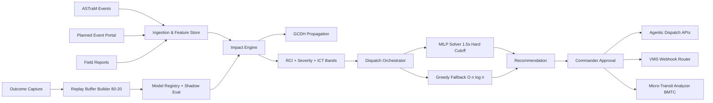

# PRD: Grid Unlocked — Event-Driven Traffic Congestion Management Platform

**Product Name:** Grid Unlocked — Intelligent Event-Driven Traffic Management  
**System Context:** ASTraM (Actionable Intelligence for Sustainable Traffic Management), Bengaluru Traffic Police  
**Prepared For:** Hackathon Submission — Senior Engineering Panel & Traffic Authority Leadership  
**Author:** Ashwary Gupta (Roll No: 23115017)  
**Date:** June 2026  
**Version:** 3.0  

---

## Problem Statement

Bengaluru Traffic Police already operates ASTraM as the operational source of incident truth, but command decisions for planned and unplanned disruption are still human-memory-centric under time pressure. Across the current corpus (8,173 incidents, 17 cause classes, 22 corridors, 54 stations), incident sensing exists; deterministic, latency-bound decisioning does not.

The core system failure is not data scarcity. It is the absence of enforceable runtime contracts between prediction, dispatch optimization, fallback behavior, and post-event learning.

### Current Gaps That Block Operational Reliability

| Gap | Observed Failure | Operational Risk |
|---|---|---|
| Impact forecast is under-instrumented | Planned events and unplanned shocks are scored inconsistently across zones | Over/under-preparation and corridor spillover |
| Dispatch optimization is brittle | Solver-first designs can block when optimization runtime spikes | Delayed dispatch under concurrent incidents |
| Propagation modeling is premature in early phases | STGCN requires continuous speed telemetry that is not yet guaranteed in Phase 1/2 | False confidence and model instability |
| Learning loop lacks anti-overfitting policy | Retraining can drift toward short-term anomalies without anchored history | Accuracy regressions after high-noise weeks |
| Operations rollout lacks degradation playbook | No tiered fallback during data, API, or model outages | Command center loses decision continuity |

### PRD 3.0 Direction

Grid Unlocked remains an intelligence layer on ASTraM, not a replacement. Version 3.0 formalizes:

1. **Non-blocking dual-tier dispatch optimization** with strict latency contracts.
2. **Graph-Centrality Decay Heuristic** replacing STGCN in Phase 1/2 propagation.
3. **Replay buffer retraining policy** (`80% new + 20% historical anchor`) with explicit anti-overfitting guardrails and a 94% target accuracy objective for core classification gates.
4. **Operational SDLC discipline**: shadow mode, graceful degradation tiers, and simulated cascade stress.
5. **Agentic extensions** after human approval: station API dispatch, barricade reservation, VMS routing, and micro-transit impact intelligence.

---

## Solution

Grid Unlocked v3.0 is a prescriptive, human-supervised traffic decision system with deterministic fallback behavior. Every phase is designed under SOLID/KISS/YAGNI constraints:

- **SOLID:** clear module boundaries, interface-driven adapters, replaceable model implementations.
- **KISS:** minimum viable reliable algorithms in early phases.
- **YAGNI:** defer telemetry-hungry graph deep models until data contracts exist.

### Runtime Contracts (Authoritative)

| Contract | Budget | Enforcement |
|---|---|---|
| Event ingest to action-card candidate | <= 350 ms P95 | Async ingestion + cached feature path |
| Dispatch optimization total decision latency | <= 1.8 s P95 | Dual-tier optimizer with hard solver cutoff |
| MILP solver window | **1.5 s hard cutoff** | Deadline kill and fallback handoff |
| Fallback dispatch runtime | <= 120 ms P95 | O(n log n) greedy selector |
| Dashboard live update | <= 5 s | WebSocket delta push |
| Planned event package generation | <= 10 s | Pre-indexed template and corridor graph |
| Post-approval agentic execution handoff | <= 200 ms | Fire-and-forget command queue with audit log |

### Non-Blocking Dispatch Pipeline (Required Behavior)

Dispatch is guaranteed non-blocking:

1. Start MILP solve with absolute 1.5-second deadline.
2. If MILP returns feasible before deadline, accept.
3. If MILP times out or fails feasibility, execute deterministic greedy fallback in O(n log n).
4. Return recommendation immediately with provenance: `source = MILP | GREEDY_FALLBACK`.
5. Never hold commander UI for solver completion beyond contract.

Fallback objective is proximity weighted by severity centrality:

`score(unit, incident) = alpha * ETA(unit, incident) + beta * RCI(incident) + gamma * CorridorCentrality(incident) + delta * CascadeRisk(incident)`

Units are ranked via heap/partial sort (O(n log n)). Tie-breakers are deterministic: station ID, unit ID.

### Propagation Policy (Phase-Correct)

**STGCN is removed from Phase 1 and Phase 2.**

Phase 1/2 propagation uses **Graph-Centrality Decay Heuristic (GCDH)**:

- Start from incident corridor node.
- Spread risk to adjacent nodes by weighted edges.
- Apply centrality-amplified decay: `risk_t+1(v) = sum_u risk_t(u) * edge_weight(u,v) * exp(-lambda * hop_distance) * (1 + k * betweenness(v))`
- Stop when marginal propagated risk < epsilon.

This gives stable, explainable ripple maps without requiring continuous telemetry streams. STGCN is permitted only in Phase 3 after sustained telemetry SLO compliance.

### Replay Buffer Retraining Policy

Retraining corpus policy is mandatory:

- **80% newly closed incidents**
- **20% historical anchor set** (stratified by corridor, cause, peak/off-peak, planned/unplanned)

Why: pure recent-data retraining overfits to transient anomalies (festival clusters, weather spikes, temporary enforcement drives). Historical anchor stabilizes decision boundaries, preserves rare-tail patterns, and protects calibration.

Targets:

- Primary operational classification accuracy target: **94%** on governance-approved validation slice.
- No promotion if drift-adjusted performance drops on anchor benchmark.

### Operations SDLC Policy

#### Shadow Mode First

- All recommendations run in parallel with live operations.
- Commanders see AI recommendation and counterfactual without auto-enforcement.
- Promotion gate requires shadow parity and no critical regressions over agreed evaluation window.

#### Graceful Degradation Tiers

| Tier | Trigger | Behavior |
|---|---|---|
| Tier 1 (Full) | All dependencies healthy | MILP primary + fallback + live APIs + dynamic routing |
| Tier 2 (Constrained) | Model/API partial outage | Offline diversion atlas + fallback dispatch + limited live scoring |
| Tier 3 (Continuity) | Major outage / data loss | Static BTP SOP templates + manual command mode + audit-only logging |

Tier transitions are automatic with manual override from command center admin.

#### Simulated Cascade Testing

Nightly synthetic drills inject concurrent high-severity closures:

- Multi-corridor blocked edges
- Conflicting station load
- API degradation + delayed telemetry
- Forced MILP timeout scenarios

Expected outcome: stable fallback dispatch and bounded latency under stress.

### New Product Features Integrated in v3.0

1. **Agentic dispatch workflow after approval**
   - Commander approves recommendation.
   - System triggers station APIs to dispatch units.
   - Barricade reservation requests are submitted programmatically.
   - Full audit: request payload, response code, replay id.

2. **Dynamic VMS webhook routing**
   - Approved diversion route auto-pushed to LED/VMS endpoints.
   - Regional templates convert route graph into board-friendly text.
   - Delivery confirmation with retry and dead-letter queue.

3. **Micro-transit impact analysis**
   - BMTC schedule overlays with predicted corridor delay.
   - Estimates delayed passenger count and transfer overload risk.
   - Outputs micro-transit impact index for command briefings.

### Architecture Flow (v3.0)

---

## User Stories

Stories are structured across **planned**, **unplanned**, **resource**, and **post-learning** contexts and include new v3.0 capabilities.

### Traffic Commander

1. **[Planned]** As a commander, I need a 72-hour event impact package (corridor risk bands, staffing, barricades, diversions) so pre-deployment is finalized before briefing.
2. **[Unplanned]** As a commander, I need real-time cascade risk with centrality-weighted spread so I can escalate before neighboring corridors collapse.
3. **[Resource]** As a commander, I need recommendations with source label (`MILP` or `GREEDY_FALLBACK`) and latency stamp so I can trust deterministic dispatch behavior.
4. **[Resource]** As a commander, I need mandatory timeout-safe dispatch cards even during solver overruns so no incident waits on optimization.
5. **[Post-Learning]** As a commander, I need override reason codes and resulting model delta reports so command intuition feeds learning governance.
6. **[Resource + Agentic]** As a commander, after approval I need one-click execution that dispatches units and reserves barricades through station APIs.
7. **[Planned + VMS]** As a commander, I need approved diversion plans pushed automatically to LED boards through VMS webhooks.
8. **[Planned + Micro-Transit]** As a commander, I need BMTC passenger-delay estimates for major events so I can coordinate public transport advisories.

### Field Officer / Station Dispatcher

9. **[Unplanned]** As a field officer, I need assignment packets within seconds, including route, hazard profile, and expected ICT quantiles.
10. **[Resource]** As a dispatcher, I need deterministic fallback recommendations when MILP times out, not empty or delayed results.
11. **[Resource]** As a dispatcher, I need unit ranking that reflects RCI severity and corridor centrality, not only nearest distance.
12. **[Post-Learning]** As a field officer, I need one-step closure with actual resources used so replay-buffer training has clean labels.
13. **[Resource + Degradation]** As a dispatcher, I need visible degradation tier status so I know whether we are in full, constrained, or continuity mode.

### Event Coordinator / Operations Analyst

14. **[Planned]** As an event coordinator, I need event registration that returns an impact envelope and compliance-ready resource checklist.
15. **[Planned]** As an event coordinator, I need alternate route scenario comparison before permit finalization.
16. **[Post-Learning]** As an analyst, I need replay buffer composition reports proving 80% new and 20% anchor coverage.
17. **[Post-Learning]** As an analyst, I need anti-overfitting diagnostics showing anchor-slice stability before model promotion.
18. **[Resource + Stress]** As an analyst, I need simulated concurrent closure drill results with latency and failover outcomes.

### Admin / Platform Governance

19. **[Post-Learning]** As an admin, I need shadow mode metrics versus production outcomes before enabling active recommendation influence.
20. **[Resource]** As an admin, I need deterministic-test evidence that fallback tie-breaking is stable across repeated runs.
21. **[Degradation]** As an admin, I need automatic tier transition logs and manual override controls for incident command continuity.
22. **[Integration]** As an admin, I need ASTraM ingestion health, station API health, and VMS webhook delivery health in one dashboard.

---

## Implementation Decisions

### Architectural Posture

Grid Unlocked remains an additive intelligence plane around ASTraM:

- ASTraM remains system-of-record for incidents.
- Grid Unlocked provides predictive, prescriptive, and learning capabilities.
- No ASTraM schema replacement is introduced in v3.0.

### Module Architecture (Prescriptive)

| Module | Responsibility | Notes |
|---|---|---|
| Ingestion Gateway | ASTraM + portal + field feed normalization | Strict schema contracts |
| Feature & Graph Service | RCI, centrality vectors, temporal features | Shared low-latency feature cache |
| Impact Engine | Closure probability + ICT quantiles | Phase-correct model policy |
| Propagation Engine | GCDH in Phase 1/2 | STGCN deferred |
| Dispatch Orchestrator | MILP primary + greedy fallback | Hard deadline management |
| Recommendation API | Action cards + evidence + provenance | Human-in-the-loop mandatory |
| Agentic Execution Broker | Station API commands + barricade reservations | Trigger only after approval |
| VMS Router | Webhook orchestration to LED boards | Retry + dead-letter handling |
| Transit Impact Service | BMTC delay/passenger estimations | Advisory outputs |
| Replay Learning Service | 80/20 buffer build + retraining | Anti-overfitting controls |
| Governance Console | shadow mode, tier control, promotion gates | RBAC and audit log |

### Dispatch Optimization Decision Policy

#### Primary Path: MILP

- Hard cutoff: **1.5 seconds** (non-negotiable).
- Objective: minimize weighted travel time + uncovered risk.
- Constraints: station capacity, shift windows, equipment compatibility, standby minimums.

#### Fallback Path: Greedy O(n log n)

- Trigger: MILP timeout / infeasible / exception.
- Ranking: distance + RCI severity + centrality + cascade risk.
- Deterministic stable sort keys to ensure identical outputs given identical inputs.

#### Non-Blocking Guarantee

- Recommendation API always responds within SLA with whichever path completes first under contract.
- No caller waits on late solver completion.

### Phased Model Policy (Updated)

| Phase | Propagation Model | Status |
|---|---|---|
| Phase 1 | Graph-Centrality Decay Heuristic | Active |
| Phase 2 | Graph-Centrality Decay Heuristic + calibrated cascade priors | Active |
| Phase 3 | STGCN (optional) after telemetry SLO validation | Conditional |

Rationale:

- **KISS:** GCDH is explainable and inexpensive.
- **YAGNI:** avoid early STGCN complexity without continuous telemetry.
- **SOLID:** propagation interface remains model-agnostic for future replacement.

### Replay Buffer and Promotion Governance

- Training set composition: `0.8 * recent_labeled + 0.2 * historical_anchor`.
- Anchor stratification dimensions: corridor, cause, time window, planned/unplanned.
- Promotion requires:
  - >=94% target accuracy on approved operational slice.
  - No anchor slice degradation beyond tolerance.
  - Shadow mode stability checks passing.

### SDLC and Rollout Decisions

1. Deploy in shadow mode first.
2. Enable recommendation influence after governance sign-off.
3. Enable agentic execution only after post-approval command reliability thresholds are met.
4. Keep degradation tiers live at all times with synthetic failover drills.

---

## Testing Decisions

Testing in v3.0 is contract-first and operations-realistic.

### 1) Fallback Determinism Tests

- Re-run identical incident batches 100x and assert identical fallback ranking/output.
- Verify stable tie-breaker behavior when ETAs and severity scores are equal.
- Assert provenance flag correctness (`MILP` vs `GREEDY_FALLBACK`).

### 2) Timeout and Latency Tests

- Force MILP runtimes above 1.5 s and verify immediate fallback handoff.
- Validate end-to-end non-blocking API response remains within latency contract.
- Ensure late MILP completions do not overwrite already-issued fallback decisions.

### 3) Chaos and Degradation Tier Tests

- Inject model service outages, station API failures, VMS webhook failures, and cache misses.
- Assert correct auto-transition among Tier 1/2/3.
- Confirm Tier 3 serves static BTP SOP templates and preserves audit logs.

### 4) Simulated Cascade Stress Tests

- Synthesize high-severity concurrent closures across central corridors.
- Evaluate dispatch throughput, queue depth, and assignment freshness.
- Validate no starvation for newly arriving high-RCI incidents.

### 5) Replay Buffer Regression Tests

- Enforce 80/20 dataset composition invariants in every retraining job.
- Run anti-overfitting checks: recent-only model vs 80/20 model; anchor slice must remain stable or improve.
- Validate promotion blocks on anchor regressions despite recent slice gains.

### 6) Feature Integration Tests (New Capabilities)

- Agentic dispatch: approval -> station API call chain -> acknowledgement persisted.
- Barricade reservation: reservation id returned and linked to deployment.
- VMS routing: diversion approval -> webhook fanout -> delivery confirmation/retry.
- Micro-transit analytics: BMTC schedule ingestion -> delayed passenger estimate -> advisory export.

### 7) Shadow Mode and Governance Tests

- Compare shadow recommendations vs live operator outcomes across planned/unplanned classes.
- Ensure no automated actuation occurs while shadow-only flag is active.
- Confirm promotion checklist completion is mandatory before policy switch.

---

## Out of Scope

The following remain intentionally excluded in v3.0:

1. City-wide autonomous signal control.
2. Full citizen-facing traffic app.
3. Production STGCN in Phase 1/2.
4. Cross-city model generalization outside Bengaluru.
5. Policy/compliance programs unrelated to dispatch intelligence core.

These exclusions preserve KISS/YAGNI and focus delivery on reliable command-center outcomes.

---

## Further Notes

### ASTraM Integration Commitment

Grid Unlocked is an additive intelligence and orchestration layer:

- ASTraM continues as source of truth.
- Existing reporting workflows remain valid.
- New capabilities are augmentative: prediction, recommendation, approval-gated actuation, and learning.

### Operational KPIs (v3.0)

| KPI | Target |
|---|---|
| Dispatch decision latency P95 | <= 1.8 s |
| MILP cutoff compliance | 100% at 1.5 s hard stop |
| Fallback availability | 100% when MILP unavailable |
| Replay policy compliance | 100% (80/20 enforced) |
| Classification target accuracy | 94% on approved slice |
| Shadow mode promotion defects | 0 critical |

### v3.0 Closing Statement

Version 3.0 converts Grid Unlocked from a prediction-centric system into a **runtime-governed, non-blocking, command-safe operations platform**. It upgrades dispatch reliability, controls model risk, and introduces approval-gated agentic execution while preserving ASTraM as the operational foundation.
