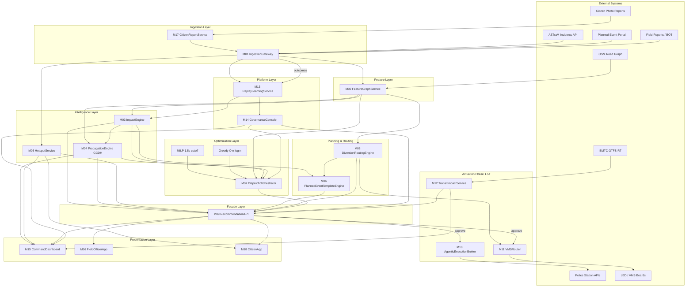

# Grid Unlocked — High-Level Architecture & System Design

**Product:** Grid Unlocked — Intelligent Event-Driven Traffic Management  
**System Context:** ASTraM (Actionable Intelligence for Sustainable Traffic Management), Bengaluru Traffic Police  
**Author:** Ashwary Gupta (Roll No: 23115017)  
**Date:** June 2026  
**Version:** 1.0  
**Related Documents:** `PRD_Event_Driven_Traffic.md` · `IMPLEMENTATION_MODULES.md` · `ML_MODELS_PRD.md`

---

## 1. Purpose of This Document

This document describes the **complete high-level structure and design** of Grid Unlocked: what the system is, how it sits alongside ASTraM, how data flows end-to-end, which modules exist, and how they interact. It is the architectural entry point for engineers, hackathon judges, and TMC operators.

For module-level API contracts and build specs, see `IMPLEMENTATION_MODULES.md`. For product requirements and runtime SLAs, see `PRD_Event_Driven_Traffic.md`.

---

## 2. Executive Summary

Grid Unlocked is an **additive intelligence layer** on top of ASTraM. It does not replace ASTraM as the system-of-record for incidents. Instead, it adds:

| Capability | What it delivers |
|---|---|
| **Predictive scoring** | Closure probability, ICT clearance bands, Recovery Complexity Index (RCI) |
| **Prescriptive optimization** | Non-blocking MILP dispatch with deterministic greedy fallback |
| **Explainable propagation** | Graph-Centrality Decay Heuristic (GCDH) ripple maps |
| **Human-supervised actuation** | Station dispatch, barricade reservation, VMS routing — only after commander approval |
| **Governed learning** | 80/20 replay buffer, 94% accuracy gate, shadow mode before promotion |
| **Citizen layer (v3.1)** | Photo + GPS congestion reports, immediate ICT quotes, corridor pre-alerts |

The system is designed for **time-bounded, deterministic decisioning** under concurrent incidents — not for blocking the command center while an optimizer runs.

---

## 3. System Context

### 3.1 Where Grid Unlocked Sits

```
┌─────────────────────────────────────────────────────────────────────────┐
│                     Bengaluru Traffic Police (BTP)                      │
│  ┌───────────────────────────────────────────────────────────────────┐  │
│  │  ASTraM (System of Record)                                        │  │
│  │  • Incident logging (BOT, cameras, citizen app)                     │  │
│  │  • TMC dashboards, e-Path, special events                         │  │
│  └───────────────────────────────┬───────────────────────────────────┘  │
│                                  │ webhooks / API / outcomes              │
│  ┌───────────────────────────────▼───────────────────────────────────┐  │
│  │  GRID UNLOCKED (Intelligence Plane)                               │  │
│  │  Sense → Enrich → Score → Optimize → Recommend → Approve → Act    │  │
│  └───────────────────────────────┬───────────────────────────────────┘  │
│                                  │ post-approval only                     │
│  ┌───────────────────────────────▼───────────────────────────────────┐  │
│  │  External Actuation                                                 │  │
│  │  • Police station APIs  • VMS/LED boards  • BMTC advisory         │  │
│  └───────────────────────────────────────────────────────────────────┘  │
└─────────────────────────────────────────────────────────────────────────┘
```

### 3.2 Corpus Grounding

Design decisions are grounded in the ASTraM anonymized export:

| Fact | Value | Design implication |
|---|---|---|
| Historical incidents | 8,173 | Training and validation corpus |
| Cause classes | 17 | Fixed vocabulary at ingest |
| Corridors | 22 | Corridor×cause priors, centrality |
| Police stations | 54 | Dispatch unit pool |
| Closure base rate | 8.3% | Imbalanced classification; PR-AUC not raw accuracy |
| Planned closure rate | 36.2% vs 6.6% unplanned | M06 planned-event path (72 h ahead) |
| ICT censoring | 61.6% missing `closed_datetime` | Survival models (Cox PH), leakage-safe features |
| ASTraM priority bias | 99–100% High on named corridors | RCI replaces priority as severity signal |

### 3.3 External Systems

| System | Role | Integration |
|---|---|---|
| **ASTraM API** | Incident create/update/close | M01 webhook ingest |
| **Planned Event Portal** | VIP movements, processions, construction | M01 planned ingest → M06 |
| **Field Reports (BOT)** | Officer supplemental reports | M01 field ingest |
| **OSM Road Graph** | Static topology, betweenness | M02 feature cache |
| **Police Station APIs** | Unit dispatch, barricade reservation | M10 (Phase 1.5+) |
| **VMS / LED Boards** | Diversion text push | M11 (Phase 1.5+) |
| **BMTC GTFS-RT** | Bus schedule + delays | M12 (Phase 2) |
| **Citizen (M18 PWA)** | Photo reports, subscriptions | M17 ingest |

---

## 4. Design Principles

| Principle | Rule |
|---|---|
| **SOLID** | One module = one reason to change. Propagation is model-agnostic behind `PropagationEngine`. MILP and greedy are separate strategies behind `DispatchOrchestrator`. |
| **KISS** | LightGBM + Cox PH for impact; GCDH for ripple maps; OR-Tools MILP with hard cutoff. No STGCN until telemetry SLO exists. |
| **YAGNI** | No city-wide signal control, no ASTraM schema replacement, no cross-city generalization in v3.1. |
| **Contract-first** | Every cross-module call has a latency budget and Tier 1/2/3 degradation path. |
| **Non-blocking dispatch** | Recommendation API never waits beyond 1.8 s P95; MILP killed at 1.5 s. |
| **Shadow before actuation** | Recommendations run parallel to live ops until governance promotion. |
| **Human-in-the-loop** | No automated dispatch from unverified citizen reports. Commander approval required for actuation. |

---

## 5. Logical Architecture — Layer Model

Grid Unlocked is organized into **seven logical layers** and **18 modules (M01–M18)**.

```
┌─────────────────────────────────────────────────────────────────────────┐
│  PRESENTATION LAYER                                                     │
│  M15 CommandDashboard  │  M16 FieldOfficerApp  │  M18 CitizenApp        │
├─────────────────────────────────────────────────────────────────────────┤
│  FACADE LAYER                                                           │
│  M09 RecommendationAPI (action cards, approval, provenance)             │
├─────────────────────────────────────────────────────────────────────────┤
│  OPTIMIZATION & PLANNING LAYER                                          │
│  M07 DispatchOrchestrator  │  M08 DiversionRoutingEngine  │  M06 Planned│
├─────────────────────────────────────────────────────────────────────────┤
│  INTELLIGENCE LAYER                                                     │
│  M03 ImpactEngine  │  M04 PropagationEngine  │  M05 HotspotService       │
├─────────────────────────────────────────────────────────────────────────┤
│  FEATURE LAYER                                                          │
│  M02 FeatureGraphService (RCI components, centrality, temporal, priors) │
├─────────────────────────────────────────────────────────────────────────┤
│  INGESTION LAYER                                                        │
│  M01 IngestionGateway  │  M17 CitizenReportService                      │
├─────────────────────────────────────────────────────────────────────────┤
│  PLATFORM LAYER                                                         │
│  M14 GovernanceConsole  │  M13 ReplayLearningService                    │
├─────────────────────────────────────────────────────────────────────────┤
│  ACTUATION LAYER (Phase 1.5+)                                         │
│  M10 AgenticExecutionBroker  │  M11 VMSRouter  │  M12 TransitImpact    │
└─────────────────────────────────────────────────────────────────────────┘
```

### 5.1 Layer Responsibilities

| Layer | Responsibility | Key modules |
|---|---|---|
| **Ingestion** | Normalize heterogeneous event feeds into `NormalizedEvent` | M01, M17 |
| **Features** | Low-latency feature cache: RCI inputs, graph centrality, bias weights | M02 |
| **Intelligence** | ML scoring, propagation, hotspot analytics | M03, M04, M05 |
| **Optimization & Planning** | Dispatch MILP/greedy, diversion atlas, 72 h planned packages | M06, M07, M08 |
| **Facade** | Unified action cards, approval workflow, provenance | M09 |
| **Presentation** | Commander dashboard, field mobile, citizen PWA | M15, M16, M18 |
| **Platform** | Governance tiers, shadow mode, replay buffer, model promotion | M13, M14 |
| **Actuation** | Post-approval execution to station APIs, VMS, transit advisory | M10, M11, M12 |

---

## 6. Module Catalog

### 6.1 Full Registry

| ID | Module | Layer | Phase | SLA (P95) |
|---|---|---|---|---|
| M01 | IngestionGateway | Ingestion | MVP | Ingest ACK ≤350 ms |
| M02 | FeatureGraphService | Features | MVP | Feature read ≤50 ms |
| M03 | ImpactEngine | Intelligence | MVP | Score ≤200 ms |
| M04 | PropagationEngine | Intelligence | MVP | GCDH ≤150 ms |
| M05 | HotspotService | Intelligence | MVP | Query ≤100 ms |
| M06 | PlannedEventTemplateEngine | Planning | MVP | Package ≤10 s |
| M07 | DispatchOrchestrator | Optimization | MVP | Decision ≤1.8 s |
| M08 | DiversionRoutingEngine | Routing | MVP | Atlas ≤80 ms |
| M09 | RecommendationAPI | Facade | MVP | Card skeleton ≤350 ms |
| M10 | AgenticExecutionBroker | Actuation | 1.5 | Handoff ≤200 ms |
| M11 | VMSRouter | Actuation | 1.5 | Fanout ≤500 ms |
| M12 | TransitImpactService | Advisory | 2 | Index ≤2 s |
| M13 | ReplayLearningService | Platform | MVP | Weekly batch |
| M14 | GovernanceConsole | Platform | MVP | Tier eval ≤1 s |
| M15 | CommandDashboard | UI | MVP | Live delta ≤5 s |
| M16 | FieldOfficerApp | UI | MVP | Packet ≤3 s |
| M17 | CitizenReportService | Ingestion | MVP | Report ACK ≤2 s |
| M18 | CitizenApp | UI | MVP | Submit ≤3 s |

### 6.2 Module Grouping by Concern

```
INGEST & NORMALIZE          INTELLIGENCE & SCORE           DECIDE & ROUTE
─────────────────          ────────────────────           ──────────────
M01 IngestionGateway       M03 ImpactEngine               M07 DispatchOrchestrator
M17 CitizenReportService   M04 PropagationEngine (GCDH)   M08 DiversionRoutingEngine
                           M05 HotspotService             M06 PlannedEventTemplate

PRESENT & APPROVE          GOVERN & LEARN                 ACTUATE (post-approval)
─────────────────          ──────────────                 ──────────────────────
M09 RecommendationAPI      M13 ReplayLearningService      M10 AgenticExecutionBroker
M15 CommandDashboard       M14 GovernanceConsole          M11 VMSRouter
M16 FieldOfficerApp                                       M12 TransitImpactService
M18 CitizenApp
```

---

## 7. End-to-End Data Flow

### 7.1 Value Chain

```
Sense → Enrich → Score → Optimize → Present → Approve → Act → Learn
  │        │        │         │          │         │       │      │
 M01     M02      M03       M07        M15       M09     M10    M13
 M17     M02      M04       M08        M16       M14     M11
                  M05       M06        M18                     
```

### 7.2 Primary Architecture Diagram



### 7.3 Critical Path Latency Budget

Unplanned incident → action card (hot path):

| Step | Module | Budget |
|---|---|---|
| Ingest + normalize | M01 | 80 ms |
| Feature read (cache hit) | M02 | 40 ms |
| Impact score (closure + ICT + RCI) | M03 | 150 ms |
| GCDH propagation | M04 | 100 ms |
| Card skeleton assembly | M09 | 50 ms |
| **Subtotal (skeleton path)** | | **≤350 ms P95** |
| Dispatch optimization (async push) | M07 | ≤1,800 ms P95 |
| Dashboard live update | M15 | ≤5 s |

The **350 ms contract** applies to the scoring path (skeleton card). Full dispatch recommendation streams to the dashboard via WebSocket within **1.8 s**.

### 7.4 Sync vs Async Boundaries

| Sync (caller waits) | Async (fire-and-forget / push) |
|---|---|
| M01 ingest ACK | M07 dispatch recommendation push |
| M02 feature read | M13 weekly retrain job |
| M09 card skeleton | M15 WebSocket deltas |
| M14 tier query | M11 VMS retry queue |
| M16 field packet | M10 station dispatch queue |
| M17 citizen report ACK + ICT quote | M18 pre-alert fanout |

---

## 8. Core Subsystems

### 8.1 Ingestion Subsystem (M01 + M17)

**Purpose:** Single ingress for all event sources; enforce schema, vocabulary, and geographic bounds.

```
ASTraM webhook ──┐
Planned portal ──┼──► M01 Normalize ──► EventNormalized ──► M02, M05, M13
Field BOT      ──┘         ▲
                           │
Citizen photo ──► M17 ─────┘ (authenticated=false until verified)
```

**Key behaviors:**
- Bengaluru bounding box validation (lat 12.8–13.3, lon 77.3–77.8)
- 17-class cause vocabulary, 22-corridor mapping
- Zone imputation when null (~57.9% of records)
- Reporting lag attached for bias correction in M02
- Citizen reports: immediate ICT quote via M03; `source=CITIZEN` badge until commander verifies

### 8.2 Feature & Graph Subsystem (M02)

**Purpose:** Shared low-latency feature cache for all intelligence and optimization modules.

**Outputs per event:**
- RCI component vectors (duration prior, betweenness, cascade seed)
- Corridor×cause historical priors
- Temporal features (hour IST, peak flag, bias weights for 14–18 IST under-reporting)
- H3 cell, junction snap, station jurisdiction

**Storage:** PostgreSQL + PostGIS for graph; Redis for hot-path feature cache.

### 8.3 Intelligence Subsystem (M03 + M04 + M05)

#### M03 — ImpactEngine

Predicts operational severity at ingest time (leakage-safe: features knowable at `start_datetime` only).

| Output | Model | Metric |
|---|---|---|
| `p_closure` | LightGBM | PR-AUC, F1-macro (not raw accuracy) |
| `ict_p20/p50/p80` | Cox PH survival | C-index, calibration |
| `rci` | Weighted composite | See RCI formula below |
| `severity_band` | Ordinal cuts on RCI | Green / Yellow / Orange / Red |

**RCI (Recovery Complexity Index):**

```
RCI = w₁ · norm(log_duration_prior_h)
    + w₂ · betweenness_norm
    + w₃ · cascade_risk_norm
    + w₄ · p_closure_live
    + w₅ · veh_complexity_score
    + w₆ · simultaneous_events_2km_norm
```

ASTraM `priority` is **not** used — it is structural (99–100% High on named corridors), not severity.

#### M04 — PropagationEngine (GCDH)

Phase 1/2 propagation uses **Graph-Centrality Decay Heuristic** — not STGCN.

```
risk_{t+1}(v) = Σ_u risk_t(u) · edge_weight(u,v) · exp(-λ · hop_distance) · (1 + k · betweenness(v))
```

| Parameter | Default | Meaning |
|---|---|---|
| λ | 0.35 | Hop decay rate |
| k | 0.15 | Centrality amplification |
| ε | 0.02 | Stop when marginal risk < ε |
| max_hops | 5 (Tier 1), 2 (Tier 2) | Latency cap |

Produces ripple maps for commander dashboard and `CascadeRisk` scalar for M07 dispatch.

#### M05 — HotspotService

- **Observed hotspots:** DBSCAN/KMeans on active events (Haversine or EPSG:32643)
- **Predicted hotspots:** Rolling density + corridor×cause priors
- Consumed by M15 map layers and M18 pre-alert subscriptions

### 8.4 Optimization Subsystem (M06 + M07 + M08)

#### M07 — DispatchOrchestrator (Dual-Tier)

```
                    ┌─────────────────┐
                    │  M07 Orchestrator│
                    └────────┬────────┘
                             │
              ┌──────────────┴──────────────┐
              ▼                             ▼
     ┌─────────────────┐          ┌─────────────────┐
     │ MILP (OR-Tools) │          │ Greedy Fallback │
     │ 1.5 s HARD cutoff│          │ O(n log n)      │
     │ ≤1.5 s          │          │ ≤120 ms P95     │
     └────────┬────────┘          └────────┬────────┘
              │ success                     │ timeout / infeasible
              └──────────────┬──────────────┘
                             ▼
                  DispatchRecommendation
                  source: MILP | GREEDY_FALLBACK
```

**Greedy fallback score** (lower = better):

```
S(u, i) = α · ETA(u, i) + β · RCI(i) + γ · C(i) + δ · R_cascade(i)
```

Tie-breakers: station_id → unit_id (deterministic, stable across runs).

**MILP constraints:** station capacity, shift windows, equipment compatibility, standby minimums.  
**Objective:** minimize weighted travel time + uncovered risk.

#### M08 — DiversionRoutingEngine

Pre-indexed diversion atlas per junction. Top-k paths ranked; cyclic gridlock flags. Consumed by M06 planned packages, M09 action cards, M11 VMS text generation.

#### M06 — PlannedEventTemplateEngine

When `is_planned=true` and `hours_until_start ≤ 72`:
- Generates 72 h impact package: staffing, barricades, diversion refs, analog events
- Planned events have **5.5× higher closure rate** — routed here instead of per-minute hot-path scoring
- VIP movement always stages barricades (hard rule)

### 8.5 Facade Subsystem (M09)

**Purpose:** Single API surface for all consumers. Assembles unified **Action Cards**.

**Action Card contents:**
- Impact score (RCI, P(closure), ICT bands)
- GCDH ripple summary
- Dispatch recommendation + provenance (`MILP` | `GREEDY_FALLBACK`)
- Diversion options
- Planned package reference (if applicable)
- Evidence panel (model versions, tier at decision)

**Approval workflow:**
```
GET /recommendations/{event_id}  →  Commander reviews on M15
POST /recommendations/{id}/approve  →  M10 dispatch + M11 VMS (if shadow_mode=false)
```

Override reason codes: `EXPERIENCE_OVERRIDE`, `LOCAL_INTEL`, `EQUIPMENT_UNAVAILABLE`, `POLITICAL_SENSITIVITY`, `MODEL_DISAGREE`, `OTHER`.

### 8.6 Platform Subsystem (M13 + M14)

#### M14 — GovernanceConsole

| Tier | Trigger | Behavior |
|---|---|---|
| **Tier 1 — Full** | All health checks green | MILP + greedy + live scoring + dynamic routing |
| **Tier 2 — Constrained** | Model timeout, cache miss, API degraded | Greedy-only dispatch; rule-based impact priors; 2-hop GCDH |
| **Tier 3 — Continuity** | Ingest failure, DB unavailable | Static BTP SOP templates; manual command mode; audit-only |

**Shadow mode:** AI recommendations computed in parallel; actuation blocked until governance promotion.

#### M13 — ReplayLearningService

```
Closed events (M01) ──► Buffer builder (80% new + 20% anchor) ──► Retrain ──► Eval gate ──► Model registry
                                                                                    │
                                                              ≥94% accuracy + no anchor regression
                                                                                    │
                                                                              M14 promotion sign-off
```

Anchor stratification: corridor, cause, peak/off-peak, planned/unplanned.

### 8.7 Actuation Subsystem (M10 + M11 + M12) — Phase 1.5+

| Module | Trigger | Action |
|---|---|---|
| M10 | Commander approval | Dispatch units + barricade reservation via station APIs |
| M11 | Diversion approval | Push route text to VMS/LED webhooks (retry + DLQ) |
| M12 | Major event card | BMTC passenger delay index for command briefing |

**Hackathon:** M10–M12 are stubbed with mock APIs; UI flow and audit log entries are real.

---

## 9. Application Surfaces (UI Design)

Grid Unlocked delivers **three user-facing applications** plus one governance console.

### 9.1 M15 — Command Dashboard (Primary TMC UI)

**Users:** Traffic Commander, Dispatcher, Event Coordinator, Analyst  
**Routes:** `/live` · `/planned` · `/governance` · `/analytics`

| Panel | Data source | Purpose |
|---|---|---|
| Alert queue | M09, M03 | Events sorted by RCI × P(closure) × peak |
| Live map | M05, M04, M08 | Observed + predicted hotspots, GCDH ripples, diversions |
| Action card | M09 | Approve/reject with override reason |
| Planned timeline | M06 | 72 h event package |
| Citizen triage | M17 | Photo, ICT bands, verify/reject (`source=CITIZEN`) |
| Governance | M14 | Tier badge, shadow mode, health panel |
| Learning | M13 | Buffer manifest, accuracy gate status |

**Transport:** REST proxy to M09/M14/M05/M06; WebSocket `dashboard.delta` for live updates (≤5 s).

### 9.2 M16 — Field Officer App

**Users:** Field Officer, Station Dispatcher  
**Purpose:** Assignment packets with route, hazard profile, ICT quantiles; closure reporting with resources used (feeds M13 labels).

### 9.3 M18 — Citizen App (PWA)

**Users:** Commuters  
**Features:**
- Photo + GPS congestion report → M17 → immediate ICT P50/P80 quote
- Corridor/route subscription → pre-alerts when M05 hotspots or M04 ripples affect saved areas
- Report confirmation with map pin

**Safety:** Unverified citizen reports never enter dispatch path until commander verifies via M17.

### 9.4 UI Architecture Overview

```
┌──────────────────────────────────────────────────────────────────┐
│                         BROWSER / MOBILE                          │
├─────────────────────┬─────────────────────┬────────────────────────┤
│  M15 CommandDashboard│  M16 FieldOfficerApp│  M18 CitizenApp (PWA) │
│  MapLibre / Kepler   │  Mobile viewport    │  Report + subscribe   │
│  WebSocket deltas    │  Assignment packets │  WebSocket alerts     │
└──────────┬───────────┴──────────┬──────────┴──────────┬───────────┘
           │                      │                      │
           └──────────────────────┼──────────────────────┘
                                  ▼
                         M09 RecommendationAPI
                         M17 CitizenReportService
                         M14 GovernanceConsole
```

---

## 10. Technology Stack

| Concern | Technology | Used by |
|---|---|---|
| API framework | FastAPI | All backend modules |
| Primary database | PostgreSQL + PostGIS | M01, M02, M13 |
| Cache / pub-sub | Redis | M02 feature cache, M15 WebSocket fanout |
| Event bus | Redis Streams or Kafka (Phase 1.5) | M01 → M02/M05/M13 async |
| ML — classification | LightGBM | M03 closure model |
| ML — survival | lifelines (Cox PH) | M03 ICT bands |
| ML — clustering | scikit-learn DBSCAN/KMeans | M05 hotspots |
| Optimization | OR-Tools MILP | M07 primary path |
| Model registry | MLflow | M13 |
| Map (command UI) | MapLibre / Kepler.gl + H3 | M15, M18 |
| Containerization | Docker | All services |
| Frontend | React or Next.js | M15, M16, M18 |

Modules communicate via **REST (sync)**, **WebSocket (dashboard)**, and **event bus (async)**.

---

## 11. Key Runtime Contracts

| Contract | Budget | Owner |
|---|---|---|
| Event ingest → action-card skeleton | ≤350 ms P95 | M01, M02, M03, M09 |
| Dispatch optimization total | ≤1.8 s P95 | M07 |
| MILP solver window | **1.5 s hard cutoff** | M07 |
| Greedy fallback alone | ≤120 ms P95 | M07 |
| Dashboard live update | ≤5 s | M15 |
| Planned event package | ≤10 s | M06 |
| Agentic handoff post-approval | ≤200 ms | M10 |
| Citizen report ACK + ICT quote | ≤2 s P95 | M17 |
| Citizen pre-alert fanout | ≤10 s | M05/M04 → M18 |
| Classification accuracy gate | ≥94% | M13 + M14 |
| Replay buffer compliance | 100% 80/20 | M13 |

**Non-blocking guarantee:** Late MILP results never overwrite an already-issued fallback decision.

---

## 12. Security, Identity & Audit

### 12.1 RBAC

| Role | Permissions |
|---|---|
| Commander | Approve recommendations, override tier, view shadow metrics |
| Dispatcher | View assignments, acknowledge field packets |
| Analyst | View replay manifests, promotion checklists |
| Admin | Tier override, shadow mode toggle, model promotion sign-off |
| Field Officer | Closure reporting, resource-used capture |
| Citizen | Submit reports, subscribe to corridors (M18 only) |

### 12.2 Audit & Retention

Every `DispatchRecommendation` includes provenance:

```json
{
  "source": "MILP | GREEDY_FALLBACK",
  "solver_ms": 1234,
  "tier_at_decision": 1,
  "model_versions": { "closure": "v3.2.1", "ict": "v2.1.0" },
  "tie_breaker_applied": false
}
```

| Data | Retention |
|---|---|
| Dispatch / approval / execution audit | 7 years |
| Citizen photos (unverified) | 90 days |
| Citizen photos (linked to verified incident) | 7 years |
| Operational caches | 24 h – 90 d per entity |

---

## 13. Phased Rollout

### 13.1 Phase Matrix

| Capability | MVP (Hackathon) | Phase 1.5 | Phase 2 | Phase 3 |
|---|---|---|---|---|
| Ingest | M01 live + CSV replay | Production ASTraM webhook | SLO monitor | Multi-source |
| Propagation | GCDH | Calibrated λ | Cascade priors | STGCN optional |
| Dispatch | MILP + greedy | OR-Tools tune | Multi-incident | RL warm-start |
| Actuation | M10–M12 stub | Live M10/M11 | M12 BMTC | MDT integration |
| Learning | 80/20 + 94% gate | Auto promote | Monsoon retrain | Annual model |
| Citizen | M17/M18 full | ASTraM push bridge | — | — |

### 13.2 Promotion Ladder

```
Deploy
  → Shadow Mode (M14)
  → Tier 1 full ops
  → Enable recommendation influence
  → Meet agentic reliability thresholds
  → Enable M10/M11
  → Phase 2 transit advisory
  → Telemetry SLO met (≥95% coverage, ≤5 min staleness)
  → Evaluate STGCN in shadow (Phase 3, optional)
```

### 13.3 STGCN Deferral

STGCN requires continuous speed telemetry not guaranteed in Phase 1/2. GCDH provides explainable ripple maps using static OSM graph + betweenness. STGCN permitted only in Phase 3 after sustained telemetry SLO compliance.

---

## 14. Hackathon Demo Architecture

### 14.1 Demo-Ready (Real Logic)

M01, M02, M03, M04, M05, M06, M07, M08, M09, M13, M14, M15, M16, M17, M18

### 14.2 Stubbed (UI Flow + Mock APIs)

| Module | Mock behavior |
|---|---|
| M10 | `POST /mock/station/ack` → fake unit_id + audit log |
| M11 | `POST /mock/vms/receive` → green checkmark on card |
| M12 | `GET /mock/transit/demo` → canned passenger delay index |

### 14.3 Five-Minute Demo Flow

1. **Planned:** Register construction on Bellary Road → M06 package → M08 diversions → M15 timeline
2. **Unplanned:** Inject breakdown Mysore Road → M03 score → M04 GCDH → M07 greedy → M09 card
3. **Governance:** Shadow mode on — approve triggers mock M10, not real station API
4. **Learning:** M13 manifest — 80/20 split, 94.2% accuracy
5. **Field:** M16 packet → closure with barricade count → M13 label queue
6. **Citizen:** M18 photo report → M17 ICT quote → M15 triage → verify → M09 card

---

## 15. Deployment Topology (Logical)

```
┌─────────────────────────────────────────────────────────────────┐
│                        Load Balancer / API Gateway               │
└────────────────────────────┬────────────────────────────────────┘
                             │
        ┌────────────────────┼────────────────────┐
        ▼                    ▼                    ▼
┌───────────────┐   ┌───────────────┐   ┌───────────────┐
│  M09 Facade   │   │  M15/M16/M18  │   │  M14 Governance│
│  M17 Citizen  │   │  Static + WS  │   │  Health probes │
└───────┬───────┘   └───────────────┘   └───────────────┘
        │
        ├──────────► M07 Dispatch (CPU-bound, isolated worker)
        ├──────────► M03/M04/M05 Intelligence (GPU optional)
        ├──────────► M01 Ingest (webhook receiver)
        │
        ▼
┌───────────────────────────────────────────────────────────────┐
│  PostgreSQL + PostGIS  │  Redis (cache + pub/sub)  │  MLflow  │
└───────────────────────────────────────────────────────────────┘
```

**M07 isolation:** MILP solver runs in a separate worker process with deadline watcher to enforce 1.5 s hard cutoff without blocking the API thread pool.

---

## 16. Document Index

| Document | Scope |
|---|---|
| `ARCHITECTURE.md` (this file) | High-level structure, layers, flows, technology |
| `PRD_Event_Driven_Traffic.md` | Product requirements, runtime contracts, user stories |
| `IMPLEMENTATION_MODULES.md` | Per-module specs, APIs, test ownership, hackathon cut |
| `ML_MODELS_PRD.md` | ML models, RCI, GCDH, evaluation metrics, leakage policy |
| `ML_MODULES_IMPLEMENTATION.md` | ML implementation details for M02–M07, M13 |
| `TRAFFIC_ANALYSIS_IDEA_PLAN.md` | Research corpus, EDA findings, hypothesis validation |
| `readme.md` | Hackathon product vision summary |

---

## 17. Glossary

| Term | Definition |
|---|---|
| **ASTraM** | Actionable Intelligence for Sustainable Traffic Management — BTP operational platform |
| **RCI** | Recovery Complexity Index — derived severity score replacing ASTraM priority |
| **ICT** | Incident Clearance Time — time to traffic normalization |
| **GCDH** | Graph-Centrality Decay Heuristic — Phase 1/2 propagation model |
| **MILP** | Mixed-Integer Linear Programming — primary dispatch optimizer |
| **Action Card** | Unified recommendation payload from M09 |
| **Shadow Mode** | AI runs parallel to ops; actuation blocked until promotion |
| **Replay Buffer** | 80% recent + 20% historical anchor training corpus |
| **TMC** | Traffic Management Center — command operations hub |
| **VMS** | Variable Message Sign — roadside LED diversion boards |
| **H3** | Uber hexagonal geospatial index for location snapping |

---

*Grid Unlocked v3.1 — Architecture Document v1.0*
