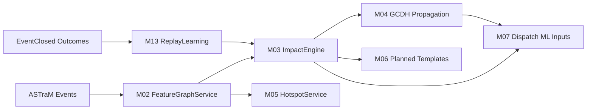

# PRD: Grid Unlocked — Machine Learning Models & Intelligence Layer

**Product Name:** Grid Unlocked — ML Models PRD (M02–M07, M13)  
**System Context:** ASTraM (Actionable Intelligence for Sustainable Traffic Management), Bengaluru Traffic Police  
**Prepared For:** Hackathon Submission — Senior Engineering Panel & Traffic Authority Leadership  
**Author:** Ashwary Gupta (Roll No: 23115017)  
**Date:** June 2026  
**Version:** 1.0

---

## Problem Statement

Bengaluru Traffic Police operates ASTraM as the operational source of incident truth across 8,173 historical incidents, 17 cause classes, 22 corridors, and 54 police stations. Incident sensing exists; **calibrated, leakage-safe, latency-bounded machine learning** does not. Commanders still receive structurally biased priority labels, uncalibrated closure estimates, and no explainable cascade maps under concurrent load.

Exploratory data analysis on the ASTraM corpus surfaces nine constraints that any production ML layer must treat as **first-class requirements**, not optional enhancements:

| EDA Finding                      | Operational Impact                                                                                                  | Required ML Response                                                                                                    |
| -------------------------------- | ------------------------------------------------------------------------------------------------------------------- | ----------------------------------------------------------------------------------------------------------------------- |
| **Priority ≠ Severity**          | 99–100% of named-corridor incidents carry ASTraM `High` priority by dispatch rule, not by true impact               | Drop `priority` as ML target; derive **RCI** from duration prior, centrality, cascade risk, closure probability         |
| **Planned closure multiplier**   | Planned events are 5.7% of volume but **36.2% closure rate** vs **6.6%** unplanned (5.5×)                           | Route planned events to **M06** 24–72 h ahead; do not waste runtime closure inference on pre-packaged planned workflows |
| **14–18 IST temporal blindspot** | Hours 14–17 show 256/93/71/65 logged events vs 1,329 in 07–09 peak — under-reporting during true evening congestion | **Inverse-frequency bias weights** in M02/M13 are an operational safety requirement                                     |
| **8.3% class imbalance**         | `requires_road_closure` is rare; dummy “always no closure” achieves **91.7% accuracy**                              | Evaluate closure model on **PR-AUC** and **F1-macro**, never raw accuracy alone                                         |
| **Data leakage**                 | 61.6% ICT censoring; post-hoc timestamps available in training tables                                               | Closure training uses only features knowable at **`start_datetime`**                                                    |
| **Spatial clustering validity**  | Euclidean DBSCAN on raw lat/lon distorts Bengaluru geometry                                                         | **Haversine** metric or **EPSG:32643** projection for DBSCAN/KMeans                                                     |
| **Heavy-vehicle dispatch risk**  | Cargo and heavy-vehicle incidents drive disproportionate corridor block time                                        | Greedy MILP fallback must prioritize **heavy_vehicle** / **cargo_material** presence                                    |
| **Cascade without telemetry**    | STGCN requires continuous speed streams unavailable in Phase 1/2                                                    | **GCDH** propagation replaces graph deep models until telemetry SLO gate                                                |
| **Retrain overfitting**          | Festival/election spikes poison pure-recent retraining                                                              | **80/20 replay buffer** with **94% promotion gate** and anchor regression block                                         |

The core ML failure is not model sophistication. It is the absence of enforceable contracts between feature engineering, inference latency, evaluation metrics, degradation tiers, and post-event learning — causing silent scoring errors, false confidence in imbalanced metrics, and dispatch starvation during solver overruns.

Grid Unlocked v3.0 ML scope covers seven modules: **M02 FeatureGraphService**, **M03 ImpactEngine**, **M04 PropagationEngine**, **M05 HotspotService**, **M06 PlannedEventTemplateEngine**, **M07 DispatchOrchestrator ML inputs**, and **M13 ReplayLearningService**. Together they form a prescriptive intelligence plane that ASTraM augments but does not replace.

---

## Solution

Grid Unlocked ML is a **phase-correct, leakage-safe, human-supervised** decision stack built under SOLID/KISS/YAGNI constraints:

- **SOLID:** Each module exposes a stable interface; propagation is model-agnostic; MILP and greedy dispatch are separate strategies.
- **KISS:** LightGBM + Cox PH + GCDH + DBSCAN in Phase 1/2; defer STGCN until telemetry SLO compliance.
- **YAGNI:** No cross-city generalization, no online learning, no citizen-app models in MVP.

### ML Runtime Contracts (Authoritative)

| Contract                                 | Budget                                 | Owner Module |
| ---------------------------------------- | -------------------------------------- | ------------ |
| Feature vector read (cache hit)          | ≤50 ms P95                             | M02          |
| Impact score (closure + ICT bands + RCI) | ≤200 ms P95                            | M03          |
| GCDH propagation (≤5 hops)               | ≤150 ms P95                            | M04          |
| Hotspot observed query                   | ≤100 ms P95                            | M05          |
| Planned event package                    | ≤10 s P95                              | M06          |
| Dispatch decision (MILP + fallback)      | ≤1.8 s P95; MILP hard cutoff **1.5 s** | M07          |
| Greedy fallback alone                    | ≤120 ms P95                            | M07          |
| Weekly retrain eval job                  | <30 min                                | M13          |

### Non-Blocking Dispatch with ML Inputs

Dispatch is guaranteed non-blocking. M07 consumes **RCI**, **CascadeRisk**, and **CorridorCentrality** from M02–M04:

1. Start MILP with absolute 1.5-second deadline.
2. If MILP returns feasible before deadline, accept with `source=MILP`.
3. If MILP times out or fails, execute deterministic greedy fallback in O(n log n) with `source=GREEDY_FALLBACK`.
4. Greedy ranking: `score = α·ETA + β·RCI + γ·Centrality + δ·CascadeRisk`, with **heavy_vehicle/cargo_material tie-boost**.
5. Never hold commander UI beyond contract; late MILP results do not overwrite issued fallback.

### RCI — Recovery Complexity Index (Authoritative)

ASTraM `priority` is **structural** (corridor naming rule), not a severity label. Grid Unlocked derives operational severity from **RCI**:

```
RCI = w₁ · norm(log_duration_prior_h)
    + w₂ · betweenness_norm
    + w₃ · cascade_risk_norm
    + w₄ · p_closure_live
    + w₅ · veh_complexity_score
    + w₆ · simultaneous_events_2km_norm
```

Where:

- `duration_prior_h` = corridor×cause median ICT from M02 priors (not observed duration — leakage-safe).
- `betweenness_norm` = OSM node betweenness scaled [0,1].
- `cascade_risk_norm` = M04 GCDH aggregate risk normalized per active incident set.
- `p_closure_live` = M03 calibrated closure probability (replaces static prior at inference).
- `veh_complexity_score` ∈ [0,1]: heavy_vehicle=1.0, cargo_material +0.4, truck age>10 +0.3.
- Default weights (calibrated on holdout): w₁=0.20, w₂=0.18, w₃=0.22, w₄=0.25, w₅=0.10, w₆=0.05.

RCI feeds M07 MILP uncovered-risk weights and greedy fallback β term. Severity bands (Green/Yellow/Orange/Red) are **ordinal cuts on RCI**, not ASTraM priority.

### GCDH — Graph-Centrality Decay Heuristic (Authoritative)

Phase 1/2 propagation uses GCDH exclusively:

```
risk_{t+1}(v) = Σ_u risk_t(u) · edge_weight(u,v) · exp(-λ · hop_distance) · (1 + k · betweenness(v))
```

| Parameter | Default                | Meaning                                |
| --------- | ---------------------- | -------------------------------------- |
| λ         | 0.35                   | Hop decay rate                         |
| k         | 0.15                   | Centrality amplification               |
| ε         | 0.02                   | Stop when marginal propagated risk < ε |
| max_hops  | 5 (Tier 1), 2 (Tier 2) | Latency cap                            |
| seed      | RCI from M03           | Initial risk at incident node          |

`CascadeRisk` scalar = max(risk) within 2 km OR sum of top-5 node risks — consumed by M07.

### Planned Event Routing (5.5× Multiplier)

When `is_planned=true` and `hours_until_start ≤ 72`:

- **M06** generates the impact package (staffing, barricades, diversion refs, analog events).
- **M03** runs once at package time for enrichment; runtime hot-path for planned events **skips** repeated closure inference unless event attributes change.
- VIP movement (`vip_movement`) always stages barricades regardless of ML output (hard rule).

This offloads 36.2%-closure-rate workflows from per-minute runtime scoring.

### Demo Pitch Narrative (Hackathon)

Side-by-side commander view:

| Dimension        | ASTraM Static                        | Grid Unlocked                                        |
| ---------------- | ------------------------------------ | ---------------------------------------------------- |
| Severity signal  | Structural `High` on named corridors | **RCI** from closure prob + centrality + cascade     |
| Closure forecast | None at ingest                       | Calibrated **P(closure)** with PR-AUC governance     |
| Dispatch         | Nearest unit heuristic               | **MILP** with 1.5 s cutoff + **greedy RCI fallback** |
| Planned events   | Ad-hoc briefing                      | **72 h M06 package** with corridor×cause templates   |
| Learning         | None                                 | **80/20 replay** with 94% gate                       |

### ML Architecture Flow



---

## User Stories

Stories are numbered across feature engineering, impact scoring, propagation, hotspots, planned events, dispatch ML integration, learning governance, evaluation, and demo personas. Each story is independently testable.

### Traffic Commander

1. As a commander, I need closure probability calibrated on PR-AUC so I can stage barricades when P(closure) > 0.35 without trusting misleading accuracy figures.
2. As a commander, I need ICT P20/P50/P80 bands at incident creation so I can brief field teams on expected clearance windows despite 61.6% historical censoring.
3. As a commander, I need **RCI-based severity bands** instead of ASTraM priority so named-corridor incidents are ranked by true operational impact.
4. As a commander, I need a GCDH ripple map within 150 ms so I can escalate before neighboring corridors collapse.
5. As a commander, I need planned event impact packages 24–72 hours ahead so construction and VIP movements are resourced before runtime congestion.
6. As a commander, I need dispatch recommendations labeled `MILP` or `GREEDY_FALLBACK` with latency stamps so I trust deterministic behavior under solver stress.
7. As a commander, I need heavy-vehicle incidents prioritized in fallback dispatch so cargo blockages receive tow-capable units first.
8. As a commander, I need SHAP top-5 explanations on closure scores so panel reviewers accept model-assisted decisions.
9. As a commander, I need observed and predicted hotspot layers on the command map so patrol pre-positioning reflects both history and forecast.
10. As a commander, I need a demo mode comparing ASTraM static priority vs Grid Unlocked RCI dispatch so leadership sees measurable uplift.

### Field Officer / Station Dispatcher

11. As a field officer, I need assignment packets with ICT quantiles and hazard profile within seconds of incident creation.
12. As a dispatcher, I need greedy fallback recommendations when MILP times out at 1.5 s, never empty or delayed results.
13. As a dispatcher, I need unit ranking reflecting RCI and corridor centrality, not only nearest distance.
14. As a field officer, I need one-step closure reporting with actual resources used so M13 replay training receives clean labels.
15. As a dispatcher, I need visible degradation tier status so I know whether scores use full ML or rule priors.
16. As a dispatcher, I need simultaneous-events-2km context on assignment cards so I understand local congestion density.
17. As a field officer, I need VIP and construction planned-event checklists before deployment so barricade counts are pre-approved.

### Event Coordinator / Operations Analyst

18. As an event coordinator, I need planned event registration to return corridor×cause impact templates within 10 seconds.
19. As an event coordinator, I need three historical analog events attached to each planned package so permit decisions are evidence-based.
20. As an analyst, I need replay buffer composition reports proving 80% new and 20% anchor stratification before any model promotion.
21. As an analyst, I need anti-overfitting diagnostics showing anchor-slice stability so festival-week retraining does not erase rare-tail patterns.
22. As an analyst, I need PR-AUC and F1-macro reported on every closure model eval so 91.7% dummy accuracy cannot pass review.
23. As an analyst, I need leakage audit manifests confirming no `end_datetime` or `closed_datetime` features entered closure training.
24. As an analyst, I need 14–18 IST bias weight tables versioned in M02 so evening under-reporting is corrected in training and live RCI adjustment.
25. As an analyst, I need corridor×cause closure rate tables (e.g., Mysore Road × vehicle_breakdown median 0.7 h) reproducible across offline and online feature paths.

### Platform Admin / ML Engineer

26. As an ML engineer, I need identical feature definitions in M02 offline batch and online API so training-serving skew stays below ε tolerance.
27. As an ML engineer, I need LightGBM closure training with `class_weight=balanced`, `is_unbalance=True`, and optional `pos_bagging_fraction` tuning documented per promotion.
28. As an ML engineer, I need Cox PH survival training that retains 61.6% censored ICT records via partial likelihood, not row drops.
29. As an admin, I need model version stamps on every `ImpactScore` for shadow comparison against incumbent models.
30. As an admin, I need promotion blocked when governance slice accuracy falls below **94%** even if recent-only accuracy improves.
31. As an admin, I need anchor slice regression beyond ε to block promotion despite recent-slice gains.
32. As an admin, I need shadow mode parallel scoring with no automated actuation until governance sign-off.
33. As a platform engineer, I need M02 feature cache freshness timestamps exposed for tier evaluation when Redis partial miss occurs.
34. As an ML engineer, I need automated weekly retrain DAG with drift trigger (KS-test on `hour_ist`) in addition to schedule.
35. As an admin, I need simulated cascade drills scoring M07 fallback under forced MILP timeout with high-RCI incident non-starvation.

### Data Scientist / Model Governance

36. As a data scientist, I need a documented feature allowlist/denylist for closure training so new engineers cannot accidentally introduce leakage.
37. As a data scientist, I need temporal cross-validation (no shuffle) for closure and ICT models so future information does not leak across folds.
38. As a data scientist, I need isotonic calibration on closure probabilities with ECE < 0.05 before production promotion.
39. As a data scientist, I need quantile coverage tests on ICT P80 bands (≥78% empirical coverage on holdout).
40. As a data scientist, I need DBSCAN clustering validated with Haversine or EPSG:32643 so Bellandur flyover zone (12.969, 77.701) appears in top-10 clusters.
41. As a data scientist, I need Poisson hotspot forecast MAPE < 25% per 4-hour block with M02 bias weights applied.
42. As a data scientist, I need GCDH monotonic decay verified: risk at hop 3 ≤ risk at hop 2 on identical paths.

### Hotspot & Spatial Analytics

43. As a shift supervisor, I need predicted event load for the next 4-hour block by zone using Poisson GLM with corridor×hour×dow features.
44. As a patrol planner, I need beat boundaries aligned to H3 res7 clusters (~1.2 km) for observed hotspot layers.
45. As a dashboard user, I need CUSUM anomaly alerts when zone event rate exceeds 3σ baseline within 30 minutes.

### Planned Event Specialist

46. As a VIP coordinator, I need `vip_movement` packages to always include barricade staging regardless of ML closure output (60% historical closure rate).
47. As a construction permit officer, I need deployment lead time (`deployment_lead_time_hours`) per cause class in M06 output.
48. As an event coordinator, I need M06 to consume M03 `p_closure` and ICT P50 once at package generation, not on every dashboard poll.

### Learning Loop & Feedback

49. As a commander, I need override reason codes (`MODEL_DISAGREE`, `EXPERIENCE_OVERRIDE`, etc.) feeding M13 feedback governance.
50. As an ML engineer, I need `EventClosed` outcomes from M01 to trigger replay buffer row eligibility with stratified anchor sampling.
51. As a governance lead, I need promotion checklist completion mandatory: 94% gate + anchor stable + shadow parity + calibration pass.

### Integration & Degradation

52. As a dispatcher in Tier 2, I need rule-based closure priors (`is_planned` → 0.36) when M03 model service times out within 50 ms.
53. As a dispatcher in Tier 3, I need static BTP SOP templates by cause when ML modules are unavailable.
54. As an integration engineer, I need M07 greedy fallback deterministic across 100 identical replays with stable station_id/unit_id tie-breakers.

---

## Implementation Decisions

### Module Architecture (ML Scope)

| Module | ML Responsibility                                                   | Phase 1           | Phase 2                   | Phase 3                         |
| ------ | ------------------------------------------------------------------- | ----------------- | ------------------------- | ------------------------------- |
| M02    | RCI components, bias weights, graph features, corridor×cause priors | Full              | + speed_ratio_corridor    | + telemetry features            |
| M03    | LightGBM closure, Cox PH ICT, RCI aggregation                       | Full              | + weather priors          | + speed adjustment              |
| M04    | GCDH propagation                                                    | Full              | + calibrated λ/k          | Optional STGCN behind interface |
| M05    | DBSCAN observed, Poisson predicted hotspots                         | Full              | + weather covariate       | Hawkes evaluation               |
| M06    | Corridor×cause templates, planned routing                           | Full (5 causes)   | + permit integration      | Resource ML labels              |
| M07    | RCI/MILP/greedy integration, heavy-vehicle heuristic                | Full dual-tier    | Multi-incident batch 30 s | VRP future                      |
| M13    | 80/20 buffer, retrain, 94% gate                                     | Full weekly batch | Monsoon anchor stratum    | —                               |

### Phased Model Policy Table

| Phase             | Closure Model                   | ICT Model                       | Propagation                | Hotspots                       | Planned Routing               | Learning               |
| ----------------- | ------------------------------- | ------------------------------- | -------------------------- | ------------------------------ | ----------------------------- | ---------------------- |
| **Phase 1 (MVP)** | LightGBM + isotonic calibration | Cox PH → P20/P50/P80            | GCDH λ=0.35, k=0.15        | Haversine DBSCAN + Poisson GLM | Template NN match             | 80/20 + 94% gate       |
| **Phase 2**       | + weather features              | AFT fallback if PH fails anchor | Calibrated cascade priors  | Weather in Poisson             | BBMP permit hooks             | Monsoon anchor stratum |
| **Phase 3**       | Speed-ratio features            | Continuous telemetry adjustment | STGCN if telemetry SLO met | Hawkes if 12+ mo data          | Resource ML from field labels | Online eval only       |

**STGCN is explicitly removed from Phase 1 and Phase 2.** Propagation interface remains swappable without M07 changes.

### Feature Allowlist / Denylist (Leakage Prevention)

Closure model training and online inference at `start_datetime` MUST respect this contract. Violations are promotion blockers.

#### ALLOWLIST — Closure Model (M03)

| Feature Group                 | Fields                                                                                              | Rationale                                       |
| ----------------------------- | --------------------------------------------------------------------------------------------------- | ----------------------------------------------- |
| Temporal (cyclical)           | `hour_sin`, `hour_cos`, `dow_sin`, `dow_cos`, `is_weekend`, `is_peak_hour`                          | Known at incident start                         |
| Spatial / corridor            | `corridor_enc`, `zone_enc`, `junction_enc`, `lat`, `lon`, `h3_res7`, `h3_res9`                      | Known at ingest                                 |
| Event taxonomy                | `event_cause_enc`, `is_planned`, `veh_type_enc`                                                     | Known at ingest                                 |
| Vehicle complexity            | `veh_complexity_score`, `has_cargo_material`, `is_heavy_vehicle`                                    | Known at ingest                                 |
| M02 priors                    | `corridor_cause_closure_rate_30d`, `corridor_cause_median_ict_7d`, `cause_median_resolution_global` | Historical aggregates, not this event's outcome |
| Graph static                  | `betweenness_norm`, `degree_norm`, `is_named_corridor`                                              | OSM graph, static                               |
| Context                       | `simultaneous_events_2km`, `reporting_bias_weight`                                                  | Computed at start from active set               |
| NLP flags                     | `keyword_hazmat`, `keyword_accident`, `keyword_construction`                                        | From description at ingest                      |
| RCI components (leakage-safe) | `duration_prior_h` (prior only), `p_closure_prior`                                                  | Prior tables, not observed outcome              |

#### DENYLIST — NEVER in Closure Training

| Field                                                        | Leakage Mechanism                                  |
| ------------------------------------------------------------ | -------------------------------------------------- |
| `end_datetime`                                               | Future information                                 |
| `resolved_datetime`                                          | Outcome timestamp                                  |
| `closed_datetime`                                            | Direct ICT label proxy                             |
| `status`                                                     | Post-hoc workflow state                            |
| `duration`, `duration_hours`                                 | Derived from close time                            |
| `requires_road_closure` as input feature                     | Is the target                                      |
| `priority` as severity signal                                | Structural, not causal (99–100% High on corridors) |
| `rci_score` computed with `requires_road_closure` in formula | EDA prototype leakage                              |
| `assigned_to_police_id`                                      | 98.4% missing; post-assignment                     |
| `route_path`, `diversion_used`                               | Post-decision                                      |

#### ICT Survival Model (M03) — Additional Rules

- Target: time-to-event with censoring indicator `event_observed = 1` iff `closed_datetime` present.
- Features: same allowlist as closure **plus** `is_planned` (Cox validated: planned coefficient significant).
- Never use realized duration as a feature for concurrent incident scoring.

### Evaluation Metrics Table

| Model / Module         | Primary Metrics                    | Secondary Metrics                                        | Anti-Patterns                       |
| ---------------------- | ---------------------------------- | -------------------------------------------------------- | ----------------------------------- |
| M03 Closure (LightGBM) | **PR-AUC**, **F1-macro**           | ROC-AUC, ECE < 0.05, precision@0.35                      | Raw accuracy (91.7% dummy baseline) |
| M03 ICT (Cox PH)       | C-index, IBS                       | P80 coverage ≥78%, MAE on uncensored fast causes <30 min | Dropping censored rows              |
| M02 RCI                | Spearman vs held-out ICT           | Component ablation stability                             | Correlation with ASTraM priority    |
| M04 GCDH               | Monotonic decay, latency P95       | CascadeRisk correlation with secondary events            | STGCN in Phase 1/2                  |
| M05 DBSCAN             | Silhouette >0.4 (Haversine)        | Top-10 includes Bellandur                                | Euclidean on raw lat/lon            |
| M05 Poisson            | MAPE <25% per 4h block             | Calibration slope ≈1                                     | Unweighted peak hours               |
| M06 Templates          | 10 s SLA, VIP hard rule            | Analog retrieval precision                               | Runtime ML on every poll            |
| M07 Greedy             | Determinism 100×, latency P95      | High-RCI non-starvation                                  | Blocking on MILP                    |
| M13 Promotion          | **≥94% accuracy** governance slice | Anchor Δ ≤ ε, PR-AUC non-regression                      | Recent-only 95% with anchor drop    |

**94% accuracy gate** applies to the governance-approved operational validation slice (stratified planned/unplanned, peak/off-peak, all major corridors). It is reported alongside PR-AUC; promotion requires both gate pass and no anchor regression.

### LightGBM Closure Hyperparameters (M03 / M13)

| Parameter              | Value                       | Rationale                      |
| ---------------------- | --------------------------- | ------------------------------ |
| `objective`            | `binary`                    | Closure yes/no                 |
| `class_weight`         | `balanced`                  | 8.3% positive rate             |
| `is_unbalance`         | `True`                      | LightGBM imbalance handling    |
| `scale_pos_weight`     | ~11                         | Complement to class weight     |
| `pos_bagging_fraction` | tune 0.1–0.5                | Focus trees on minority class  |
| `n_estimators`         | 200                         | EDA baseline                   |
| `max_depth`            | 6                           | Prevent overfit on rare causes |
| `learning_rate`        | 0.05                        | Stable convergence             |
| `subsample`            | 0.8                         | Row subsampling                |
| `colsample_bytree`     | 0.8                         | Feature subsampling            |
| Calibration            | Isotonic on validation fold | Alert threshold P>0.35         |

### DBSCAN Spatial Configuration (M05)

| Setting       | Value                                  | Rationale                      |
| ------------- | -------------------------------------- | ------------------------------ |
| Metric        | `haversine` on (lat, lon) radians      | Valid great-circle distance    |
| Alternative   | EPSG:32643 projected coords            | Bengaluru UTM; ~meter accuracy |
| `eps`         | ~0.005 rad (~500 m) or 500 m projected | Tuned on silhouette            |
| `min_samples` | 5                                      | Suppress single-incident noise |
| Aggregation   | H3 res7 (~1.2 km) for dashboard        | Consistent with M02            |

**Forbidden:** `sklearn.cluster.DBSCAN` with default Euclidean on raw degrees.

### 14–18 IST Bias Weight Policy (M02 / M13)

```
weight(hour_ist) = clip(median_hourly_count / logged_hourly_count, 0.5, 3.0)
```

Observed logged counts hours 14–17: **256, 93, 71, 65** vs morning peak **1,329** at 07–09. Typical weights for hours 14–18: **2.5–4.0×**.

- Applied as **sample_weight** in M13 closure and ICT training.
- Applied as **live RCI multiplier** during 14:00–18:59 IST window for dispatch ranking.
- Versioned in `hour_bias_weights` table; promotion requires manifest cites weight version.

### M07 Greedy Fallback — Heavy Vehicle Heuristic

When `source=GREEDY_FALLBACK` (MILP timeout at 1.5 s):

```
if is_heavy_vehicle or has_cargo_material:
    score(unit, incident) += η · equip_match(unit, heavy_tow)
```

- `η` default 0.5; boosts incidents with `veh_type` containing `heavy_vehicle`, `truck`, `lcv`, or non-empty `cargo_material`.
- Equipment constraint: patrol cars cannot satisfy heavy breakdown (MILP constraint; greedy tie-boost only when tow-capable unit available).
- Default greedy weights: α=1.0, β=0.4, γ=0.25, δ=0.35.
- Tie-breakers: `station_id ASC`, `unit_id ASC` (deterministic).

### M06 Planned Event Routing Decision

```
if is_planned and hours_until_start <= 72:
    route to M06 (package generation)
    skip M03 hot-path unless attribute change
else:
    full M02 → M03 → M04 → M07 pipeline
```

Template matching: nearest neighbor on `(cause, corridor, dow, hour_ist, estimated_duration)`.

Staffing priors: construction 3–8 officers, vip_movement 8–20, procession 6–15.

### Replay Buffer Policy (M13)

```
buffer = 0.8 × recent_closed(last_4_weeks) ∪ 0.2 × anchor_sample(stratified)
strata = corridor × cause × peak_flag × is_planned
anchor_pool_min = 1,500 records, refreshed monthly
sample_weights = reporting_bias_weight from M02
```

### Promotion Gates (M13 + M14)

| Gate                     | Threshold                             | Block Condition                           |
| ------------------------ | ------------------------------------- | ----------------------------------------- |
| G1 — Governance accuracy | ≥ **94%** on approved slice           | accuracy < 94%                            |
| G2 — PR-AUC              | ≥ incumbent − 0.01                    | PR-AUC regression                         |
| G3 — F1-macro            | ≥ incumbent − 0.02                    | Macro F1 drop                             |
| G4 — Anchor slice        | Δ accuracy ≤ ε (default 1.5 pp)       | Anchor degradation                        |
| G5 — Calibration         | ECE < 0.05                            | Reliability fail                          |
| G6 — Shadow mode         | Zero critical regressions over window | Shadow parity fail                        |
| G7 — Leakage audit       | Allowlist compliance 100%             | Any denylist feature in training manifest |
| G8 — 80/20 composition   | 80% ± 0.5% recent                     | Buffer policy violation                   |

Promotion executes only after M14 checklist sign-off. `ModelPromoted` event triggers M03 warm reload.

### Type Shapes (Authoritative Contracts)

```typescript
type FeatureVector = {
  event_id: string;
  hour_sin: number;
  hour_cos: number;
  dow_sin: number;
  dow_cos: number;
  is_peak_hour: boolean;
  is_weekend: boolean;
  reporting_bias_weight: number;
  betweenness_norm: number;
  corridor_cause_closure_rate_30d: number;
  corridor_cause_median_ict_7d: number;
  duration_prior_h: number;
  veh_complexity_score: number;
  simultaneous_events_2km: number;
  is_named_corridor: boolean;
  h3_res7: string;
};

type ImpactScore = {
  event_id: string;
  p_closure: number;
  ict_p20_h: number;
  ict_p50_h: number;
  ict_p80_h: number;
  rci: number;
  severity_band: "Green" | "Yellow" | "Orange" | "Red";
  cascade_risk_seed: number;
  model_versions: { closure: string; ict: string };
};

type PropagationMap = {
  event_id: string;
  nodes: Array<{
    node_id: string;
    risk: number;
    hop: number;
    parent_edge?: string;
  }>;
  cascade_risk: number;
  gcdh_params: { lambda: number; k: number; epsilon: number };
};

type DispatchRecommendation = {
  recommendation_id: string;
  source: "MILP" | "GREEDY_FALLBACK";
  solver_ms: number;
  assignments: Array<{ unit_id: string; incident_id: string; score: number }>;
  tier_at_decision: 1 | 2 | 3;
  model_versions: Record<string, string>;
};

type ReplayBufferManifest = {
  job_id: string;
  recent_pct: number;
  anchor_pct: number;
  strata_coverage: Record<string, number>;
  bias_weight_version: string;
  promotion_decision: "PASS" | "BLOCK";
  metrics: {
    accuracy: number;
    pr_auc: number;
    f1_macro: number;
    anchor_accuracy: number;
  };
};
```

### Degradation Tiers (ML Behavior)

| Tier       | Trigger                     | M02                   | M03            | M04        | M05                  | M06            | M07                |
| ---------- | --------------------------- | --------------------- | -------------- | ---------- | -------------------- | -------------- | ------------------ |
| **Tier 1** | Healthy                     | Full features         | LightGBM + Cox | 5-hop GCDH | Observed + predicted | ML-enriched    | MILP + greedy      |
| **Tier 2** | M03 timeout / partial cache | Static priors         | Rule priors    | 2-hop GCDH | Observed only        | Rule templates | Greedy only        |
| **Tier 3** | Multi-module outage         | Cause×corridor lookup | SOP templates  | seed only  | Top-10 static list   | PDF SOP        | Nearest + RCI sort |

---

## Testing Decisions

Testing is **contract-first** and **operations-realistic**. Good tests assert external behavior visible to commanders and analysts, not internal implementation details.

### What Makes a Good ML Test

- Assert **outputs and latencies** against contracts, not private function calls.
- Use **fixed seeds** for deterministic greedy dispatch and GCDH traces.
- Validate **leakage denylist** programmatically on every training manifest.
- Compare **offline vs online** M02 features on identical events (skew < ε).
- Never use raw accuracy alone to pass closure model CI.

### M02 — FeatureGraphService

- Training-serving skew: identical `event_id` → batch vs API diff < 1e-6 on numeric features.
- Bias weights: `weight(16) > weight(10)` with documented expected ratio band.
- Centrality: ORR segment betweenness ranks top-20 vs residential leaf nodes.
- Cache hit rate >90% under steady-state replay.
- Prior reproducibility: Mysore Road × vehicle_breakdown median ICT ≈ 0.7 h ± tolerance.

### M03 — ImpactEngine

- Closure PR-AUC > 0.85 on holdout (baseline); F1-macro > 0.85.
- Dummy "always negative" classifier achieves ~91.7% accuracy but **fails** promotion gate.
- Calibration ECE < 0.05 on reliability diagram.
- Cox PH: synthetic 60% censoring recovers true hazard ordering.
- Quantile coverage: P80 contains ≥78% held-out ICT.
- `vip_movement` (n≈20): rule escalation fires regardless of low sample model output.
- Tier 2: model down → rule priors within 50 ms.
- Leakage CI: denylist columns absent from training parquet schema.

### M04 — PropagationEngine

- Monotonic decay along fixed path.
- Centrality amplification: high-betweenness node receives more risk at same hop.
- Epsilon termination: no infinite BFS.
- 100 concurrent ripples ≤150 ms P95.
- Mock STGCN adapter passes same interface contract tests (Phase 3 prep).

### M05 — HotspotService

- Haversine DBSCAN silhouette >0.4; Euclidean-on-degrees **fails** CI by design.
- Bellandur flyover zone in top-10 observed clusters.
- Poisson MAPE <25% on 4-hour blocks.
- 2 km radius query matches brute-force fixture.
- CUSUM detects synthetic IPL spike within 30 min.

### M06 — PlannedEventTemplateEngine

- VIP hard rule: every `vip_movement` package includes barricade staging.
- 10 s SLA under 20 concurrent requests.
- Construction on Mysore Road returns valid analog events.
- Planned event with `hours_until_start=48` does **not** invoke M03 on every dashboard refresh (routing test).

### M07 — DispatchOrchestrator ML Integration

- 100× identical input → identical greedy ranking.
- Forced MILP >1.5 s → GREEDY_FALLBACK; provenance correct.
- Late MILP does not overwrite fallback (`recommendation_id` idempotency).
- Heavy vehicle incident: tow-capable unit ranked above patrol car in fallback.
- Cascade drill: 5 concurrent high-RCI incidents all assigned <1.8 s.

### M13 — ReplayLearningService

- Manifest: 80/20 ±0.5% every job.
- All 22 corridors in anchor or documented exception.
- Promotion blocked when recent 95% but anchor dropped 3%.
- PR-AUC regression blocks despite accuracy pass.
- Drift trigger: injected `hour_ist` shift fires KS retrain.
- Leakage: injected `closed_datetime` feature fails audit gate.
- Warm reload: M03 serves new model within 10 s of `ModelPromoted`.
- Override feedback: M09 rejections with `MODEL_DISAGREE` appear in governance report.

### Cross-Module Integration Tests

- **Hot path E2E:** M01 ingest → M02 features → M03 score → M04 ripple → M09 skeleton ≤350 ms.
- **Dispatch E2E:** M07 recommend completes ≤1.8 s with provenance on card.
- **Planned routing E2E:** `is_planned` event at T-48h → M06 package → subsequent polls skip M03.
- **Bias equity E2E:** Synthetic 16:00 IST incident receives higher dispatch rank than identical 10:00 incident when bias correction applied.
- **Demo E2E:** Side-by-side ASTraM priority column vs RCI column on same incident set.

### Performance Regression Suite

| Test            | Threshold | Frequency             |
| --------------- | --------- | --------------------- |
| M02 feature P95 | ≤50 ms    | Nightly               |
| M03 score P95   | ≤200 ms   | Nightly               |
| M04 ripple P95  | ≤150 ms   | Nightly               |
| M07 greedy P95  | ≤120 ms   | Nightly               |
| M07 total P95   | ≤1800 ms  | Nightly cascade drill |
| M13 eval job    | <30 min   | Weekly                |

### Shadow Mode & Governance

- Shadow recommendations stored; M10/M11 reject actuation.
- Side-by-side metrics: AI RCI ranking vs operator choice captured.
- Promotion checklist incomplete → 403 on promote.

### Prior Art

- Latency contract tests mirror PRD v3.0 dispatch non-blocking suite.
- Buffer policy tests mirror IMPLEMENTATION_MODULES §5.3 replay policy.
- EDA notebook `astram_eda.ipynb` fixtures seed golden-file expected priors and bias weights.
- Geotab quantile benchmark referenced for ICT P80 coverage target (≥78%).
- BTP SOP static templates serve as Tier 3 golden outputs for degradation tests.

---

## Out of Scope

The following are intentionally excluded from ML Models PRD v1.0:

1. **ASTraM `priority` as ML target or severity label** — structural only; use RCI.
2. **STGCN / graph deep learning** in Phase 1 and Phase 2 propagation.
3. **Real-time online learning** — batch weekly retrain via M13 only for MVP.
4. **Cross-city model generalization** outside Bengaluru OSM graph and ASTraM vocabulary.
5. **Citizen-facing prediction APIs** — command-center scope only.
6. **Autonomous signal timing models** — city-wide signal control excluded.
7. **Full NLP embedding training (mBERT)** in MVP hot path — keyword flags only; embeddings Tier 1 optional.
8. **BMTC GTFS-RT live integration** — M12 stubbed; not ML module scope here.
9. **Production station API dispatch** — M10 stubbed Phase 1.5.
10. **Using raw accuracy as sole closure metric** — explicitly forbidden.
11. **Euclidean DBSCAN on raw lat/lon** — explicitly forbidden.
12. **Repeated runtime M03 inference for stable planned events** within 72 h window — routed to M06.
13. **Policy/compliance programs** unrelated to dispatch intelligence core.
14. **VRP patrol route optimization** — Phase 3 future.

These exclusions preserve KISS/YAGNI and focus delivery on reliable, explainable command-center ML outcomes.

---

## Further Notes

### ASTraM Integration Commitment

Grid Unlocked ML is an **additive intelligence plane**:

- ASTraM remains system-of-record for incidents and historical labels.
- ML modules mirror and enrich; they do not replace ASTraM schema or workflows.
- Closed-event outcomes flow back through M01 → M13 for governed retraining.

### Operational KPIs (ML v1.0)

| KPI                          | Target                 | Owner     |
| ---------------------------- | ---------------------- | --------- |
| Feature read P95 (cache hit) | ≤50 ms                 | M02       |
| Impact score P95             | ≤200 ms                | M03       |
| GCDH propagation P95         | ≤150 ms                | M04       |
| Hotspot observed query P95   | ≤100 ms                | M05       |
| Planned package P95          | ≤10 s                  | M06       |
| Dispatch decision P95        | ≤1.8 s                 | M07       |
| MILP cutoff compliance       | 100% at 1.5 s          | M07       |
| Replay 80/20 compliance      | 100%                   | M13       |
| Closure PR-AUC (holdout)     | ≥0.85 MVP; tune upward | M03       |
| Governance accuracy gate     | ≥94%                   | M13 + M14 |
| Anchor regression tolerance  | ≤1.5 pp                | M14       |
| Leakage audit pass rate      | 100%                   | M13       |
| Shadow promotion defects     | 0 critical             | M14       |

### EDA-to-Module Traceability Matrix

| #   | EDA Finding                 | Requirement ID  | Module        |
| --- | --------------------------- | --------------- | ------------- |
| 1   | Priority ≠ Severity         | REQ-RCI-001     | M02, M03      |
| 2   | 5.5× planned closure        | REQ-PLAN-001    | M06           |
| 3   | 14–18 IST blindspot         | REQ-BIAS-001    | M02, M13      |
| 4   | 8.3% imbalance              | REQ-METRIC-001  | M03, M13      |
| 5   | Data leakage                | REQ-LEAK-001    | M02, M03, M13 |
| 6   | DBSCAN geometry             | REQ-SPATIAL-001 | M05           |
| 7   | LightGBM imbalance          | REQ-LGBM-001    | M03, M13      |
| 8   | MILP fallback heavy vehicle | REQ-DISP-001    | M07           |
| 9   | Demo ASTraM vs RCI          | REQ-DEMO-001    | M07, M15      |

### Hackathon Demo Script (ML Highlights)

1. **Live unplanned incident** on Old Airport Road: show P(closure), ICT bands, GCDH ripple, RCI severity vs ASTraM `High` priority.
2. **Forced MILP timeout**: demonstrate GREEDY_FALLBACK with heavy-vehicle boost in <1.8 s.
3. **Planned construction** 48 h ahead: M06 package in <10 s without repeated M03 polling.
4. **Hotspot layer**: Bellandur cluster + 4-hour Poisson forecast.
5. **Shadow card**: AI recommendation vs commander choice; override code captured for M13.
6. **Promotion dashboard**: 80/20 manifest, PR-AUC 0.89, accuracy 94.2%, anchor stable → PASS.

### v1.0 Closing Statement

Version 1.0 converts Grid Unlocked ML from ad-hoc notebook prototypes into a **runtime-governed, leakage-safe, metric-honest intelligence stack**. It replaces structural ASTraM priority with RCI, routes high-closure planned workflows to M06, enforces PR-AUC over misleading accuracy, and closes the learning loop through anchored replay buffers — all within strict latency contracts that never block commanders during solver stress.

---

## Appendix A — Closure Model Feature Reference (Complete Allowlist)

The following table is the exhaustive MVP allowlist for M03 LightGBM closure training. Any column not listed here requires M14 exception approval before inclusion.

| #   | Feature Name                      | Type        | Source         | Transform                    |
| --- | --------------------------------- | ----------- | -------------- | ---------------------------- |
| 1   | `hour_sin`                        | float       | start_datetime | sin(2π·hour/24)              |
| 2   | `hour_cos`                        | float       | start_datetime | cos(2π·hour/24)              |
| 3   | `dow_sin`                         | float       | start_datetime | sin(2π·dow/7)                |
| 4   | `dow_cos`                         | float       | start_datetime | cos(2π·dow/7)                |
| 5   | `is_weekend`                      | bool        | start_datetime | dow ≥ 5                      |
| 6   | `is_peak_hour`                    | bool        | start_datetime | hour ∈ {7..10, 17..21}       |
| 7   | `hour_ist`                        | int         | start_datetime | 0–23 (optional raw for SHAP) |
| 8   | `corridor_enc`                    | categorical | corridor       | label encoding               |
| 9   | `cause_enc`                       | categorical | event_cause    | label encoding               |
| 10  | `zone_enc`                        | categorical | zone           | imputed if null              |
| 11  | `junction_enc`                    | categorical | junction       | reverse-geocoded             |
| 12  | `planned`                         | bool        | event_type     | is_planned                   |
| 13  | `lat`                             | float       | coordinates    | WGS84                        |
| 14  | `lon`                             | float       | coordinates    | WGS84                        |
| 15  | `h3_res7`                         | categorical | lat/lon        | H3 index                     |
| 16  | `betweenness_norm`                | float       | M02 graph      | [0,1] scaled                 |
| 17  | `degree_norm`                     | float       | M02 graph      | [0,1] scaled                 |
| 18  | `is_named_corridor`               | bool        | corridor list  | structural flag              |
| 19  | `corridor_cause_closure_rate_30d` | float       | M02 priors     | rolling                      |
| 20  | `corridor_cause_median_ict_7d`    | float       | M02 priors     | rolling                      |
| 21  | `cause_median_resolution_global`  | float       | M02 priors     | all-time                     |
| 22  | `duration_prior_h`                | float       | M02 priors     | = median ICT prior           |
| 23  | `veh_complexity_score`            | float       | veh attrs      | see M02                      |
| 24  | `has_cargo_material`              | bool        | cargo_material | non-empty                    |
| 25  | `is_heavy_vehicle`                | bool        | veh_type       | pattern match                |
| 26  | `simultaneous_events_2km`         | int         | M05 geo        | active count                 |
| 27  | `reporting_bias_weight`           | float       | M02 bias       | hour lookup                  |
| 28  | `keyword_hazmat`                  | bool        | description    | keyword NLP                  |
| 29  | `keyword_accident`                | bool        | description    | keyword NLP                  |
| 30  | `keyword_construction`            | bool        | description    | keyword NLP                  |
| 31  | `same_cause_corridor_7d`          | int         | M02 rolling    | recurrence count             |
| 32  | `reporting_lag_minutes`           | float       | created-start  | ingest metadata              |

**Target variable (not a feature):** `requires_road_closure` (binary, 8.3% positive).

---

## Appendix B — ICT Survival Covariates

Cox PH and AFT models use the closure allowlist plus:

| Covariate      | Rationale from EDA                                     |
| -------------- | ------------------------------------------------------ |
| `planned`      | Significant coefficient in Cox prototype (p≈1.5e-21)   |
| `is_peak_hour` | Peak congestion extends clearance                      |
| `cause_enc`    | Bimodal ICT: vehicle_breakdown 0.7h vs pot_holes 32.1h |

Censoring indicator: `event_observed = 1` if `closed_datetime` present, else 0 (61.6% censored).

Quantile output mapping:

| Band               | Survival quantile | Commander interpretation |
| ------------------ | ----------------- | ------------------------ |
| P20 (optimistic)   | S(t) = 0.80       | Best-case planning       |
| P50 (expected)     | S(t) = 0.50       | Median clearance         |
| P80 (conservative) | S(t) = 0.20       | Resource staging horizon |

---

## Appendix C — Poisson Hotspot Model Specification (M05)

```
log(E[count_{z,t}]) = β₀ + β_corridor[z] + β₁·hour_sin + β₂·hour_cos
                    + β₃·dow_sin + β₄·dow_cos + β₅·is_weekend
                    + offset(log(bias_weight_hour))
```

Where `count_{z,t}` = incident count in zone z during hour block t.

Validation: compare predicted vs actual per 4-hour block; MAPE < 25% on held-out weeks.

---

## Appendix D — M06 Template Index Structure

Pre-indexed for 10 s SLA:

```json
{
  "template_id": "construction_mysore_road_weekend",
  "cause": "construction",
  "corridor": "Mysore Road",
  "dow_mask": [5, 6],
  "hour_bin": "morning",
  "duration_class": "24-48h",
  "staffing_min": 3,
  "staffing_max": 8,
  "barricade_matrix_ref": "dual_carriageway_full",
  "analog_event_ids": ["evt_123", "evt_456", "evt_789"],
  "deployment_lead_time_hours": 12
}
```

---

## Appendix E — Greedy vs MILP Decision Matrix

| Condition                  | Expected Path          | Commander UI                      |
| -------------------------- | ---------------------- | --------------------------------- |
| Single incident, <10 units | MILP completes <200 ms | `source=MILP`                     |
| 3+ concurrent high-RCI     | MILP may timeout       | `source=GREEDY_FALLBACK` likely   |
| Tier 2 degradation         | MILP disabled          | `source=GREEDY_FALLBACK` always   |
| Equipment mismatch         | MILP infeasible        | Greedy with heavy boost           |
| VIP planned 24h ahead      | M06 pre-package        | Dispatch pre-staged; M07 optional |

---

## Appendix F — Shadow Mode ML Metrics

| Metric               | Definition                                                 | Promotion threshold  |
| -------------------- | ---------------------------------------------------------- | -------------------- |
| Agreement rate       | % incidents where AI severity band = operator outcome band | ≥70%                 |
| Override rate        | % cards with `MODEL_DISAGREE` code                         | <15% (informational) |
| RCI rank correlation | Spearman(AI RCI rank, operator resource deploy rank)       | ≥0.65                |
| Critical regression  | High-RCI incident starved of assignment                    | 0 tolerance          |
| Calibration drift    | ECE on shadow-scored closures vs outcomes                  | <0.08                |

---

## Appendix G — Corpus Statistics (EDA Reference)

| Statistic                       | Value         | ML Implication                       |
| ------------------------------- | ------------- | ------------------------------------ |
| Total incidents                 | 8,173         | Training corpus size                 |
| Unplanned                       | 7,706 (94.3%) | Primary closure model population     |
| Planned                         | 467 (5.7%)    | Route to M06; include `planned` flag |
| Closure rate (global)           | 8.3%          | class_weight balanced mandatory      |
| Closure rate (planned)          | 36.2%         | M06 templates; not runtime default   |
| Closure rate (unplanned)        | 6.6%          | Baseline prior                       |
| ICT censored                    | 61.6%         | Cox PH not naive regression          |
| Zones missing                   | 57.9%         | Zone imputation required in M01/M02  |
| `assigned_to_police_id` missing | 98.4%         | Exclude from MVP features            |
| Cause classes                   | 17            | Label encoding vocabulary            |
| Corridors                       | 22            | Stratification dimension             |
| Stations                        | 54            | M07 roster proxy                     |
| Officers (approx)               | ~6,000        | Capacity constraint context          |

---

## Appendix H — Risk Register (ML-Specific)

| Risk                            | Likelihood | Impact   | Mitigation                       |
| ------------------------------- | ---------- | -------- | -------------------------------- |
| Leakage in new feature PR       | Medium     | Critical | Denylist CI on every train       |
| 91.7% accuracy false confidence | High       | High     | PR-AUC primary metric            |
| Evening under-deployment        | Medium     | High     | 14–18 IST bias weights mandatory |
| MILP blocks commander UI        | Low        | Critical | 1.5 s hard cutoff + greedy       |
| STGCN premature deploy          | Medium     | Medium   | Phase gate in PRD                |
| Anchor pool stale               | Low        | Medium   | Monthly refresh + ε gate         |
| Haversine eps mis-tuned         | Medium     | Low      | Silhouette validation            |
| VIP under-staging               | Low        | Critical | M06 hard rule                    |

---

## Appendix I — Glossary

| Term                    | Definition                                                                        |
| ----------------------- | --------------------------------------------------------------------------------- |
| **ASTraM**              | Actionable Intelligence for Sustainable Traffic Management — BTP system of record |
| **RCI**                 | Recovery Complexity Index — Grid Unlocked operational severity score              |
| **GCDH**                | Graph-Centrality Decay Heuristic — explainable propagation model                  |
| **ICT**                 | Incident Clearance Time — hours until road fully reopened                         |
| **PR-AUC**              | Precision-Recall Area Under Curve — primary closure metric                        |
| **F1-macro**            | Unweighted mean F1 across classes — balances rare closure class                   |
| **Cox PH**              | Cox Proportional Hazards — survival model for censored ICT                        |
| **CUSUM**               | Cumulative sum control chart — anomaly detection in M05                           |
| **H3**                  | Uber hexagonal hierarchical spatial index                                         |
| **MILP**                | Mixed-Integer Linear Programming — primary dispatch optimizer                     |
| **Shadow mode**         | Parallel AI recommendations without automated actuation                           |
| **Anchor pool**         | Fixed historical stratified sample in replay buffer                               |
| **Structural priority** | ASTraM priority field encoding corridor dispatch rules                            |

---

## Appendix J — Version History

| Version | Date      | Author                   | Changes                                                          |
| ------- | --------- | ------------------------ | ---------------------------------------------------------------- |
| 1.0     | June 2026 | Ashwary Gupta (23115017) | Initial ML PRD covering M02–M07, M13 with EDA-first requirements |

---

_End of ML Models PRD v1.0_
