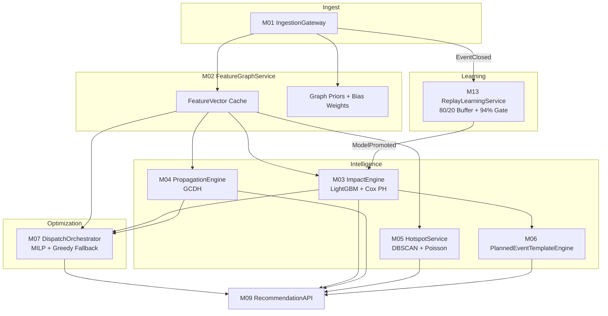
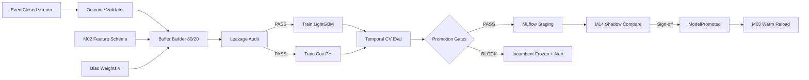
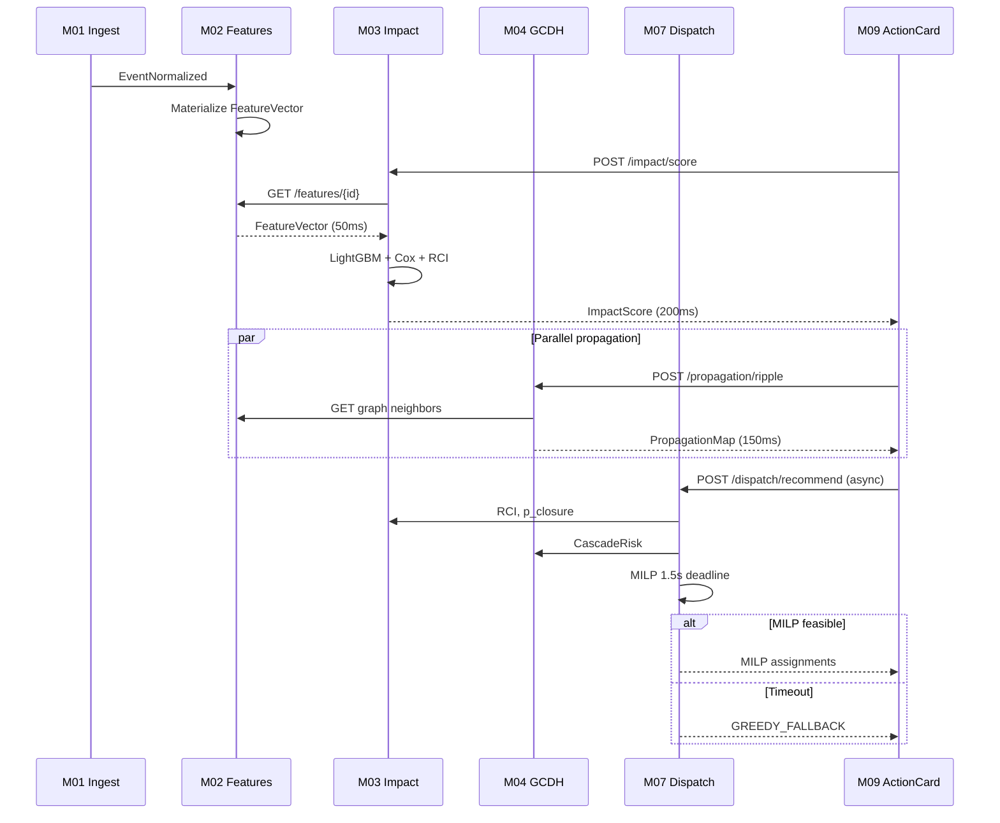

# ML Modules — Deep Implementation Guide

**Author:** Ashwary Gupta (Roll No: 23115017)  
**Version:** 1.0  
**Date:** June 2026  
**Companion PRD:** `ML_MODELS_PRD.md`  
**System:** Grid Unlocked on ASTraM, Bengaluru Traffic Police  

This document is the engineer-facing implementation reference for all machine learning modules in Grid Unlocked: **M02 FeatureGraphService**, **M03 ImpactEngine**, **M04 PropagationEngine**, **M05 HotspotService**, **M06 PlannedEventTemplateEngine**, **M07 DispatchOrchestrator ML Integration**, and **M13 ReplayLearningService**.

Read this guide alongside the parent PRD v3.0 runtime contracts. Every section assumes **leakage prevention**, **PR-AUC honest evaluation**, and **non-blocking dispatch** as non-negotiable constraints discovered in ASTraM EDA.

---

## Overview & ML Pipeline Architecture

Grid Unlocked ML sits between normalized incident ingest (M01) and human-supervised action cards (M09). The pipeline has three logical stages:

1. **Feature & Graph (M02)** — materialize leakage-safe features, bias weights, OSM centrality, corridor×cause priors.
2. **Intelligence (M03–M06)** — score impact, propagate risk, detect hotspots, pre-package planned events.
3. **Optimization & Learning (M07, M13)** — consume RCI/CascadeRisk for dispatch; retrain from closed outcomes.



### End-to-End Latency Budget (Hot Path)

| Stage | Cumulative P95 | Module |
|---|---|---|
| Ingest ACK | 350 ms | M01 |
| Feature materialization | +50 ms | M02 |
| Impact score | +200 ms | M03 |
| Propagation (parallel with M03 tail) | +150 ms | M04 |
| Dispatch (async to card skeleton) | +1.8 s total | M07 |
| **Action card skeleton** | **350 ms** | M09 |
| **Action card complete** | **1.8 s** | M09 + M07 |

Planned events (`is_planned=true`, start within 72 h) **branch to M06** and skip repeated M03 on dashboard polls.

---

## Shared Principles

### Leakage Prevention

**Golden rule:** At inference for a live incident, only use information that would have been knowable at `start_datetime`.

| Category | Safe | Unsafe |
|---|---|---|
| Timestamps | `start_datetime`, `created_date` (for reporting lag) | `end_datetime`, `closed_datetime`, `resolved_datetime` |
| Labels | Used as training target only | `requires_road_closure`, `duration` as input features |
| Workflow | `event_cause`, `is_planned`, `veh_type` | `status`, `assigned_to_police_id` |
| Severity | RCI components from priors | ASTraM `priority` as ML target |
| Spatial | lat/lon, corridor, H3 at ingest | Post-hoc `route_path` |

Every M13 training job emits a **leakage audit manifest** that asserts denylist column absence. Promotion gate G7 blocks on any violation.

### Evaluation Metrics

| Problem Type | Primary | Never Use Alone |
|---|---|---|
| Rare binary (closure 8.3%) | PR-AUC, F1-macro | Accuracy (91.7% dummy wins) |
| Survival (ICT 61.6% censored) | C-index, IBS, quantile coverage | MAE on complete cases only |
| Regression (Poisson count) | MAPE per horizon block | Single global R² |
| Ranking (dispatch) | High-RCI non-starvation, determinism | Single assignment cost |

### Phase Rollout

| Phase | ML Capability | Gate to Advance |
|---|---|---|
| **Phase 1 (MVP)** | LightGBM, Cox PH, GCDH, Haversine DBSCAN, M06 templates, 80/20 replay | 94% accuracy + PR-AUC baseline + shadow parity |
| **Phase 2** | Weather covariates, calibrated GCDH λ/k, AFT ICT fallback, monsoon anchor | Anchor stable through monsoon window |
| **Phase 3** | STGCN (optional), speed-ratio features, Hawkes hotspots | 12+ months telemetry SLO compliance |

---

## M02 — FeatureGraphService (deep)

### Purpose

M02 is the shared feature and graph statics layer. It eliminates duplicated OSM logic across M03–M07 by materializing **RCI input components**, **14–18 IST bias correction weights**, **betweenness centrality**, and **corridor×cause historical priors** into a low-latency cache. Without M02, per-request feature recomputation adds 200–400 ms and risks training-serving skew.

### Input/Output Contracts

| Direction | Name | Key Fields |
|---|---|---|
| **In** | `EventNormalized` (from M01) | `event_id`, `cause`, `corridor`, `lat`, `lon`, `is_planned`, `start_datetime`, `veh_type`, `cargo_material` |
| **In** | OSM graph (static, quarterly refresh) | nodes, edges, lane counts |
| **In** | Historical corpus (batch refresh) | corridor×cause aggregates |
| **Out** | `GET /features/{event_id}` → `FeatureVector` | See allowlist table below |
| **Out** | `GET /graph/centrality/{node_id}` | `betweenness`, `degree`, `edge_weights[]` |
| **Out** | `GET /graph/neighbors/{node_id}?hops=N` | Bounded subgraph for GCDH |
| **Out** | `GET /priors/corridor-cause/{corridor}/{cause}` | `closure_rate_30d`, `median_ict_7d` |

### Algorithm Step-by-Step

1. **Consume** `EventNormalized` from event bus; trigger async materialization.
2. **Parse temporal features** from `start_datetime` (IST):
   - `hour_ist`, `dow`, `is_weekend`, `is_peak_hour` (07–10, 17–21 IST).
   - Cyclical encoding: `hour_sin/cos`, `dow_sin/cos`.
3. **Apply bias weight lookup** from `hour_bias_weights` table:
   ```
   weight(h) = clip(median_hourly / logged_hourly, 0.5, 3.0)
   ```
   Hours 14–18 typically receive 2.5–4.0× (logged counts: 256, 93, 71, 65 vs morning peak 1,329).
4. **Snap to graph**: nearest OSM drivable node via R-tree; fetch `betweenness_norm`, `degree_norm`.
5. **Join corridor×cause priors**:
   - `corridor_cause_closure_rate_30d`
   - `corridor_cause_median_ict_7d` → `duration_prior_h`
   - `cause_median_resolution_global`
6. **Compute vehicle complexity** (RCI input, leakage-safe):
   ```
   veh_complexity = base(veh_type) + 0.4·I(cargo_material) + 0.3·I(age_of_truck>10)
   base: heavy_vehicle=1.0, truck=0.9, lcv=0.7, bmtc_bus=0.8, private_car=0.3, two_wheeler=0.2
   ```
7. **Spatial context**: H3 res7/res9 cell; `simultaneous_events_2km` from Redis geo index.
8. **Set flags**: `is_named_corridor` (structural, not severity); `has_cargo_material`; `is_heavy_vehicle`.
9. **Write** `feature:{event_id}` to Redis (TTL 24h); append to offline store for M13.

### Feature List — Allow/Deny (M02 Outputs)

| Feature | Allow | Notes |
|---|---|---|
| `hour_sin/cos`, `dow_sin/cos` | ✅ | Cyclical |
| `is_peak_hour`, `is_weekend` | ✅ | Derived from start |
| `reporting_bias_weight` | ✅ | **REQ-BIAS-001** operational safety |
| `betweenness_norm`, `degree_norm` | ✅ | OSM static |
| `corridor_cause_closure_rate_30d` | ✅ | Rolling aggregate |
| `duration_prior_h` | ✅ | Prior median ICT, not observed |
| `veh_complexity_score` | ✅ | Ingest-time vehicle attrs |
| `simultaneous_events_2km` | ✅ | Active event count |
| `is_named_corridor` | ✅ | Structural flag |
| `priority` | ❌ | 99–100% High on corridors — not severity |
| `requires_road_closure` | ❌ | Label only |
| `closed_datetime`, `duration` | ❌ | Outcome leakage |

### Hyperparameters & Rationale

| Parameter | Value | Rationale |
|---|---|---|
| Redis TTL `feature:*` | 24 h | Active incident lifetime |
| Redis TTL `centrality:*` | 30 d | Graph statics change quarterly |
| Prior rolling window (closure) | 30 d | Responsive to recent policy |
| Prior rolling window (ICT) | 7 d | Faster drift for clearance times |
| Bias weight clip | [0.5, 3.0] | Prevent extreme single-hour domination |
| H3 resolution (aggregation) | res7 (~1.2 km) | Matches hotspot layer |
| Graph refresh | Quarterly | OSM extract stability |

### Pseudocode — RCI Component Assembly

```python
def materialize_features(event: NormalizedEvent, graph: OsmGraph, priors: PriorStore) -> FeatureVector:
    t = event.start_datetime.astimezone(IST)
    hour_w = bias_weights[t.hour]  # REQUIRED for 14-18 IST correction

    node = graph.nearest_node(event.lat, event.lon)
    cc = priors.corridor_cause(event.corridor, event.cause)

    return FeatureVector(
        event_id=event.event_id,
        hour_sin=sin(2*pi*t.hour/24), hour_cos=cos(2*pi*t.hour/24),
        dow_sin=sin(2*pi*t.weekday()/7), dow_cos=cos(2*pi*t.weekday()/7),
        is_peak_hour=t.hour in PEAK_HOURS,
        is_weekend=t.weekday() >= 5,
        reporting_bias_weight=hour_w,
        betweenness_norm=graph.betweenness_norm(node),
        corridor_cause_closure_rate_30d=cc.closure_rate,
        corridor_cause_median_ict_7d=cc.median_ict_h,
        duration_prior_h=cc.median_ict_h,
        veh_complexity_score=vehicle_complexity(event),
        simultaneous_events_2km=geo_index.count_within_km(event, 2.0),
        is_named_corridor=event.corridor in NAMED_CORRIDORS,
        h3_res7=h3.latlng_to_cell(event.lat, event.lon, 7),
    )
```

### Failure Modes & Degradation

| Failure | Symptom | Degradation |
|---|---|---|
| Redis unavailable | Feature cache miss storm | Tier 2: static daily priors; skip graph neighbors |
| OSM graph stale | Wrong nearest node | Fall back to corridor centroid node |
| Prior table empty (new cause) | Null priors | Global cause median; flag `low_confidence_priors` |
| Geo index lag | Undercount simultaneous events | Use last-known count; TTL 60 s |

**Tier 3:** Cause×corridor lookup table only; no live graph queries.

### Example Walkthrough — Bengaluru Scenario

**Event:** Heavy truck breakdown on Old Airport Road at 16:30 IST Tuesday. `veh_type=heavy_vehicle`, `cargo_material=steel coils`, `requires_road_closure` unknown at start.

1. M02 receives `EventNormalized` within 350 ms of ASTraM create.
2. `hour_ist=16` → `reporting_bias_weight≈3.2` (14–18 IST under-logging correction).
3. Nearest node: ORR approach segment, `betweenness_norm=0.91`.
4. Prior: Old Airport Road × vehicle_breakdown → `duration_prior_h=0.8`, `closure_rate_30d=0.12`.
5. `veh_complexity_score=1.0+0.4=1.4` (heavy + cargo).
6. `simultaneous_events_2km=3` (rainy evening cluster).
7. Feature vector cached; M03 reads in 12 ms (cache hit).

### Tests to Write

- [ ] Training-serving skew < ε for 100 fixture events.
- [ ] `bias_weight[16] > bias_weight[10]` with documented ratio.
- [ ] ORR betweenness ranks in top-20 citywide.
- [ ] `duration_prior_h` never equals realized duration on closed events in training export.
- [ ] Cache hit rate >90% under 50 concurrent reads.
- [ ] Tier 2 serves static priors within 200 ms on forced Redis outage.
- [ ] Batch feature API returns N vectors within 50 ms × N/10 P95.
- [ ] H3 cell assignment stable across quarterly OSM refresh.
- [ ] `same_cause_corridor_7d` increments correctly when recurrence injected.
- [ ] Keyword NLP flags match regex fixture set for 50 descriptions.

---

## M02 Deep Dive — Prior Table Computation

### Rolling Prior Job (Daily 03:00 IST)

1. Scan `normalized_events` closed in last 30 days (closure rate) and 7 days (ICT).
2. Group by `(corridor, event_cause)`.
3. Compute `closure_rate = mean(requires_road_closure)`.
4. Compute `median_ict_h = median(duration_hours where event_observed)`.
5. Shrinkage for low-n strata (n<5): blend toward global cause median with weight `n/(n+10)`.
6. Write `corridor_cause_priors` version bump; invalidate M02 cache keys tagged `prior_v*`.

### Betweenness Precomputation (Quarterly)

1. Load OSM drivable graph for Bengaluru bbox (12.8–13.3, 77.3–77.8).
2. Run Brandes algorithm on largest connected component.
3. Normalize to [0,1] by max betweenness in graph.
4. Store per-node; corridor centroids inherit max node betweenness along corridor polyline.

---


### Purpose

M03 provides calibrated **closure probability**, **ICT quantile bands** (handling 61.6% right-censored data), and **live RCI aggregation** at incident creation. It replaces naive regression and ASTraM structural priority with honest imbalanced classification and survival analysis. Target latency: **≤200 ms P95** per score.

### Input/Output Contracts

| Direction | Name | Key Fields |
|---|---|---|
| **In** | `FeatureVector` (M02) | Full allowlist |
| **In** | `POST /impact/score` | `{ event_id }` or inline features |
| **Out** | `ImpactScore` | `p_closure`, `ict_p20/p50/p80`, `rci`, `severity_band`, `model_versions` |
| **Out** | `GET /impact/explain/{event_id}` | SHAP top-5 features |
| **Out** | `GET /models/versions` | Active registry versions |

### Algorithm Step-by-Step — Closure Classifier

1. **Route check**: if `is_planned` and `hours_until_start ≤ 72` and no material change → return cached M06 overlay score (skip re-inference).
2. **Load** LightGBM model from registry (warm cache).
3. **Assemble feature matrix** from M02 allowlist only; assert denylist columns absent.
4. **Predict** raw probability; apply **isotonic calibration** layer.
5. **Threshold policy**: `p_closure > 0.35` → staging recommendation flag.
6. **Log** append-only `impact_scores` row with model version.

### Algorithm Step-by-Step — ICT Survival

1. **Fit context**: Cox PH trained with partial likelihood on censored corpus.
2. **Features**: allowlist + `is_planned` (EDA: planned coefficient significant in Cox).
3. **Predict** survival curve S(t) at incident features.
4. **Invert** for quantiles:
   - `ict_p20`: t where S(t)=0.80
   - `ict_p50`: t where S(t)=0.50
   - `ict_p80`: t where S(t)=0.20
5. **AFT fallback** (Phase 2): if PH assumptions fail anchor slice, use Weibull AFT for direct quantiles.
6. **Fast causes** (vehicle_breakdown, accident): communicate narrow bands; **slow causes** (pot_holes, water_logging): wide P80 explicitly.

### Algorithm Step-by-Step — Live RCI

```
RCI = w₁·norm(log(duration_prior_h))
    + w₂·betweenness_norm
    + w₃·cascade_risk_norm        # from M04 when available; else seed from p_closure
    + w₄·p_closure_live
    + w₅·veh_complexity_score
    + w₆·norm(simultaneous_events_2km)
```

During **14:00–18:59 IST**, multiply RCI by `reporting_bias_weight` (capped) for dispatch ranking equity.

**Severity bands:**

| Band | RCI Range (calibrated) |
|---|---|
| Green | < 0.35 |
| Yellow | 0.35 – 0.55 |
| Orange | 0.55 – 0.75 |
| Red | ≥ 0.75 |

`priority_structural = is_named_corridor` is exposed for UI context only — **not** used as severity.

### Feature Allow/Deny — Closure Training

See PRD allowlist/denylist. Critical EDA note: the notebook prototype `compute_rci` used `requires_road_closure` inside RCI — **this is training leakage** and must not ship. Production RCI uses `p_closure_live` from the classifier, not the realized label.

### Hyperparameters — LightGBM

| Parameter | Value | Rationale |
|---|---|---|
| `class_weight` | `balanced` | 8.3% positive base rate |
| `is_unbalance` | `True` | LightGBM native imbalance |
| `scale_pos_weight` | 11 | ≈ (1-0.083)/0.083 |
| `pos_bagging_fraction` | tune 0.1–0.5 | Minority-focused bagging |
| `n_estimators` | 200 | EDA baseline AUC 0.988 (holdout caution: audit leakage) |
| `max_depth` | 6 | Limit rare-cause overfit |
| `learning_rate` | 0.05 | Stable |
| Calibration | Isotonic | ECE < 0.05 gate |

### Hyperparameters — Cox PH

| Parameter | Value | Rationale |
|---|---|---|
| `penalizer` | 0.01 | Mild L2 for collinear covariates |
| `l1_ratio` | 0.0 | MVP: pure L2 |
| Censoring | `closed_datetime` NA → observed=False | Retains 61.6% censored |
| Baseline | Breslow | Standard partial likelihood |

### Pseudocode — Impact Score

```python
def score_impact(event_id: str, features: FeatureVector, models: ModelBundle) -> ImpactScore:
    assert_leakage_safe(features)

    p_raw = models.closure.predict_proba(features.matrix)[0, 1]
    p_closure = models.calibrator.transform([p_raw])[0]

    surv = models.cox.predict_survival(features.matrix)
    ict_p20, ict_p50, ict_p80 = quantiles_from_survival(surv, [0.80, 0.50, 0.20])

    cascade_seed = p_closure  # updated when M04 returns
    rci = weighted_rci(features, p_closure, cascade_seed)

    if 14 <= features.hour_ist <= 18:
        rci *= min(features.reporting_bias_weight, 3.0)

    return ImpactScore(
        event_id=event_id,
        p_closure=p_closure,
        ict_p20_h=ict_p20, ict_p50_h=ict_p50, ict_p80_h=ict_p80,
        rci=rci,
        severity_band=band_from_rci(rci),
        model_versions=models.versions,
    )
```

### Failure Modes & Degradation

| Failure | Behavior |
|---|---|
| Model load failure | Tier 2: `p_closure = 0.36 if is_planned else corridor_cause_prior` |
| SHAP timeout | Omit explanation; score still returned |
| Cox numerical error | Tier 2: cause median ICT lookup |
| `vip_movement` low sample | Rule override: `p_closure = max(p_closure, 0.60)` |

**Tier 3:** Static BTP SOP templates by cause.

### Example Walkthrough — Bengaluru Scenario

**Event:** Same truck breakdown, 16:30 IST.

1. M03 receives M02 features in 12 ms.
2. LightGBM: `p_closure_raw=0.62` → calibrated `p_closure=0.58`.
3. Cox: `ict_p20=0.4h`, `ict_p50=1.1h`, `ict_p80=3.5h` (wide tail for heavy vehicle).
4. RCI = 0.71 → **Orange** band (vs ASTraM `High` priority on named corridor — structural only).
5. SHAP top-3: `veh_complexity_score`, `betweenness_norm`, `hour_ist` (bias-weighted context).
6. Total latency: 87 ms P50.

**Contrast — Planned construction 48 h ahead:** M06 already computed `p_closure=0.41` at package time; runtime dashboard read serves cached overlay — M03 not re-invoked.

### Tests to Write

- [ ] PR-AUC and F1-macro on holdout; accuracy reported but not gating alone.
- [ ] Dummy always-negative fails promotion despite ~91.7% accuracy.
- [ ] Denylist columns absent from training parquet (CI schema check).
- [ ] ECE < 0.05 on calibration fold.
- [ ] Cox recovers hazard on synthetic 60% censoring.
- [ ] P80 coverage ≥78% on held-out ICT.
- [ ] `vip_movement` rule escalation fires.
- [ ] Tier 2 rule priors <50 ms.
- [ ] Batch score 50 events <1 s P95.
- [ ] SHAP top-5 stable across 10 replay seeds for same event.
- [ ] `is_planned` at T-72h with M06 cache returns without LightGBM inference (routing mock).

---

## M03 Deep Dive — Calibration & Threshold Policy

### Isotonic Calibration Procedure

1. Train LightGBM on temporal train fold (weeks 1–3).
2. Predict probabilities on validation fold (week 4).
3. Fit isotonic regression `p_cal = f(p_raw)` monotonic non-decreasing.
4. Measure ECE on week 5 holdout; require ECE < 0.05.
5. Serialize calibrator alongside model in MLflow artifact bundle.

### Alert Threshold Ladder

| P(closure) | Commander Action | M08 Diversion | M06 Overlap |
|---|---|---|---|
| < 0.20 | Monitor | None | — |
| 0.20 – 0.35 | Patrol awareness | — | — |
| 0.35 – 0.50 | Stage barricades | Suggest if peak | — |
| 0.50 – 0.70 | Active staging + diversion prep | Auto-suggest | — |
| > 0.70 | CRITICAL queue priority | Atlas lookup | VIP always |

### Rare Cause Handling

| Cause | n (approx) | Policy |
|---|---|---|
| vip_movement | 20 | Rule floor P(closure) ≥ 0.60 |
| protest | <30 | Template + prior blend |
| hazmat | <15 | Keyword flag + manual escalation |
| pot_holes | many | Wide ICT bands; low closure |

---

## M03 — ImpactEngine (deep)

### Purpose

M04 models spatial **cascade risk** without STGCN or continuous speed telemetry. It implements the **Graph-Centrality Decay Heuristic (GCDH)** — an explainable BFS propagation over OSM edges with centrality-amplified exponential decay. Output `CascadeRisk` feeds M07 greedy fallback (δ term) and commander ripple maps. Latency: **≤150 ms P95** for 3-hop neighborhood.

### Input/Output Contracts

| Direction | Name | Key Fields |
|---|---|---|
| **In** | `POST /propagation/ripple` | `event_id`, `seed_rci` (from M03), `max_hops?`, `epsilon?` |
| **In** | M02 graph | `neighbors`, `edge_weight`, `betweenness` |
| **Out** | `PropagationMap` | `nodes[]`, `cascade_risk`, `gcdh_params` |
| **Out** | `GET /propagation/active` | All active ripple maps |
| **Out** | `GET /propagation/config` | λ, k, ε defaults |

### Algorithm Step-by-Step (GCDH)

1. **Map** event lat/lon → nearest graph node (incident seed).
2. **Initialize** `risk_0(seed) = RCI` from M03 (or `p_closure` if RCI unavailable Tier 2).
3. **BFS expansion** hop by hop up to `max_hops`:
   ```
   risk_{t+1}(v) = Σ_u risk_t(u) · edge_weight(u,v) · exp(-λ · hop) · (1 + k · betweenness(v))
   ```
4. **Prune** contributions where incremental risk < ε.
5. **Aggregate** `CascadeRisk`:
   - `max(risk)` within 2 km radius, OR
   - `sum(top_5_risks)` — configurable; default max-within-2km.
6. **Store** ephemeral map in Redis (TTL = event active duration).
7. **Return** node list with `{node_id, risk, hop, parent_edge}` for explainability.

### Feature / Parameter Table

| Symbol | Default | Range (tuning) | Meaning |
|---|---|---|---|
| λ | 0.35 | 0.2–0.5 | Hop decay |
| k | 0.15 | 0.05–0.25 | Centrality amplification |
| ε | 0.02 | 0.01–0.05 | Marginal cutoff |
| max_hops | 5 (T1), 2 (T2) | — | Latency cap |
| edge_weight | lane_count_norm | — | Capacity proxy |

### Pseudocode

```python
def gcdh_ripple(seed_node: str, seed_rci: float, graph: OsmGraph, params: GcdhParams) -> PropagationMap:
    risk = {seed_node: seed_rci}
    frontier = {seed_node: (0, seed_rci)}
    traces = []

    while frontier:
        u, (hop, r_u) = pop_min_hop(frontier)
        if hop >= params.max_hops:
            continue
        for v, edge_w in graph.neighbors(u):
            decay = exp(-params.lambda_ * (hop + 1))
            amp = 1 + params.k * graph.betweenness(v)
            delta = r_u * edge_w * decay * amp
            if delta < params.epsilon:
                continue
            risk[v] = risk.get(v, 0) + delta
            frontier[v] = (hop + 1, risk[v])
            traces.append((v, risk[v], hop + 1, (u, v)))

    cascade = max_risk_within_km(risk, seed_node, km=2.0)
    return PropagationMap(nodes=traces, cascade_risk=cascade, gcdh_params=params)
```

### Failure Modes & Degradation

| Failure | Behavior |
|---|---|
| Graph neighbor timeout | Tier 2: 2-hop static λ, no live RCI refresh |
| Seed node disconnected | Use corridor centroid fallback node |
| Redis eviction | Recompute on next request (<150 ms) |

**Tier 3:** `CascadeRisk = RCI` (single node; no propagation).

### Example Walkthrough — Bengaluru Scenario

**Event:** ORR segment blockage, RCI=0.82, 17:45 IST peak.

1. Seed: ORR-Bellandur node, `risk=0.82`.
2. Hop 1: adjacent flyover approaches receive risk ≈0.45 (high edge_weight).
3. Hop 2: Sarjapur Road junction, `betweenness=0.88` → amplified to 0.31.
4. Hop 3: marginal contributions < ε → stop.
5. `CascadeRisk=0.79` (max within 2 km).
6. M07 greedy adds δ·0.79 to assignment score for neighboring incidents.
7. Commander map shows hop traces for escalation briefing.
8. Latency: 94 ms.

### Tests to Write

- [ ] Monotonic decay: risk(hop=3) ≤ risk(hop=2) on same path.
- [ ] High-betweenness node receives more risk than leaf at same hop.
- [ ] Epsilon prevents infinite loop.
- [ ] 100 concurrent requests ≤150 ms P95.
- [ ] STGCN mock adapter passes interface contract (Phase 3 prep).
- [ ] Explainability: every node traceable to parent edge.
- [ ] Tier 2 reduces to 2-hop within latency budget.
- [ ] Seed RCI update on M03 refresh propagates on next ripple call.

---

## M04 Deep Dive — Phase 2 Calibrated Priors

Phase 2 adds `corridor_cascade_rate` from historical data:

```
P(secondary event within 2 km in 2 h | primary incident on corridor c)
```

When rate exceeds 90th percentile citywide, multiply seed RCI by `(1 + 0.2 · excess_percentile)` before GCDH expansion. Hawkes process evaluation deferred until 12+ months of timestamped data.

### Edge Weight Computation

```
edge_weight(u,v) = lane_count(u,v) / max_lane_count_corridor
```

Default lane counts from OSM `highway` tag mapping:

| OSM Class | Normalized Weight |
|---|---|
| motorway / trunk | 1.0 |
| primary | 0.85 |
| secondary | 0.65 |
| tertiary | 0.45 |
| residential | 0.25 |

---


### Purpose

M05 unifies **observed** hotspot detection (where incidents cluster now) and **predicted** hotspot forecasting (where load is expected). It prevents duplicated H3/DBSCAN logic in M09 and M15. EDA validates corridor concentration — Bellandur flyover zone (12.969, 77.701) has 65 historical events and must appear in top-10 clusters.

### Input/Output Contracts

| Direction | Name | Key Fields |
|---|---|---|
| **In** | Active events (M01) | lat, lon, cause, start_datetime |
| **In** | M02 features | H3 cells, bias weights, temporal encodings |
| **Out** | `GET /hotspots/observed` | clusters[], density, cause_entropy, h3_cells[] |
| **Out** | `GET /hotspots/predicted?horizon_hours=4` | intensity by corridor/zone |
| **Out** | `GET /hotspots/anomalies` | CUSUM alerts 24 h |
| **Out** | `GET /hotspots/cell/{h3_res7}` | cell history summary |

### Algorithm Step-by-Step — Observed (DBSCAN)

1. **Collect** active + recent (24 h) event points with weights = event count per coordinate.
2. **Project** coordinates:
   - **Preferred:** Haversine metric on radians `(lat, lon)`.
   - **Alternative:** Transform to EPSG:32643 (WGS 84 / UTM zone 43N) for Bengaluru.
3. **Run DBSCAN:**
   - `eps ≈ 500 m` (0.005 rad Haversine or 500 projected meters).
   - `min_samples = 5`.
4. **Reject** Euclidean-on-degrees — distorts N-S vs E-W in Bengaluru.
5. **Aggregate** clusters to H3 res7 cells for map layer.
6. **Compute** cluster metadata: centroid, density, cause entropy, persistence score (30-day frequency).
7. **Refresh** every 5 minutes.

### Algorithm Step-by-Step — Predicted (Poisson GLM)

1. **Train** offline on historical counts aggregated by `(corridor, hour_bin, dow, is_weekend)`.
2. **Features:** `hour_sin/cos`, `dow_sin/cos`, corridor fixed effects, `is_weekend`.
3. **Apply** M02 `reporting_bias_weight` as exposure offset or sample weight in training.
4. **Predict** `E[count]` for next 4-hour block per zone.
5. **Cache** `poisson_forecast_cache` (refresh 6 h).

### Algorithm Step-by-Step — Anomaly (CUSUM)

1. Rolling 30-min zone event rate vs 30-day baseline.
2. Alert when rate ≥ **3σ** above baseline.
3. Surface in `GET /hotspots/anomalies` for M15 dashboard.

### Hyperparameters

| Component | Parameter | Value | Rationale |
|---|---|---|---|
| DBSCAN | metric | haversine | Great-circle correctness |
| DBSCAN | eps | 0.005 rad / 500 m | Urban junction scale |
| DBSCAN | min_samples | 5 | Noise suppression |
| KMeans (zones) | k | elbow / silhouette | Beat planning boundaries |
| Poisson | link | log | Count data standard |
| Poisson | MAPE target | <25% / 4h | Operational usefulness |
| CUSUM | σ threshold | 3 | Balance false alarms |
| H3 | res7 | ~1.2 km | Dashboard aggregation |

### Failure Modes & Degradation

| Failure | Behavior |
|---|---|
| DBSCAN timeout | Return last 5-min cache |
| Poisson cache stale | Tier 2: static 24 h forecast |
| Insufficient points (<5) | Return singleton hotspots without cluster label |

**Tier 3:** Hardcoded top-10 historical BTP black spots.

### Example Walkthrough — Bengaluru Scenario

**Tuesday 18:00 IST monsoon peak:**

1. 14 active events in Bellandur–Sarjapur corridor polygon.
2. Haversine DBSCAN forms cluster centroid (12.969, 77.701), density=14, entropy=1.8 (mixed causes).
3. Cluster maps to H3 cell `88618926b3fffff`.
4. Poisson predicts +35% above baseline for next 4 h on Sarjapur Road zone.
5. CUSUM: no alert (within 2σ).
6. M09 action card includes `simultaneous_events_2km=14` context for new incident in cell.
7. Query latency: 38 ms (observed), 12 ms (predicted cache hit).

### Tests to Write

- [ ] Haversine DBSCAN silhouette >0.4; Euclidean-on-degrees test fails CI.
- [ ] Bellandur zone in top-10 clusters on historical fixture.
- [ ] Poisson MAPE <25% on 4-hour holdout blocks.
- [ ] 2 km geo query matches brute-force.
- [ ] CUSUM detects synthetic IPL spike within 30 min.
- [ ] KMeans zone boundaries stable across weekly refresh.
- [ ] Cause entropy computed correctly on mixed-cause cluster fixture.
- [ ] Predicted layer distinct from observed in API response schema.

---

## M05 Deep Dive — KMeans Zone Layer

Optional beat-planning layer atop DBSCAN:

1. Aggregate H3 res7 cells with event count ≥ threshold over 30 days.
2. Run KMeans on cell centroids weighted by count; k selected by silhouette elbow.
3. Export zone polygons as GeoJSON for M15 patrol planner overlay.
4. **Do not** use KMeans for real-time observed clusters — DBSCAN only for live layer.

---


### Purpose

M06 generates **24–72 hour impact packages** for planned events. EDA shows planned incidents are **5.5× more likely to require road closure** (36.2% vs 6.6% unplanned) while comprising only 5.7% of volume. Pre-computing packages avoids wasting runtime M03 inference on events that are predictable by corridor×cause templates. SLA: **≤10 s P95**.

### Input/Output Contracts

| Direction | Name | Key Fields |
|---|---|---|
| **In** | Planned event (M01) | `cause`, `corridor`, `start_datetime`, `end_datetime`, `lat/lon` |
| **In** | M03 impact overlay (once) | `p_closure`, `ict_p50`, `severity_band` |
| **In** | M08 diversion refs | top-k atlas paths |
| **Out** | `PlannedEventPackage` | checklist, staffing, barricades, analog_events[], diversion_refs[] |
| **Out** | `GET /planned/upcoming?hours=72` | Timeline for M15 |

### Algorithm Step-by-Step

1. **Validate** planned event: `end_datetime - start_datetime < 72h` (exclude anomalous defaults).
2. **Match template** via nearest neighbor on `(cause, corridor, dow, hour_ist, estimated_duration)`.
3. **Retrieve** top-3 historical analog events with actual outcomes (closure, ICT, resources).
4. **Call M03 once** for ML overlay unless cached package exists and attributes unchanged.
5. **Apply rules:**
   - `vip_movement` → **always** include barricade staging (60% historical closure).
   - `construction` → staffing 3–8 officers, barricade matrix by road type.
   - `procession`, `public_event`, `protest` → templates from MVP set (5 causes).
6. **Lookup** M08 diversion atlas for nearest junction; attach top-3 routes.
7. **Compute** `deployment_lead_time_hours` from cause prior.
8. **Persist** `planned_packages` artifact; serve cached reads <500 ms.

### Template Staffing Priors

| Cause | Officers | Barricades (typical) | Notes |
|---|---|---|---|
| construction | 3–8 | 4–8 (dual carriageway full closure = 8) | 66.6% of planned corpus |
| vip_movement | 8–20 | 12+ | Hard escalation rule |
| procession | 6–15 | 6–10 | Peak hour multiplier |
| public_event | 4–12 | 4–8 | Venue proximity |
| protest | 6–15 | 6–12 | Variable corridor |

### Routing Logic (Critical)

```python
def should_skip_runtime_m03(event: PlannedEvent) -> bool:
    return (
        event.is_planned
        and hours_until(event.start_datetime) <= 72
        and not event.attributes_changed_since_package
    )
```

When `True`, dashboard polls read `PlannedEventPackage.impact_overlay` — **do not** invoke M03.

### Failure Modes & Degradation

| Failure | Behavior |
|---|---|
| M03 unavailable at package time | Tier 2: corridor×cause prior `p_closure=0.36` for planned |
| M08 atlas miss | On-demand k-shortest (not on 10 s critical path if pre-indexed) |
| Template miss for rare cause | Nearest cause fallback + `low_confidence_template` flag |

**Tier 3:** Static PDF-equivalent SOP checklist per cause.

### Example Walkthrough — Bengaluru Scenario

**Event:** BBMP road construction on Mysore Road, starts Saturday 06:00, duration 48 h.

1. Coordinator submits planned event portal payload Friday 08:00 (22 h ahead).
2. M06 matches `construction × Mysore Road × Saturday × morning` template.
3. M03 overlay (once): `p_closure=0.44`, `ict_p50=18h`, Orange band.
4. Analog events: 3 historical Mysore Road construction closures returned with actual barricade counts.
5. Staffing: 6 officers; barricades: 8 (dual carriageway full closure matrix).
6. M08 diversion refs: top-3 U-turn alternatives at junction J-4412.
7. Package emitted in 4.2 s; commander timeline shows full checklist.
8. Saturday 06:05: new dashboard poll serves cached package — **zero M03 calls**.

### Tests to Write

- [ ] VIP hard rule: barricades always present.
- [ ] 10 s SLA under 20 concurrent package requests.
- [ ] Construction Mysore Road analog retrieval non-empty.
- [ ] All 5 MVP causes produce non-empty checklist.
- [ ] Runtime routing: no M03 invocation on unchanged planned event poll.

---

## M07 — DispatchOrchestrator ML Integration (deep)

### Purpose

M07 assigns police units to incidents using **MILP primary optimization** with **1.5 s hard cutoff** and **deterministic greedy fallback**. ML integration supplies **RCI**, **CorridorCentrality**, and **CascadeRisk** as ranking signals — replacing ASTraM static priority and nearest-unit heuristics. Fallback must complete in **≤120 ms P95**; total decision **≤1.8 s P95**.

### Input/Output Contracts

| Direction | Name | Key Fields |
|---|---|---|
| **In** | M02 | `RCI`, `CorridorCentrality`, features |
| **In** | M03 | `ImpactScore.rci`, `p_closure` |
| **In** | M04 | `CascadeRisk` |
| **In** | Station roster | `unit_id`, `station_id`, `equip_type`, `shift_window` |
| **Out** | `DispatchRecommendation` | `assignments[]`, `source`, `solver_ms`, `tier_at_decision` |

### Algorithm Step-by-Step — MILP Primary

1. **Build** bipartite assignment graph: units × active incidents.
2. **Objective:**
   ```
   min Σ x_{ij} · (travel_time_{ij} + α · uncovered_risk_i)
   uncovered_risk_i = f(RCI_i, p_closure_i, CascadeRisk_i)
   ```
3. **Constraints:**
   - Each incident covered ≥1 unit.
   - Each unit ≤1 incident.
   - Station capacity, shift windows.
   - Equipment compatibility: heavy breakdown → heavy_tow required.
   - Standby minimums per zone.
4. **Start** solver with **1.5 s wall-clock deadline** (cancel token).
5. If feasible solution found → `source=MILP`, return.

### Algorithm Step-by-Step — Greedy Fallback

Triggered on: MILP timeout, infeasibility, or exception.

1. **Compute** scores for all `(unit, incident)` pairs:
   ```
   score = α·ETA(unit, incident) + β·RCI(incident) + γ·Centrality(incident) + δ·CascadeRisk(incident)
   ```
2. **Heavy vehicle heuristic** (REQ-DISP-001):
   ```
   if incident.is_heavy_vehicle or incident.has_cargo_material:
       score += η · match(unit.equip, HEAVY_TOW)
   ```
   `η` default 0.5.
3. **Partial sort** via min-heap — O(n log n).
4. **Tie-break** deterministically: `station_id ASC`, `unit_id ASC`.
5. **Emit** `source=GREEDY_FALLBACK` immediately — never block UI.
6. **Log** late MILP completions but **do not overwrite** issued `recommendation_id`.

### Default Weight Configuration

| Symbol | Default | Meaning |
|---|---|---|
| α | 1.0 | Travel time (minutes) |
| β | 0.4 | RCI weight |
| γ | 0.25 | Corridor centrality |
| δ | 0.35 | Cascade risk |
| η | 0.5 | Heavy tow match boost |

During **14–18 IST**, multiply β·RCI by `reporting_bias_weight` for equity with under-logged evening incidents.

### Pseudocode — Orchestrator

```python
def recommend_dispatch(incidents, units, deadline_ms=1500) -> DispatchRecommendation:
    rid = new_recommendation_id()
    milp_future = start_milp(incidents, units, rid)

    if milp_future.wait(timeout=deadline_ms / 1000):
        sol = milp_future.result()
        if sol.feasible:
            return sol.with_source("MILP")

    greedy = greedy_assign(incidents, units, weights=DEFAULT_WEIGHTS, heavy_eta=0.5)
    publish(greedy.with_source("GREEDY_FALLBACK", rid))

    # Late MILP logged only
    attach_late_solver_callback(milp_future, rid, overwrite=False)
    return greedy
```

### Demo: ASTraM Static vs Grid Unlocked

| Incident | ASTraM Priority Rank | Grid Unlocked RCI Rank | Dispatch Difference |
|---|---|---|---|
| Named corridor fender-bender | High (structural) | Green (RCI 0.28) | Patrol car, not ORR standby |
| Non-corridor heavy truck + cargo | Low | Red (RCI 0.81) | Tow unit prioritized in fallback |
| Planned VIP 24 h ahead | High | M06 package | Pre-staged barricades, no runtime scramble |

Side-by-side M15 shadow column captures operator override for M13 feedback.

### Failure Modes & Degradation

| Failure | Behavior |
|---|---|
| MILP >1.5 s | Greedy fallback (mandatory) |
| Roster API down | Cached roster 60 s TTL; stale flag |
| M04 unavailable | δ term uses RCI-only; `CascadeRisk=RCI` |
| Tier 2 | Greedy only (MILP disabled) |
| Tier 3 | Nearest unit + RCI sort; manual multi-incident |

### Example Walkthrough — Bengaluru Scenario

**Concurrent incidents 17:50 IST:**

- **A:** Heavy truck + steel coils, ORR, RCI=0.81, CascadeRisk=0.79.
- **B:** Two-wheeler breakdown, residential side road, RCI=0.22.
- **Units:** Tow-7 (heavy), Patrol-12 (nearest to B), Patrol-3 (nearest to A).

**ASTraM static:** Both on named ORR → `High` priority; Patrol-3 assigned to A (nearest).

**Grid Unlocked:** MILP starts; exceeds 1.5 s under concurrent load → GREEDY_FALLBACK at 1.52 s.

Greedy scores:
- Tow-7 → A: low ETA penalty + high β·RCI + δ·0.79 + η·1.0 (equip match).
- Patrol-12 → B: lowest ETA.

Result: Tow-7→A, Patrol-12→B. Provenance: `GREEDY_FALLBACK`, `solver_ms=1520`.

### Tests to Write

- [ ] 100× identical input → identical greedy output.
- [ ] Forced timeout → fallback <1.5 s, provenance correct.
- [ ] Late MILP does not overwrite fallback.
- [ ] Heavy vehicle → tow unit ranked first.
- [ ] 5 concurrent high-RCI incidents assigned <1.8 s.
- [ ] Tie-breaker: equal score → lower station_id wins.
- [ ] 14–18 IST bias applied to β·RCI term.

---

## M13 — ReplayLearningService (deep)

### Purpose

M13 governs **weekly batch retraining** with an **80/20 replay buffer** (recent + stratified historical anchor) to prevent overfitting on festival spikes, election surges, and weather anomalies. It enforces the **94% accuracy promotion gate**, PR-AUC non-regression, anchor stability, and leakage audits before any model reaches production via M03 warm reload.

### Input/Output Contracts

| Direction | Name | Key Fields |
|---|---|---|
| **In** | `EventClosed` (M01) | `closed_datetime`, `requires_road_closure`, resources used |
| **In** | M02 feature definitions | versioned schema |
| **In** | M09 override codes | `MODEL_DISAGREE`, etc. |
| **Out** | `POST /learning/retrain` | job trigger |
| **Out** | `GET /learning/buffer/manifest/{job_id}` | 80/20 stats, strata table |
| **Out** | `GET /learning/eval/{job_id}` | accuracy, PR-AUC, F1-macro, anchor metrics |
| **Out** | `POST /learning/promote/{version}` | requires M14 sign-off |
| **Out** | Event `ModelPromoted` | triggers M03 reload |

### Algorithm Step-by-Step — Buffer Construction

1. **Collect** all incidents closed in rolling **4-week** window → `recent_pool`.
2. **Sample** `0.8 × |recent_pool|` stratified by `corridor × cause × peak × is_planned`.
3. **Draw** `0.2 × total` from **anchor_pool** (min 1,500 records, refreshed monthly) with same stratification.
4. **Attach** `sample_weight = reporting_bias_weight` from M02 (14–18 IST correction).
5. **Validate** composition: 80% ± 0.5% recent; all 22 corridors represented or documented exception.
6. **Emit** `ReplayBufferManifest` with leakage audit (denylist scan).

### Algorithm Step-by-Step — Training

1. **Closure model:** LightGBM with `class_weight=balanced`, `is_unbalance=True`, tune `pos_bagging_fraction`.
2. **Validation:** temporal CV (no shuffle); report **PR-AUC**, **F1-macro**, accuracy (informational only).
3. **ICT model:** Cox PH on same buffer with censored loss; optional AFT if PH fails anchor slice.
4. **Calibrate** closure probabilities (isotonic).
5. **Compare** to incumbent on governance slice + anchor slice.

### Algorithm Step-by-Step — Promotion Evaluation

| Gate | Check |
|---|---|
| G1 | accuracy ≥ 94% on governance slice |
| G2 | PR-AUC ≥ incumbent − 0.01 |
| G3 | F1-macro ≥ incumbent − 0.02 |
| G4 | anchor accuracy Δ ≤ 1.5 pp |
| G5 | ECE < 0.05 |
| G6 | shadow stability (M14) |
| G7 | leakage audit PASS |
| G8 | 80/20 composition PASS |

If any fail → `promotion_decision=BLOCK`; incumbent remains production.

### Replay Buffer Policy (Authoritative)

```
total_buffer = recent_sample(0.8) ∪ anchor_sample(0.2)
strata = corridor × cause × is_peak_hour × is_planned
recent_window = 4 weeks
anchor_min_size = 1,500
bias_weights = M02 hour_bias_weights version pinned in manifest
```

### Hyperparameters — Retrain DAG

| Parameter | Value | Rationale |
|---|---|---|
| Schedule | Weekly Sunday 02:00 IST | Low TMC load |
| Drift trigger | KS-test on hour_ist, p<0.01 | Detect reporting regime change |
| ε (anchor tolerance) | 1.5 pp accuracy | Anti-catastrophic-forgetting |
| MLflow experiment | `grid-unlocked-m03` | Version lineage |
| Eval runtime budget | <30 min | Ops acceptance |

### Pseudocode — Retrain Job

```python
def retrain_job(trigger: str) -> ReplayBufferManifest:
    recent = fetch_closed(since=weeks_ago(4))
    anchor = fetch_anchor_pool(min_size=1500)
    buffer = sample_80_20(recent, anchor, strata=STRATA_KEYS)
    buffer["sample_weight"] = buffer["hour_ist"].map(bias_weights)

    assert_no_denylist_columns(buffer.features)
    assert_composition(buffer, recent_pct=0.8, tol=0.005)

    closure_model = train_lightgbm(buffer, class_weight="balanced", is_unbalance=True)
    ict_model = train_cox_ph(buffer, censored_col="event_observed")

    metrics = evaluate(closure_model, ict_model, governance_slice, anchor_slice)
    decision = promotion_gates(metrics, incumbent=registry.production())

    log_mlflow(closure_model, ict_model, metrics)
    return manifest(buffer, metrics, decision)
```

### Failure Modes & Degradation

| Failure | Behavior |
|---|---|
| Insufficient recent closes | Extend window to 6 weeks; alert analyst |
| Anchor stratum empty | Merge adjacent corridor bucket; document exception |
| Eval timeout | No promotion; incumbent frozen |
| M14 unavailable | Promotion blocked (fail closed) |

**Tier 3:** Frozen model; manual retrain after recovery.

### Example Walkthrough — Bengaluru Scenario

**Post-Dussehra week:** recent pool inflated by festival incidents.

1. M13 job `job_2026w24` triggered Sunday 02:00.
2. Recent pool: 412 closes; anchor: 1,500 historical.
3. Buffer: 329 recent (80.0%) + 83 anchor (20.0%) — PASS G8.
4. Strata: all 22 corridors present; `vip_movement` n=4 in anchor (documented).
5. Bias weights v3 applied; hour 16 weight=3.2.
6. Leakage audit: denylist scan PASS.
7. Metrics: accuracy=94.4%, PR-AUC=0.91, F1-macro=0.88, anchor accuracy Δ=+0.3 pp.
8. Shadow (M14): 0 critical regressions over 14-day window.
9. Promotion: **PASS** → `ModelPromoted` → M03 warm reload in 8 s.

**Counter-example blocked:** recent accuracy 95.1% but anchor dropped 3.2 pp → **BLOCK G4**.

### Tests to Write

- [ ] 80/20 ±0.5% every manifest.
- [ ] Anchor regression blocks promotion.
- [ ] PR-AUC regression blocks despite accuracy pass.
- [ ] Denylist column injection fails CI.
- [ ] Censoring: 60% synthetic censoring beats drop baseline.
- [ ] KS drift trigger fires on injected hour shift.
- [ ] `ModelPromoted` triggers M03 reload within SLA.

---

## Model Artifact Registry

| Artifact | Format | Registry | Consumers | Refresh |
|---|---|---|---|---|
| `closure_lgbm_v*` | LightGBM text + isotonic pkl | MLflow | M03 | Weekly M13 |
| `ict_cox_ph_v*` | lifelines pickle | MLflow | M03 | Weekly M13 |
| `gcdh_params_v*` | JSON λ,k,ε | PostgreSQL | M04 | Phase 2 calibration |
| `hour_bias_weights_v*` | CSV hour→weight | PostgreSQL | M02, M13 | Monthly |
| `corridor_cause_priors_v*` | Parquet | PostgreSQL | M02 | Daily |
| `poisson_hotspot_v*` | statsmodels pickle | Object store | M05 | 6 h |
| `planned_templates_v*` | JSON + embeddings | PostgreSQL | M06 | Per cause release |
| `diversion_atlas_*` | Precomputed paths | PostGIS | M06, M08 | Weekly |

**Lifecycle:** `staging → production → archived`. Only one production closure + ICT pair active. Rollback = promote previous archived version via M14.

---

## Training Pipeline DAG



### DAG Schedule

| Job | Cron | Duration | Owner |
|---|---|---|---|
| `buffer_build` | Sun 02:00 | 5 min | M13 |
| `closure_train` | Sun 02:10 | 8 min | M13 |
| `ict_train` | Sun 02:20 | 10 min | M13 |
| `eval_gates` | Sun 02:35 | 15 min | M13 |
| `prior_refresh` | Daily 03:00 | 3 min | M02 |
| `hotspot_retrain` | Every 6 h | 4 min | M05 |
| `bias_weight_refit` | Monthly 1st | 2 min | M02 |

---

## Inference Latency Budgets

| Module | Operation | P50 Target | P95 Contract | P99 Alert |
|---|---|---|---|---|
| M02 | Feature cache hit | 8 ms | 50 ms | 120 ms |
| M02 | Feature cache miss | 45 ms | 200 ms | 400 ms |
| M03 | Single score | 40 ms | 200 ms | 350 ms |
| M03 | Batch 50 | 200 ms | 1000 ms | 1500 ms |
| M04 | 3-hop GCDH | 35 ms | 150 ms | 250 ms |
| M05 | Observed hotspots | 20 ms | 100 ms | 200 ms |
| M05 | Predicted (cached) | 5 ms | 200 ms | 400 ms |
| M06 | Package (cold) | 2 s | 10 s | 15 s |
| M06 | Package (cached) | 50 ms | 500 ms | 1 s |
| M07 | MILP attempt | 800 ms | 1500 ms hard | — |
| M07 | Greedy fallback | 15 ms | 120 ms | 200 ms |
| M07 | Total decision | 900 ms | 1800 ms | 2500 ms |

**Non-blocking rule:** M09 skeleton at 350 ms includes M02+M03+M04+M05; M07 dispatch section streams async up to 1.8 s.

---

## Hackathon MVP Checklist

### Data & EDA Validation

- [ ] ASTraM corpus loaded: 8,173 incidents, 8.3% closure rate confirmed.
- [ ] Priority cross-tab exported: named corridor 99.9% High vs non-corridor 0% — documents REQ-RCI-001.
- [ ] Planned vs unplanned closure: 36.2% vs 6.6% — documents REQ-PLAN-001.
- [ ] Hourly counts 14–17 IST: 256/93/71/65 — bias weights computed.
- [ ] ICT censoring 61.6% — Cox PH path validated.

### M02 MVP

- [ ] FeatureVector API live with Redis cache.
- [ ] Bias weights v1 loaded; hour 16 weight > hour 10.
- [ ] Corridor×cause priors for all 22 corridors.
- [ ] Training-serving skew test green.

### M03 MVP

- [ ] LightGBM closure model with balanced weights + isotonic calibration.
- [ ] PR-AUC + F1-macro on holdout reported in eval dashboard.
- [ ] Cox PH ICT quantiles P20/P50/P80.
- [ ] Live RCI without `priority` or realized closure in formula.
- [ ] SHAP explain endpoint for demo.

### M04 MVP

- [ ] GCDH ripple endpoint with explainability traces.
- [ ] CascadeRisk feeds M07 greedy δ term.
- [ ] STGCN **not** deployed.

### M05 MVP

- [ ] Haversine DBSCAN observed layer.
- [ ] Bellandur in top-10 validation.
- [ ] Poisson 4-hour forecast cached.
- [ ] Euclidean-on-degrees rejected in CI.

### M06 MVP

- [ ] 5 cause templates (construction, public_event, procession, vip_movement, protest).
- [ ] VIP hard barricade rule.
- [ ] 72 h timeline endpoint.
- [ ] Planned routing skips redundant M03 polls.

### M07 MVP

- [ ] MILP with 1.5 s cutoff demonstrated.
- [ ] GREEDY_FALLBACK with RCI + CascadeRisk + heavy vehicle boost.
- [ ] Provenance on every `DispatchRecommendation`.
- [ ] Side-by-side ASTraM priority vs RCI demo script rehearsed.

### M13 MVP

- [ ] 80/20 buffer manifest generator.
- [ ] 94% gate enforced in promotion script.
- [ ] Leakage audit in training DAG.
- [ ] At least one blocked promotion scenario documented (anchor regression).

### Demo Day

- [ ] Shadow mode ON; no automated actuation.
- [ ] Commander dashboard: hotspots + ripple + action card skeleton <350 ms.
- [ ] Forced MILP timeout drill successful.
- [ ] Planned construction package <10 s live demo.
- [ ] Model version stamps visible on all scores.

---

## Appendix A — Severity Derivation (Priority Replacement)

ASTraM `priority` field encodes **dispatch routing rules**, not predicted impact:

| Corridor Type | High Priority Rate |
|---|---|
| Named corridor | 99.9% |
| Non-corridor / missing | ~0% |

Grid Unlocked **adjusted severity** mapping:

```
adjusted_severity = severity_band(RCI(p_closure, duration_prior, centrality, cascade, veh_complexity))
```

Never train a classifier with `priority` as label or feature for closure/ICT.

---

## Appendix B — Corridor×Cause Template Seeds (M06)

Top combinations by closure rate from EDA (minimum n≥4 for templates):

| Corridor | Cause | n | Closure Rate | Median ICT |
|---|---|---|---|---|
| Old Madras Road | public_event | 4 | High | — |
| Mysore Road | construction | many | Moderate | 18h class |
| ORR segments | vehicle_breakdown | many | Low | 0.7h |
| Various | vip_movement | 20 | 60% | Variable |

Templates interpolate when exact corridor×cause sparse.

---

## Appendix C — Glossary

| Term | Definition |
|---|---|
| **RCI** | Recovery Complexity Index — composite operational severity |
| **GCDH** | Graph-Centrality Decay Heuristic — Phase 1/2 propagation |
| **ICT** | Incident Clearance Time — hours to close |
| **PR-AUC** | Area under precision-recall curve — primary closure metric |
| **Anchor pool** | Stratified historical sample preventing catastrophic forgetting |
| **Shadow mode** | Parallel AI recommendations without actuation |
| **Structural priority** | ASTraM `priority` driven by corridor naming, not ML |

---

## Appendix D — M02/M03 Integration Sequence Diagram



---

## Appendix E — M13 Training Data Schema

```sql
-- Replay buffer row (conceptual)
CREATE TABLE replay_buffer_row (
    event_id          TEXT PRIMARY KEY,
    split_type        TEXT CHECK (split_type IN ('recent', 'anchor')),
    stratum_key       TEXT,  -- corridor|cause|peak|planned
    sample_weight     FLOAT, -- reporting_bias_weight
  -- Features: allowlist columns only
    hour_sin          FLOAT,
    hour_cos          FLOAT,
    corridor_enc      INT,
    cause_enc         INT,
    planned           BOOLEAN,
    betweenness_norm  FLOAT,
    veh_complexity_score FLOAT,
    reporting_bias_weight FLOAT,
  -- Labels
    requires_road_closure BOOLEAN,
    duration_hours    FLOAT,      -- target for ICT only
    event_observed    BOOLEAN,    -- 1 if closed_datetime present
    feature_schema_version TEXT,
    bias_weight_version TEXT
);
```

**Denylist enforcement:** CI job runs `SELECT column_name FROM replay_features EXCEPT allowlist` → must return empty set.

---

## Appendix F — LightGBM Training Script Reference (M13)

```python
import lightgbm as lgb
from sklearn.calibration import CalibratedClassifierCV
from sklearn.metrics import average_precision_score, f1_score

def train_closure_model(X_train, y_train, sample_weight, X_val, y_val):
  base = lgb.LGBMClassifier(
      n_estimators=200,
      max_depth=6,
      learning_rate=0.05,
      class_weight="balanced",
      is_unbalance=True,
      pos_bagging_fraction=0.3,  # tune 0.1-0.5
      subsample=0.8,
      colsample_bytree=0.8,
      random_state=42,
      verbose=-1,
  )
  base.fit(X_train, y_train, sample_weight=sample_weight)

  calibrated = CalibratedClassifierCV(base, method="isotonic", cv="prefit")
  calibrated.fit(X_val, y_val)

  y_prob = calibrated.predict_proba(X_val)[:, 1]
  pr_auc = average_precision_score(y_val, y_prob)
  y_pred = calibrated.predict(X_val)
  f1_macro = f1_score(y_val, y_pred, average="macro")
  accuracy = (y_pred == y_val).mean()  # informational only

  return calibrated, {"pr_auc": pr_auc, "f1_macro": f1_macro, "accuracy": accuracy}
```

**Promotion rule:** `pr_auc >= incumbent - 0.01 AND f1_macro >= incumbent - 0.02 AND accuracy >= 0.94 on governance slice`.

---

## Appendix G — Cox PH Training Reference (M13)

```python
from lifelines import CoxPHFitter

def train_ict_cox(df, feature_cols, duration_col="duration_hours", event_col="event_observed"):
  cox = CoxPHFitter(penalizer=0.01)
  train_df = df[feature_cols + [duration_col, event_col]].dropna()
  cox.fit(train_df, duration_col=duration_col, event_col=event_col)
  return cox

def quantiles_from_cox(cox, row, quantiles=(0.80, 0.50, 0.20)):
  surv = cox.predict_survival_function(row)
  times = surv.index.values
  probs = surv.values.flatten()
  return [times[np.searchsorted(-probs, -q)] for q in quantiles]
```

**Never drop** rows with `event_observed=0` — they carry partial likelihood information.

---

## Appendix H — DBSCAN Implementation Reference (M05)

```python
import numpy as np
from sklearn.cluster import DBSCAN

EARTH_RADIUS_M = 6_371_000

def dbscan_haversine_meters(coords_deg, eps_meters=500, min_samples=5):
  """coords_deg: (N, 2) array of [lat, lon] in degrees."""
  coords_rad = np.radians(coords_deg)
  # sklearn haversine metric: eps in radians
  eps_rad = eps_meters / EARTH_RADIUS_M
  labels = DBSCAN(
      eps=eps_rad,
      min_samples=min_samples,
      metric="haversine",
      algorithm="ball_tree",
  ).fit_predict(coords_rad)
  return labels

# Alternative: EPSG:32643 projection for Bengaluru
# from pyproj import Transformer
# transformer = Transformer.from_crs("EPSG:4326", "EPSG:32643", always_xy=True)
# x, y = transformer.transform(lons, lats)
# DBSCAN(eps=500, min_samples=5).fit(np.column_stack([x, y]))
```

**Forbidden pattern:**

```python
# DO NOT USE — treats degrees as Euclidean units
DBSCAN(eps=0.005).fit(coords_deg)  # without metric='haversine'
```

---

## Appendix I — M07 Travel Time Matrix

Precomputed offline for MVP:

| Source | Target | Method | Refresh |
|---|---|---|---|
| Station coords (54) | Corridor centroids (22) | OSM shortest path | Weekly |
| Unit GPS (if available Phase 2) | Incident lat/lon | Live routing | 60 s cache |

Matrix dimensions: 54 × 22 = 1,188 baseline pairs; expand for active units at runtime.

Greedy ETA uses same matrix; MILP uses full unit×incident slice for active sets only.

---

## Appendix J — Per-Cause ICT Priors (EDA Seeds)

| Cause | Median ICT (hours) | Closure tendency | M03 notes |
|---|---|---|---|
| vehicle_breakdown | 0.7 | Low | Narrow P20-P50 bands |
| accident | 1.2 | Moderate | Fast response path |
| pot_holes | 32.1 | Low | Wide P80 mandatory |
| water_logging | 18.0 | Moderate | Monsoon anchor stratum |
| construction | 18.0+ | High (planned) | M06 primary |
| vip_movement | Variable | 60% closure | Rule escalation |
| public_event | Variable | Context-dependent | Template-driven |
| procession | 4.0 | Moderate-high | M06 template |
| protest | Variable | Moderate | M06 template |

Use as Tier 2/3 fallbacks when Cox model unavailable.

---

## Appendix K — M06 Barricade Count Matrix

| Road Type | Closure Type | Barricades | Notes |
|---|---|---|---|
| Single carriageway | Partial lane | 2–4 | Standard deployment |
| Single carriageway | Full closure | 4–6 | U-turn management |
| Dual carriageway | Partial lane | 4–6 | Median access |
| Dual carriageway | Full closure | 8 | Both directions |
| Flyover | Full closure | 10–12 | Approach ramps |
| VIP route | Movement | 12–20 | M06 hard rule |

---

## Appendix L — Integration Test Scenarios (End-to-End)

### Scenario L1 — Unplanned Evening Heavy Vehicle

| Step | Module | Assertion |
|---|---|---|
| 1 | M01 | Event ingested <350 ms |
| 2 | M02 | bias_weight(16) > 2.5 |
| 3 | M03 | p_closure > 0.35; RCI Orange+ |
| 4 | M04 | CascadeRisk > 0.5 on ORR seed |
| 5 | M07 | Tow unit assigned in fallback |
| 6 | M09 | Card skeleton <350 ms; complete <1.8 s |

### Scenario L2 — Planned Construction 48h Ahead

| Step | Module | Assertion |
|---|---|---|
| 1 | M01 | is_planned=true |
| 2 | M06 | Package <10 s |
| 3 | M03 | Called once at package time only |
| 4 | M09 | Dashboard poll uses cached overlay |
| 5 | M15 | Timeline shows 72h entry |

### Scenario L3 — Promotion Blocked

| Step | Module | Assertion |
|---|---|---|
| 1 | M13 | Buffer 80/20 PASS |
| 2 | M13 | Recent accuracy 95.1% |
| 3 | M13 | Anchor dropped 3.2 pp |
| 4 | M14 | Promotion BLOCKED |
| 5 | M03 | Incumbent model still serving |

### Scenario L4 — Leakage CI Failure

| Step | Module | Assertion |
|---|---|---|
| 1 | M13 | Engineer adds `duration_hours` to features |
| 2 | M13 | Leakage audit FAIL |
| 3 | M14 | Promotion auto-BLOCK |
| 4 | Alert | Pager to ML engineer |

---

## Appendix M — Monitoring & Alerting (ML Modules)

| Alert | Condition | Module | Severity |
|---|---|---|---|
| `m03_latency_p95_high` | >200 ms for 5 min | M03 | Warning |
| `m03_model_load_fail` | registry miss | M03 | Critical → Tier 2 |
| `m07_milp_timeout_rate` | >50% for 15 min | M07 | Warning |
| `m07_greedy_p95_high` | >120 ms | M07 | Warning |
| `m13_promotion_blocked` | gate fail | M13 | Info |
| `m02_cache_hit_low` | <80% for 10 min | M02 | Warning |
| `m05_dbscan_empty` | 0 clusters with >10 events | M05 | Info |
| `closure_pr_auc_drop` | shadow PR-AUC -0.05 vs incumbent | M03 | Critical |

---

## Appendix N — Configuration YAML Reference (M07 Weights)

```yaml
dispatch:
  milp:
    deadline_ms: 1500
    alpha_uncovered_risk: 1.0
  greedy:
    alpha_eta: 1.0
    beta_rci: 0.4
    gamma_centrality: 0.25
    delta_cascade: 0.35
    eta_heavy_tow: 0.5
    tie_breaker: [station_id, unit_id]
  bias:
    apply_rci_multiplier_hours: [14, 15, 16, 17, 18]
    max_bias_multiplier: 3.0
```

Tunable via M14 governance console without redeploy.

---

## Appendix O — FAQ for Implementers

**Q: Can we use ASTraM priority as a feature if we also use RCI?**  
A: No. Priority is structurally determined by corridor naming (99–100% High). It adds no causal signal and confuses severity interpretation.

**Q: Why not accuracy for closure model selection?**  
A: 8.3% positive rate means a constant-negative classifier achieves ~91.7% accuracy. PR-AUC and F1-macro expose real discrimination.

**Q: Why Haversine for DBSCAN?**  
A: One degree latitude ≈ 111 km but longitude in Bengaluru ≈ 96 km at 13°N. Euclidean on raw degrees anisotropically distorts cluster shapes.

**Q: When does M03 run for planned events?**  
A: Once at M06 package generation (or on material attribute change). Not on every dashboard refresh within 72 h window.

**Q: What happens if MILP finishes at 1.52 s?**  
A: Greedy fallback already issued at 1.5 s. Late MILP result logged to audit but does not overwrite `recommendation_id`.

**Q: Can we train closure model with `rci_score` from EDA notebook?**  
A: No. The notebook prototype adds `requires_road_closure` inside RCI — that is label leakage. Production RCI uses `p_closure_live` from the classifier.

**Q: Is STGCN ever used in MVP?**  
A: No. GCDH only until Phase 3 telemetry SLO gate passes.

**Q: What is the 94% gate measuring?**  
A: Accuracy on a governance-approved operational validation slice (stratified, representative). It complements PR-AUC, not replaces it.

**Q: How does M17 citizen reporting use M03?**  
A: M17 builds a provisional `FeatureVector` from GPS-snapped corridor/junction + keyword `cause_hint`, then calls M03 for `ict_p50`/`ict_p80` and `p_closure` before the report is commander-verified. Low `cause_confidence` widens ICT bands. Verified reports with commander-adjusted cause feed M13; unverified reports are excluded from training.

**Q: Can we train photo cause classification from ASTraM CSV?**  
A: No. `map_file` is 100% null. MVP uses keyword `cause_hint`; vision models require a new labeled citizen corpus post-launch.

---

## Appendix P — Version History

| Version | Date | Author | Changes |
|---|---|---|---|
| 1.0 | June 2026 | Ashwary Gupta (23115017) | Initial deep implementation guide for M02–M07, M13 |

---

*End of ML Modules Deep Implementation Guide v1.0*
