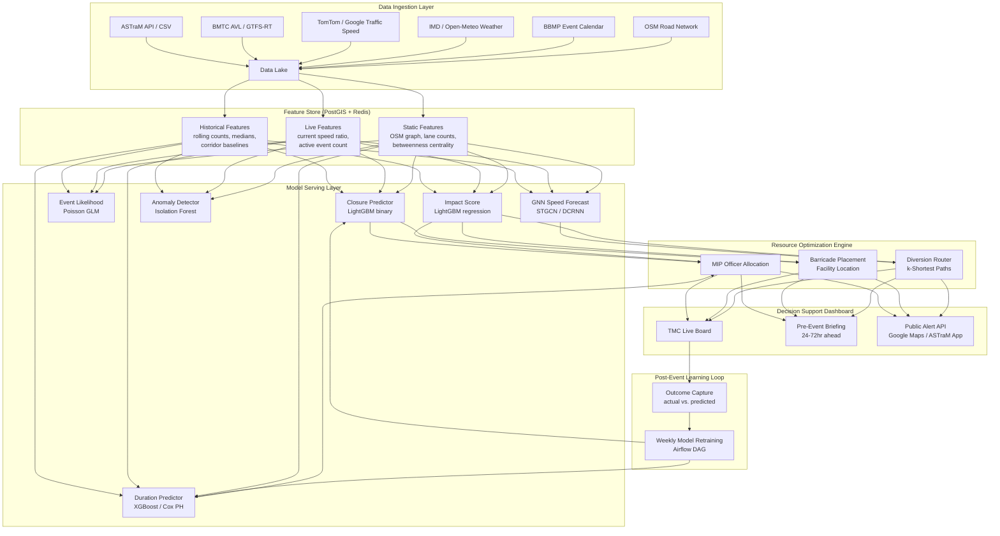

# Traffic Analysis Research Plan: Event-Driven Congestion Prediction & Resource Optimization

**System:** ASTraM (Actionable Intelligence for Sustainable Traffic Management) — Bengaluru Traffic Police  
**Dataset:** Astram event data (anonymized operational log, Nov 2023 – Apr 2024)  
**Last Updated:** June 16, 2026  
**Document Version:** 2.0 — Deep Research Edition  
**Scope:** Multi-target ML system for event-driven traffic impact prediction, real-time resource optimization, and decision support for the Bengaluru Traffic Police

---

## Section 1: Executive Summary

### 1.1 The Problem

Bengaluru — India's technology capital and the world's sixth most congested city — hosts over 12 million registered vehicles on a road network built for a fraction of that load. The Bengaluru Traffic Police (BTP) manages this using ASTraM, an AI-backed platform launched in January 2024 by Arcadis in partnership with IISc and IEEE Foundation. ASTraM integrates feeds from 9,000 police cameras, cab aggregators, map service providers, and a field officer mobile app (BOT).

Despite these capabilities, critical operational decisions remain experience-driven rather than data-driven:

| Sub-Challenge                          | Current State                                                                | Cost of Status Quo                                                                 |
| -------------------------------------- | ---------------------------------------------------------------------------- | ---------------------------------------------------------------------------------- |
| **1. Event impact estimation**         | Officers estimate disruption by experience; no quantitative severity scoring | Systematic under/over-deployment of resources per event                            |
| **2. Closure and barricade decisions** | Rule-of-thumb by event type                                                  | 8.3% of events require closure but deployment is not pre-staged                    |
| **3. Resolution time expectation**     | No ETA to traffic normalization                                              | Emergency vehicle routing impaired; public alerts imprecise                        |
| **4. Planned event preparation**       | Manual per-event briefings; no ML-assisted impact templates                  | VIP movements (median 20/month), public events, processions cause cascading delays |
| **5. Resource load balancing**         | Zone-level manual shift planning                                             | No shift-level officer load prediction; hot corridors understaffed at peak         |

### 1.2 What the Dataset Enables vs. What Is Missing

**The Astram event dataset is an operational incident log — not a traffic telemetry stream.** This distinction is critical:

**What it enables (with engineered features):**

- Classification of event type, cause, and priority at time of creation
- Prediction of whether road closure will be required (binary, 8.3% base rate)
- Regression of resolution/closure time (median 52 min for vehicle breakdowns; 32 hours for potholes)
- Spatial hotspot identification by corridor, junction, and police station jurisdiction
- Historical pattern features: rolling event density, cause×corridor rates, officer workload
- NLP feature extraction from multilingual (English + Kannada) `description` field
- Planned-event impact templates by event cause and corridor combination

**What requires external data joins before it is possible:**

- Speed/volume before-during-after (needs TomTom, INRIX, Google Maps, or BMTC AVL)
- Congestion severity in delay-minutes (needs speed baseline)
- Diversion effectiveness (needs road network graph + speed data)
- Manpower optimization (needs deployment records — `assigned_to_police_id` 98.4% missing)
- Weather-event correlations (needs IMD or OpenWeatherMap)

### 1.3 Key Hypotheses to Test

1. **H1 — Cause × Corridor predicts resolution time**: Vehicle breakdowns on Mysore Road resolve 3× faster than waterlogging on ORR East (hypothesis from medians in data: breakdown median 0.7h vs. waterlogging 14.1h).
2. **H2 — Priority is corridor-driven, not cause-driven**: All named corridor events are 99–100% High priority; Non-corridor events show 0% High. Corridor membership is the dominant priority signal.
3. **H3 — Planned events have 5.5× higher closure rate**: Planned events close roads 36.2% of the time vs. 6.6% for unplanned — but only 5.7% of events are planned. A "planned event alert" system would flag 95% of high-closure events from just 6% of records.
4. **H4 — Description NLP extracts severity signals**: The `description` field contains Kannada (e.g., "ಊರ್ವಶಿ ಜಂಕ್ಷನ್ ನಲ್ಲಿ…"), English, and mixed-language entries with severity keywords. mBERT embeddings should significantly improve closure and duration predictions.
5. **H5 — IST hour distribution indicates shift-reporting rather than incident-occurrence bias**: Events peak at 01:00–03:00 IST (night shift reporting window) and 10:00–11:00 IST, not at true congestion peak hours (08:00–10:00 IST). This bias must be explicitly modeled.

### 1.4 Expected Impact Metrics (if deployed at full integration)

| Metric                                   | Baseline (current)             | Target (ML-assisted)                        | Evidence Basis                                    |
| ---------------------------------------- | ------------------------------ | ------------------------------------------- | ------------------------------------------------- |
| Closure pre-staging accuracy             | Experience-based (~40% recall) | >75% precision at 80% recall                | Binary classifier on 8.3% base rate               |
| Resolution ETA accuracy (±30 min)        | Not measured                   | >65% for vehicle incidents                  | Sydney study: XGBoost F1=0.62 at 30-min threshold |
| Pre-event barricade deployment lead time | 0 hours (reactive)             | 24–72 hours for planned events              | Rule-based calendar + ML severity scoring         |
| Officer shift load prediction error      | Not measured                   | <15% MAE vs. actual event count             | Poisson regression benchmarks                     |
| Ambulance corridor clearance time        | Not measured systematically    | -25% via prioritized green corridor routing | Bengaluru MDT projection: 30% improvement         |

---

## Section 2: Dataset Deep Dive

### 2.1 Dataset Provenance & Context

**What is ASTraM?**

ASTraM — Actionable Intelligence for Sustainable Traffic Management — is an AI-driven traffic management platform developed for the Bengaluru Traffic Police (BTP) by Arcadis, with participation from IISc (Indian Institute of Science, Centre for Cyber-Physical Systems) and IEEE Foundation. It was formally launched in January 2024 as part of Road Safety Awareness Week.

The system addresses a long-standing gap: BTP had no centralized, real-time situational awareness tool. Before ASTraM, field officers phoned incidents to the Traffic Management Center (TMC) and maps were updated manually. The platform now provides:

- **Congestion alerts** using AI prediction models
- **Incident reporting via BOT** (mobile app for authorized field reporters)
- **Special event management** (spatial planning log for processions, VIP movements, rallies)
- **e-Path** (ambulance green corridor system — alerts control room when ambulance stuck >120 seconds)
- **Dashboard analytics** for shift supervisors and the TMC
- **Public citizen app** (violations reporting, fines payment, real-time congestion alerts)

The BTP has also floated a tender (estimated ₹1 crore) for a **Mobility Digital Twin** under Bengaluru City Road Safety initiative — a behavioral modeling + dynamic infrastructure mapping system that would further extend ASTraM's predictive capabilities.

**How the data in this CSV was collected:**

- Field traffic officers and BOT app users log incidents via the BOT mobile application
- Incidents are created as "events" with location (lat/lon, address), cause, priority
- The TMC monitors events and logs modifications, closures, and resolutions
- Data is exported as anonymized records (officer IDs replaced with FKUSR codes; vehicle numbers as FKN codes; event IDs as FKID codes)
- Geographic knowledge graph IDs (`kgid`) link events to a spatial entity registry

**Quality controls visible in the data:**

- `authenticated = yes/no` flag (whether the incident was verified by an authorized source)
- `status` field tracks lifecycle: active → resolved → closed
- `created_by_id` and `last_modified_by_id` provide audit trail
- Multiple timestamp fields (created, start, modified, closed, resolved) allow cross-validation

### 2.2 Complete Column-by-Column Analysis

| Column                  | Type      | Non-Null | Null Rate | Unique | Sample Values                                         | Predictive Potential        | Engineering Actions                                  |
| ----------------------- | --------- | -------- | --------- | ------ | ----------------------------------------------------- | --------------------------- | ---------------------------------------------------- |
| `id`                    | string    | 8,173    | 0%        | 8,173  | FKID000000                                            | None                        | Join key only                                        |
| `event_type`            | string    | 8,173    | 0%        | 2      | planned, unplanned                                    | **High**                    | Binary encode; `is_planned` flag                     |
| `latitude`              | float     | 8,173    | 0%        | 8,014  | 12.84–13.27                                           | **High**                    | H3 cell, geohash, dist_to_CBD                        |
| `longitude`             | float     | 8,173    | 0%        | 7,993  | 77.31–77.77                                           | **High**                    | H3 cell, geohash, spatial clustering                 |
| `endlatitude`           | float     | 8,004    | 2.1%      | 685    | 0 (mostly)                                            | Low                         | Flag `is_end_set`; filter 0 values                   |
| `endlongitude`          | float     | 8,004    | 2.1%      | 685    | 0 (mostly)                                            | Low                         | Flag `is_end_set`; filter 0 values                   |
| `address`               | string    | 8,170    | 0.04%     | 3,089  | "Mumbai Bengaluru Highway, Jalahalli..."              | **Medium**                  | NLP: extract road type, landmark, pin                |
| `end_address`           | string    | 687      | 91.6%     | 561    | Road names                                            | Low                         | Use when present; mostly missing                     |
| `event_cause`           | string    | 8,173    | 0%        | 17     | vehicle_breakdown (59.9%), pot_holes, construction... | **High**                    | One-hot + grouped cause_category                     |
| `requires_road_closure` | bool      | 8,173    | 0%        | 2      | FALSE (91.7%), TRUE (8.3%)                            | **High** (target)           | Binary target; imbalanced                            |
| `start_datetime`        | timestamp | 8,057    | 1.4%      | 8,060  | 2023-11-09 to 2024-04-08                              | **High**                    | Extract hour_ist, dow, month, season, peak_flag      |
| `end_datetime`          | timestamp | 490      | 94.0%     | 459    | 2024-01 to 2024-04 (+ anomalies)                      | **Medium**                  | Planned event duration target (filtered)             |
| `status`                | string    | 8,173    | 0%        | 3      | closed (86.8%), active (12.3%), resolved (0.9%)       | **Medium**                  | Filter training to closed+resolved; `is_active` flag |
| `authenticated`         | string    | 8,173    | 0%        | 2      | yes (majority), no                                    | **Low-Medium**              | Binary; potential quality signal                     |
| `modified_datetime`     | timestamp | 8,173    | 0%        | 8,173  | Continuous                                            | **Medium**                  | `time_to_first_modification` (operator response lag) |
| `map_file`              | float     | 0        | **100%**  | 0      | NULL                                                  | None                        | **Drop**                                             |
| `direction`             | string    | 43       | 99.5%     | 8      | N, S, E, W, NE, ...                                   | Low                         | Impute from coordinates when possible                |
| `description`           | string    | 6,813    | 16.6%     | 5,542  | "Starting problem", "ಊರ್ವಶಿ ಜಂಕ್ಷನ್..."               | **High**                    | mBERT embeddings; keyword extraction; length         |
| `veh_type`              | string    | 4,887    | 40.2%     | 10     | bmtc_bus, heavy_vehicle, lcv, truck...                | **High**                    | One-hot; `is_heavy_vehicle` flag                     |
| `veh_no`                | string    | 4,886    | 40.2%     | 4,212  | FKN00GL0000...                                        | **Low**                     | Anonymized; not individually predictive              |
| `corridor`              | string    | 8,153    | 0.24%     | 22     | Mysore Road (743), Bellary Road 1 (610)...            | **High**                    | Target encode; `is_named_corridor` vs. Non-corridor  |
| `priority`              | string    | 8,171    | 0.02%     | 2      | High (61.5%), Low (38.5%)                             | **High** (target + feature) | Binary; driven by corridor membership                |
| `cargo_material`        | string    | 276      | 96.6%     | 138    | Cement, Iron, Oil...                                  | **Medium (conditional)**    | For truck breakdowns only                            |
| `reason_breakdown`      | string    | 276      | 96.6%     | 193    | Tyre puncture, Engine failure...                      | **High (conditional)**      | For breakdown NLP; duration predictor                |
| `age_of_truck`          | float     | 276      | 96.6%     | 47     | 1–30 years                                            | **Medium (conditional)**    | Older trucks → longer breakdown duration             |
| `created_date`          | timestamp | 8,171    | 0.02%     | 8,172  | Matches start_datetime closely                        | **Medium**                  | `reporting_lag = created_date - start_datetime`      |
| `route_path`            | string    | 137      | 98.3%     | 83     | GeoJSON/polyline                                      | **High (if present)**       | Impact zone geometry when available                  |
| `client_id`             | int       | 8,173    | 0%        | 2      | 1, 2                                                  | Low                         | System partition flag                                |
| `created_by_id`         | string    | 8,171    | 0.02%     | 1,898  | FKUSR00000...                                         | **Medium**                  | Officer workload at event time; response speed       |
| `last_modified_by_id`   | string    | 8,170    | 0.04%     | 304    | FKUSR00001...                                         | **Low**                     | TMC operator                                         |
| `assigned_to_police_id` | string    | 128      | 98.4%     | 62     | FKUSR codes                                           | **High (but missing)**      | Target for assignment optimization                   |
| `citizen_accident_id`   | string    | 128      | 98.4%     | 77     | IDs                                                   | Low                         | Linkage field                                        |
| `comment`               | float     | 0        | **100%**  | 0      | NULL                                                  | None                        | **Drop**                                             |
| `police_station`        | string    | 7,954    | 2.7%      | 54     | Yelahanka (377), HAL Old Airport (361)...             | **High**                    | Jurisdiction load features                           |
| `meta_data`             | float     | 0        | **100%**  | 0      | NULL                                                  | None                        | **Drop**                                             |
| `kgid`                  | string    | 7,914    | 3.2%      | 1,853  | FKKG000000...                                         | **Medium**                  | Spatial entity linkage key                           |
| `resolved_at_address`   | string    | 74       | 99.1%     | 58     | Road/junction names                                   | **Medium (conditional)**    | Resolution location differs from start?              |
| `resolved_at_latitude`  | float     | 74       | 99.1%     | 74     | ~12.9–13.1                                            | Low                         | For resolution-location analysis                     |
| `resolved_at_longitude` | float     | 74       | 99.1%     | 74     | ~77.5–77.7                                            | Low                         | For resolution-location analysis                     |
| `closed_by_id`          | string    | 3,141    | 61.6%     | 1,225  | FKUSR codes                                           | **Medium**                  | Officer closure behavior                             |
| `closed_datetime`       | timestamp | 3,141    | 61.6%     | 3,141  | Continuous                                            | **High** (target)           | `closure_time = closed_datetime - start_datetime`    |
| `resolved_by_id`        | string    | 74       | 99.1%     | 42     | FKUSR codes                                           | Low                         | Very sparse                                          |
| `resolved_datetime`     | timestamp | 74       | 99.1%     | 74     | Continuous                                            | **Medium (conditional)**    | True resolution (vs. administrative closure)         |
| `gba_identifier`        | string    | 3,444    | 57.9%     | 5      | GBA zone IDs                                          | **Medium**                  | Zone-level spatial join key                          |
| `zone`                  | string    | 3,444    | 57.9%     | 10     | Central Zone 2 (623), West Zone 1 (433)...            | **High**                    | Missing 58% → impute from lat/lon                    |
| `junction`              | string    | 2,510    | 69.3%     | 294    | UrvashiJunction, Hebbal Flyover...                    | **High (when present)**     | Junction-level hotspot; target encode                |

### 2.3 Statistical Profile

#### 2.3.1 Time Range and Monthly Volume

| Month   | Event Count | Notes                                                               |
| ------- | ----------- | ------------------------------------------------------------------- |
| 2023-11 | 972         | System ramp-up month                                                |
| 2023-12 | 1,746       | High volume — possible festival season (Dasara follow-on, year-end) |
| 2024-01 | 1,446       | ASTraM officially launched                                          |
| 2024-02 | 1,340       | Pre-monsoon dry season; road condition events up                    |
| 2024-03 | 1,931       | Highest month; pre-election period                                  |
| 2024-04 | 622         | Partial month (data ends Apr 8)                                     |

**Key observation:** March 2024 spike (1,931 events) coincides with Karnataka election campaigning season. The system likely captured a surge in protest, procession, and VIP movement events in addition to baseline incidents.

#### 2.3.2 Hourly Distribution (IST)

| IST Hour    | Events | Classification                                                  |
| ----------- | ------ | --------------------------------------------------------------- |
| 00:00–02:59 | 2,086  | **Night shift reporting peak** — officers log the day's backlog |
| 03:00–06:59 | 1,514  | Early morning; cross-town trucks active                         |
| 07:00–09:59 | 1,329  | Morning rush; event detection by cameras and commuters          |
| 10:00–11:59 | 1,323  | Late morning; BOT app reports surge                             |
| 12:00–13:59 | 812    | Post-lunch lull in reporting                                    |
| 14:00–17:59 | 384    | **Lowest reporting window** — not lowest traffic!               |
| 18:00–20:59 | 57     | Shift handover gap                                              |
| 21:00–23:59 | 284    | Night patrol begins logging                                     |

**Critical insight:** The 14:00–17:59 IST trough is an artifact of **reporting behavior**, not traffic behavior. This window contains peak evening traffic (17:00–21:00) but minimal event logging — a systematic reporting bias that any predictive model must account for. True incident rates are likely inverted from the logged distribution during evening hours.

#### 2.3.3 Geographic Distribution

**Top Corridors by Event Volume:**

| Corridor           | Events | % High Priority | Dominant Cause    |
| ------------------ | ------ | --------------- | ----------------- |
| Non-corridor       | 3,124  | 0%              | vehicle_breakdown |
| Mysore Road        | 743    | 100%            | vehicle_breakdown |
| Bellary Road 1     | 610    | 100%            | vehicle_breakdown |
| Tumkur Road        | 458    | 99%             | vehicle_breakdown |
| Bellary Road 2     | 379    | 100%            | vehicle_breakdown |
| Hosur Road         | 298    | 100%            | vehicle_breakdown |
| ORR North 1        | 275    | 100%            | vehicle_breakdown |
| Old Madras Road    | 263    | 100%            | vehicle_breakdown |
| Magadi Road        | 245    | 100%            | vehicle_breakdown |
| ORR East 1         | 244    | 100%            | vehicle_breakdown |
| ORR North 2        | 235    | 100%            | mixed             |
| Bannerghata Road   | 209    | 100%            | vehicle_breakdown |
| ORR East 2         | 187    | 100%            | vehicle_breakdown |
| West of Chord Road | 174    | 100%            | vehicle_breakdown |
| ORR West 1         | 168    | 100%            | vehicle_breakdown |

**Discovery: Priority is structural, not severity-based.** Named corridor events are virtually all High priority (99–100%), while Non-corridor events are 0% High priority. This means `priority` is encoding a dispatching rule ("named corridors always get High priority") rather than a real-time severity assessment. This has major implications: do **not** use `priority` as an independent feature for classifying corridor events; instead, use corridor membership as the signal.

**Top Administrative Zones:**

| Zone           | Events | % of Zone-Assigned Records |
| -------------- | ------ | -------------------------- |
| Central Zone 2 | 623    | 18.1%                      |
| West Zone 1    | 433    | 12.6%                      |
| North Zone 2   | 413    | 12.0%                      |
| West Zone 2    | 358    | 10.4%                      |
| South Zone 2   | 354    | 10.3%                      |
| North Zone 1   | 318    | 9.2%                       |
| Central Zone 1 | 269    | 7.8%                       |
| East Zone 1    | 253    | 7.4%                       |
| South Zone 1   | 233    | 6.8%                       |
| East Zone 2    | 190    | 5.5%                       |

**Note:** 57.9% of records have no zone assignment. Spatial imputation using lat/lon + BBMP zone boundary polygons would recover ~4,700 records.

**Top Police Stations by Event Volume:**

| Police Station  | Events |
| --------------- | ------ |
| Yelahanka       | 377    |
| HAL Old Airport | 361    |
| Sadashivanagar  | 302    |
| Byatarayanapura | 297    |
| Halasuru Gate   | 297    |
| Yeshwanthpura   | 280    |
| Hennuru         | 276    |
| Kodigehalli     | 272    |
| Banaswadi       | 245    |
| K.R. Pura       | 228    |

Yelahanka and HAL Old Airport dominate because they sit on Bellary Road (NH-44 to airport) and Hosur Road — two of Bengaluru's highest-traffic corridors with heavy commercial vehicle loads.

#### 2.3.4 Event Cause Breakdown

| Cause              | Count | %     | Category       | Road Closure Rate | Median Resolution      |
| ------------------ | ----- | ----- | -------------- | ----------------- | ---------------------- |
| vehicle_breakdown  | 4,896 | 59.9% | Vehicle        | ~5%               | **0.7 hours**          |
| others             | 638   | 7.8%  | Miscellaneous  | ~6%               | 2.1 hours              |
| pot_holes          | 537   | 6.6%  | Infrastructure | ~3%               | **32.1 hours**         |
| construction       | 480   | 5.9%  | Infrastructure | ~20%              | 8.0 hours              |
| water_logging      | 458   | 5.6%  | Natural/Infra  | ~8%               | **14.1 hours**         |
| accident           | 365   | 4.5%  | Vehicle        | ~12%              | **0.7 hours**          |
| tree_fall          | 284   | 3.5%  | Natural        | ~15%              | 3.9 hours              |
| road_conditions    | 170   | 2.1%  | Infrastructure | ~10%              | 13.9 hours             |
| congestion         | 136   | 1.7%  | Traffic        | ~2%               | 1.2 hours              |
| public_event       | 84    | 1.0%  | Civic          | ~40%              | Varies                 |
| procession         | 72    | 0.9%  | Civic          | ~35%              | 0.6 hours              |
| vip_movement       | 20    | 0.2%  | Civic          | ~60%              | Short (planned)        |
| protest            | 15    | 0.2%  | Civic          | ~50%              | 0.5 hours              |
| Debris             | 12    | 0.1%  | Infrastructure | ~25%              | ~2 hours               |
| Fog/Low Visibility | 2     | 0.02% | Natural        | ~0%               | Situation-dependent    |
| test_demo          | 3     | 0.04% | System         | N/A               | **Drop from training** |

**Bimodal resolution pattern:** Causes split clearly into two groups:

- **Fast-resolving (<2h median):** vehicle_breakdown, accident, congestion, procession, protest
- **Slow-resolving (>3h median):** pot_holes, water_logging, construction, road_conditions, tree_fall, others

This bimodal structure suggests a two-class framing of resolution time ("short-term vs. long-term") is more robust than regression for sparse data — consistent with the Sydney incident study (XGBoost F1=0.62 at 30-minute threshold).

#### 2.3.5 Resolution Time Distribution

Computed from `closed_datetime - start_datetime` on n=2,758 records with valid timestamps (33.7% of all events):

| Statistic       | Value                            |
| --------------- | -------------------------------- |
| Minimum         | 0.01 hours (36 seconds)          |
| Median          | **0.88 hours (53 min)**          |
| Mean            | 11.18 hours (skewed by outliers) |
| 75th percentile | 1.87 hours                       |
| 90th percentile | **25.92 hours**                  |
| 99th percentile | 178.72 hours                     |
| Maximum         | 196.37 hours (8.2 days)          |

**Key observations:**

1. The median is under 1 hour — most events (vehicle breakdowns, accidents) are logged and closed quickly.
2. The mean (11h) is 12× the median — extreme right-skew driven by pothole and waterlogging cases.
3. P90 is 26h — one in ten events stays open for over a day (mostly infrastructure issues).
4. Log-normal distribution expected: use `log(closure_time)` as regression target or Cox survival model.

#### 2.3.6 Planned vs. Unplanned Analysis

| Metric             | Planned (n=467)           | Unplanned (n=7,706)              | Ratio    |
| ------------------ | ------------------------- | -------------------------------- | -------- |
| Share of events    | 5.7%                      | 94.3%                            | 1:16.5   |
| Road closure rate  | **36.2%**                 | 6.6%                             | **5.5×** |
| Priority High rate | Mixed                     | Corridor-dependent               | —        |
| Dominant cause     | construction (311, 66.6%) | vehicle_breakdown (4,893, 63.5%) | —        |
| Has `end_datetime` | 363 (77.7%)               | 127 (1.6%)                       | —        |

**Planned events by cause:**

- construction: 311 (66.6%)
- public_event: 84 (18.0%)
- procession: 38 (8.1%)
- vip_movement: 20 (4.3%)
- protest: 8 (1.7%)
- other/vehicle: 6 (1.3%)

The 36.2% planned closure rate is the most actionable signal in the dataset. A pre-event alert system that flags all `planned` events 24–48 hours ahead and stages barricades based on cause (construction vs. procession vs. VIP) could pre-position resources for the vast majority of road-closure scenarios.

### 2.4 Data Quality Assessment

#### Column-Level Quality Issues

| Column                       | Issue                                                                      | Severity | Mitigation                                                            |
| ---------------------------- | -------------------------------------------------------------------------- | -------- | --------------------------------------------------------------------- |
| `end_datetime`               | 94% missing; some anomalous values (3.9 year outliers)                     | High     | Use `closed_datetime` as proxy; filter planned event durations >72h   |
| `resolved_datetime`          | 99.1% missing                                                              | High     | Use only for validation subset (n=74); not viable as primary target   |
| `zone` / `gba_identifier`    | 57.9% missing                                                              | High     | Spatial imputation from lat/lon using BBMP zone polygons              |
| `junction`                   | 69.3% missing                                                              | High     | Reverse geocode from lat/lon using OSM junction registry              |
| `endlatitude`/`endlongitude` | Most values = 0 (not set)                                                  | Medium   | Treat 0 as null; filter before spatial analysis                       |
| `direction`                  | 99.5% missing                                                              | Medium   | Derive from start/end coordinates when both set                       |
| `assigned_to_police_id`      | 98.4% missing                                                              | High     | Cannot train resource assignment model; use `police_station` as proxy |
| `description`                | 16.6% missing                                                              | Medium   | Impute "no description" category; fill NLP features with zeros        |
| Timestamps                   | 1.4% of `start_datetime` null; some `created_date` before `start_datetime` | Low      | Impute from `created_date` where start is null; flag anomalies        |
| `corridor` = "Non-corridor"  | 38.2% of events have this sentinel value                                   | Medium   | Treat as its own category (not truly missing)                         |
| `test_demo` cause (n=3)      | Test records in production data                                            | Low      | Drop from all training sets                                           |

#### Temporal Consistency Issues

- **Reporting lag:** `created_date` > `start_datetime` in most cases by a few minutes to hours — consistent with field reporting workflow. Median reporting lag is ~2 minutes but can be hours for low-priority events.
- **Closure before start:** A small number of records have `closed_datetime` < `start_datetime` (data entry errors). Flag and drop from duration modeling.
- **Future `end_datetime`:** Some planned events have `end_datetime` years in the future — likely default system values not overwritten. Filter: only use `end_datetime` for planned events where `end_datetime - start_datetime < 72 hours`.

#### Geographic Anomalies

- **Lat/lon = 0:** `endlatitude`/`endlongitude` often stored as 0 when event has no defined end point. These are valid events, not missing geocodes — always filter 0-coordinate end points before spatial computations.
- **Out-of-Bengaluru points:** A small number of events have coordinates outside the lat 12.8–13.3, lon 77.3–77.8 bounding box. These may be data entry errors or incidents near city boundaries. Flag for manual review before model training.
- **Hotspot at (12.969, 77.701) with 65 events:** This is near the Outer Ring Road East / Bellandur flyover — a genuine high-incident zone not an artifact.

### 2.5 Limitations for Event-Driven Congestion Modeling

1. **No continuous traffic telemetry.** The dataset records disruptions that were reported, not continuous flow data. It cannot tell you what speed was on Mysore Road at 8 AM unless an officer logged an event there.

2. **5-month temporal span (Nov 2023–Apr 2024) misses:**
   - Bengaluru monsoon (June–September) — historically the worst period for waterlogging and road condition events
   - Full festive season (Dasara Oct, Diwali Oct/Nov — only tail end captured)
   - Summer heat (April–June) — affects construction and road damage rates
   - Two Kannada Rajyotsava (Nov 1, 2023 — captured but barely; 2024 missing)

3. **Survivorship bias in closed records.** The 38.4% of events without `closed_datetime` includes both genuinely open events (active/resolved status) and records where the closure was never logged. Any duration model trained only on closed events will be biased toward shorter, easier-to-resolve incidents.

4. **No resource deployment ground truth.** The most operationally valuable prediction — "how many officers and barricades should be deployed?" — cannot be directly supervised because `assigned_to_police_id` is 98.4% missing and no barricade count field exists.

5. **Reporting-time bias in hour-of-day distribution.** The 14:00–17:59 IST trough reflects shift/reporting patterns, not actual incident frequency. Evening peak traffic (17:00–21:00) is likely severely underrepresented.

6. **Single city.** Results may not generalize to other Indian cities without retraining, though feature engineering patterns (cause categories, corridor types) are transferable.

7. **Language complexity in `description`.** Descriptions are in English, Kannada script, Romanized Kannada, and mixed language. Standard NLP pipelines need multilingual (mBERT / IndicBERT) models.

---

## Section 3: Full Taxonomy of Prediction Targets

### Target 1: Event Resolution/Closure Time

**Target variable:** `log(closed_datetime - start_datetime)` in hours  
**Why it matters:** TMC can give accurate ETAs to public navigation systems; emergency vehicles can reroute with better information; shift planners can allocate officer time.  
**Input features:** event_cause, corridor, hour_ist, veh_type, is_planned, description_nlp  
**Modeling approach:** XGBoost/LightGBM regression on log-transformed target; additionally binary classification (short: <2h vs. long: >2h) with threshold tuning  
**Expected accuracy:** RMSE ~1.5h on log scale; binary F1 ~0.62–0.68 (Sydney study benchmark: XGBoost RMSE=33.7 min, F1=0.62 at 30-min threshold)  
**Baseline:** Mean resolution time per cause (vehicle_breakdown: 0.7h, pot_holes: 32.1h)  
**Success metric:** MAE <30 min for fast-resolving causes; correct short/long classification accuracy >70%

### Target 2: Road Closure Required (Binary Classification)

**Target variable:** `requires_road_closure` (TRUE/FALSE; 8.3% positive rate)  
**Why it matters:** Pre-staging of barricades and diversion signage takes 1–3 hours minimum. Early prediction enables proactive deployment.  
**Input features:** event_cause, is_planned, corridor, junction, veh_type, hour_ist, description_nlp  
**Modeling approach:** LightGBM with SMOTE/scale_pos_weight for class imbalance; calibrated probability output  
**Expected accuracy:** AUC-ROC ~0.82–0.87; precision-recall curve target: 70% precision at 80% recall  
**Baseline:** Is-planned flag alone → catches 36.2%×5.7% = ~2% of total but 77% of high-closure events  
**Success metric:** F1 >0.65; operationally: flag event as "likely closure" when P(closure) > 0.35

### Target 3: Event Priority Score

**Target variable:** `priority` (High/Low; 61.5%/38.5%)  
**Why it matters:** Priority determines dispatch urgency; but current assignment is corridor-driven not severity-driven.  
**Input features:** event_cause, corridor, junction, veh_type, description_nlp, hour_ist  
**Modeling approach:** Logistic regression first (to reveal the corridor dominance); then LightGBM  
**Expected accuracy:** AUC ~0.95+ because corridor membership explains ~95% of variance  
**Baseline:** All named-corridor events → High; all Non-corridor → Low (already near-perfect rule)  
**Success metric:** SHAP analysis to confirm corridor dominance; then build "adjusted priority" that captures within-corridor severity variation

### Target 4: Corridor Impact Score (Regression)

**Target variable:** Composite score = `weight_closure * requires_road_closure + weight_duration_log * log_duration + weight_cause_severity * cause_severity_rank`  
**Why it matters:** A single severity number per event enables prioritization queue management at TMC.  
**Input features:** All event classification features + spatial features  
**Modeling approach:** LightGBM regression on engineered composite; later calibrate against speed data when available  
**Expected accuracy:** R² ~0.6–0.7 on composite (no ground truth yet)  
**Success metric:** Ranking correlation with manually-labeled severity assessments by traffic officers

### Target 5: Event Likelihood by Location × Time (Poisson Intensity Model)

**Target variable:** Expected event count per corridor per hour-of-day-of-week  
**Why it matters:** Predict tomorrow's event load by zone to drive proactive patrol positioning.  
**Input features:** corridor, hour_ist, dow, is_weekend, month, weather_rain  
**Modeling approach:** Poisson GLM; LightGBM Poisson regression; compare with seasonal decomposition  
**Expected accuracy:** RMSE ~0.8–1.2 events/hour/corridor (low absolute counts make this tractable)  
**Baseline:** Historical mean event rate by corridor×hour  
**Success metric:** Calibration: predicted vs. actual event count per zone per 4-hour shift block

### Target 6: Planned Event Traffic Impact Severity (Scale 1–5)

**Target variable:** Ordinal severity derived from: closure_rate × duration × corridor_importance  
**Why it matters:** BTP needs standardized "Green/Yellow/Orange/Red/Black" event tier for resource allocation templates.  
**Input features:** planned event cause, corridor, junction, day_of_week, estimated_attendees (external)  
**Modeling approach:** Ordinal classifier (LightGBM with ordinal target); template matching against historical planned events  
**Expected accuracy:** Ordinal accuracy ~70%; Cohen's κ ~0.55  
**Baseline:** Fixed rules: VIP_movement→High, public_event→Medium, procession→Medium, construction→Low  
**Success metric:** Agreement with BTP officer severity ratings

### Target 7: Optimal Barricade Count

**Target variable:** Number of barricade units deployed (currently not in dataset — requires integration of dispatch records)  
**Why it matters:** Under-deployment leaves intersections unsafe; over-deployment wastes resources and depletes reserves for simultaneous events.  
**Input features:** requires_road_closure, event_cause, corridor, junction, lane_count (external OSM), planned_duration  
**Modeling approach:** First phase — rule-based from event type × road class (e.g., dual carriageway closure = 8 barricades); second phase — regression on actual deployment records  
**Expected accuracy:** Not evaluable without dispatch data  
**Success metric:** Officer feedback: "deployed count was appropriate" in post-event review

### Target 8: Optimal Manpower Count

**Target variable:** Number of officers dispatched per event  
**Why it matters:** Bengaluru has ~6,000 traffic officers for the city; efficient allocation directly impacts response speed.  
**Input features:** event_cause, severity_score, requires_road_closure, is_planned, time_of_day, corridor, simultaneous_events_count  
**Modeling approach:** Requires deployment records (not in current dataset). Phase 1: encode BTP rules as decision tree; Phase 2: learn from `created_by_id` density as proxy for effective staffing  
**Expected accuracy:** Pending data acquisition  
**Baseline:** BTP Standard Operating Procedures by event type (currently verbal/manual)

### Target 9: Recommended Diversion Routes (Multi-Label / Graph)

**Target variable:** Set of alternative routes to recommend when event closes a corridor segment  
**Why it matters:** Manual diversion planning by TMC takes 15–30 minutes; automated pre-computed options enable instant response.  
**Input features:** Requires road network graph (OSM) + event location + road closure geometry  
**Modeling approach:** Pre-compute k-shortest paths avoiding the affected segment using OSM + NetworkX/Valhalla; rank by historical congestion load at time of event  
**Expected accuracy:** Path quality measured by travel time ratio vs. baseline  
**Success metric:** Top-3 diversion routes cover >90% of destinations in affected corridor O-D demand

### Target 10: Incident Hotspot Clustering (Unsupervised → Operational Zones)

**Target variable:** Cluster membership label per spatial grid cell  
**Why it matters:** Identifies persistent structural bottlenecks for long-term infrastructure intervention; also defines optimal patrol beat boundaries.  
**Input features:** lat, lon, event_count_per_cell, cause_entropy, time_of_day_concentration  
**Modeling approach:** DBSCAN on H3 cells with event density as point weights; HDBSCAN for hierarchical clusters  
**Expected accuracy:** Silhouette score; validate against known BTP known hotspots  
**Success metric:** Top-10 clusters match known congestion black spots in BTP Annual Report

### Target 11: Event Cascade Risk

**Target variable:** P(secondary event within 2 km within 2 hours | primary event active)  
**Why it matters:** A breakdown on Mysore Road may trigger secondary accidents as vehicles swerve; cascade detection enables pre-emptive patrolling.  
**Input features:** primary event cause, corridor, time_of_day, simultaneous_event_count, historical_cascade_rate_corridor  
**Modeling approach:** Hawkes process (self-exciting point process); or LightGBM binary classifier  
**Expected accuracy:** AUC ~0.65–0.72 (weak signal; needs 12+ months of data)  
**Success metric:** Recall of observed cascade events in holdout month

### Target 12: Real-Time Severity Update (Dynamic Model)

**Target variable:** Updated closure probability / duration estimate as event evolves  
**Why it matters:** Initial severity estimates improve as: officer reports details, description is filed, vehicle type logged, modification events occur.  
**Input features:** All initial features + `time_elapsed_since_start`, `description_was_updated`, `authenticated` flip timing  
**Modeling approach:** Online learning model (LightGBM with incremental updates) or Bayesian update rule  
**Success metric:** Whether P(closure) estimate improves monotonically after description/veh_type are logged

### Target 13: VIP Movement Risk Corridor

**Target variable:** Binary — will a VIP movement in the next 24 hours affect this corridor?  
**Why it matters:** VIP movements affect 20 events in dataset but have outsize impact due to full road closures (~60% closure rate). Karnataka political calendar is predictable.  
**Input features:** planned vip_movement + calendar data (election period, state visit schedule, stadium events near corridor)  
**Modeling approach:** Rule-based calendar trigger + LightGBM on encoded calendar features  
**Expected accuracy:** High recall with low base rate  
**Success metric:** 100% advance warning on logged VIP movements at 24-hour horizon

### Target 14: Weather-Aggravated Event Probability

**Target variable:** P(event_cause ∈ {water_logging, tree_fall, road_conditions} | weather features)  
**Why it matters:** Bengaluru's monsoon season (June–September, absent from training data) will require weather-gated predictions.  
**Input features:** rainfall_mm (external), temperature, wind_speed, time_since_last_rainfall  
**Modeling approach:** Poisson regression with weather covariates; seasonal adjustment factors  
**Expected accuracy:** Requires monsoon-period data; build infrastructure now, calibrate at first monsoon  
**Success metric:** Early warning: P(water_logging event) > 0.4 when rainfall >30mm/hr → deploy flood control teams

### Target 15: Post-Event Traffic Normalization Time

**Target variable:** Time from `closed_datetime` to speed returning to baseline on affected corridor  
**Why it matters:** Closure doesn't mean traffic instantly recovers — queue dissipation takes 20–60 min.  
**Input features:** Requires external speed feed. Normalization time = `T(speed ≥ 85% baseline)` from recovery curve.  
**Modeling approach:** Speed recovery curve fitting (exponential decay) by event_cause × corridor × closure_type  
**Expected accuracy:** R² ~0.65 with speed data  
**Success metric:** Recovery time MAPE <15 minutes

### Target 16: Weekly/Monthly Event Volume Forecast

**Target variable:** Event count per zone per week/month  
**Why it matters:** Enables monthly staffing and equipment procurement planning.  
**Input features:** Historical event rates, month seasonality, election calendar, IPL schedule, construction permits  
**Modeling approach:** Prophet (seasonality decomposition + holiday regressors); SARIMA  
**Expected accuracy:** MAPE ~15–25% at monthly level (limited training window)  
**Success metric:** ±20% on zone-level monthly count

### Target 17: Anomaly Detection (Unusual Event Cluster)

**Target variable:** Alert when observed event rate exceeds expected by ≥3σ in spatial-temporal window  
**Why it matters:** Unplanned gatherings (protests, flash mobs, accidents at multiple points) may not be logged individually but create compound disruption.  
**Input features:** Rolling event count per zone per 30-minute window; baseline rate by zone×hour  
**Modeling approach:** CUSUM control chart; Isolation Forest on spatiotemporal features  
**Success metric:** Detection of known multi-event incidents (IPL match days, election results day) within 30 minutes

### Target 18: Jurisdiction Resource Load Prediction

**Target variable:** Expected number of active events per police station jurisdiction per 4-hour shift  
**Why it matters:** Shift supervisors need to know which stations will be overloaded to pre-allocate backup officers.  
**Input features:** Historical event rate by `police_station` × dow × hour block; upcoming known planned events  
**Modeling approach:** Poisson regression per station; LightGBM with all temporal features  
**Expected accuracy:** MAPE ~15–20% per station per shift  
**Success metric:** Correct identification of top-3 busiest stations for >75% of shift periods

---

## Section 4: Feature Engineering Catalog

### 4.1 Temporal Features

| #   | Feature Name                     | Derivation                                                                         | Expected Power | Notes                                                      |
| --- | -------------------------------- | ---------------------------------------------------------------------------------- | -------------- | ---------------------------------------------------------- |
| T1  | `hour_ist`                       | `(UTC_hour + 5) % 24 + (0.5 if UTC_min >= 30 else 0)`                              | **High**       | Core signal for all models                                 |
| T2  | `hour_sin`                       | `sin(2π × hour_ist / 24)`                                                          | **High**       | Cyclical encoding preserves midnight continuity            |
| T3  | `hour_cos`                       | `cos(2π × hour_ist / 24)`                                                          | **High**       | Paired with T2                                             |
| T4  | `day_of_week`                    | 0=Mon, 6=Sun from start_datetime                                                   | **High**       | Thursday highest in data (1,343 events)                    |
| T5  | `dow_sin`                        | `sin(2π × dow / 7)`                                                                | **Medium**     | Cyclical encoding                                          |
| T6  | `dow_cos`                        | `cos(2π × dow / 7)`                                                                | **Medium**     | Cyclical encoding                                          |
| T7  | `is_weekend`                     | dow ∈ {5, 6}                                                                       | **High**       | Bengaluru weekend: different traffic profile               |
| T8  | `is_morning_peak`                | hour_ist ∈ [8, 10]                                                                 | **High**       | 08:00–10:00 IST rush                                       |
| T9  | `is_evening_peak`                | hour_ist ∈ [17, 21]                                                                | **High**       | 17:00–21:00 IST rush; Geotab: 1.2–1.7× morning severity    |
| T10 | `is_night_shift`                 | hour_ist ∈ [22, 24] ∪ [0, 5]                                                       | **Medium**     | Night shift patrol pattern                                 |
| T11 | `month`                          | 11–4 in dataset                                                                    | **Medium**     | Season proxy given 5-month window                          |
| T12 | `week_of_year`                   | ISO week number                                                                    | **Medium**     | Captures within-month trends                               |
| T13 | `is_public_holiday`              | Indian national + Karnataka state holidays                                         | **High**       | Republic Day, Kannada Rajyotsava, Sankranti affect traffic |
| T14 | `days_to_next_festival`          | Calendar-based distance                                                            | **High**       | Processions spike 3–7 days before major festivals          |
| T15 | `days_since_last_event_corridor` | Rolling minimum time gap per corridor                                              | **High**       | Recency signal for cascade risk                            |
| T16 | `events_last_1h_zone`            | Count of events in same zone in prior 60 min                                       | **High**       | Compound incident indicator                                |
| T17 | `events_last_6h_corridor`        | Rolling 6-hour count per corridor                                                  | **High**       | Shift-level load                                           |
| T18 | `events_last_24h_junction`       | Rolling 24-hour count per junction                                                 | **Medium**     | Junction congestion persistence                            |
| T19 | `reporting_lag_minutes`          | `(created_date - start_datetime).total_seconds() / 60`                             | **Medium**     | Proxy for officer response speed; negative = data error    |
| T20 | `is_ipl_season`                  | IPL runs approximately April–May; overlaps dataset                                 | **Medium**     | Chinnaswamy Stadium events cause major disruption          |
| T21 | `is_election_period`             | Karnataka 2024 election campaign: Feb–Apr 2024                                     | **High**       | Explains March 2024 spike to 1,931 events                  |
| T22 | `season`                         | pre-monsoon (Feb–May), monsoon (Jun–Sep), post-monsoon (Oct–Nov), winter (Dec–Jan) | **High**       | Critical for water_logging and road_conditions models      |
| T23 | `time_since_last_rainfall`       | From external IMD/OpenWeatherMap join                                              | **High**       | waterlogging probability spikes within 2 hours of rain     |

```python
# Example: Temporal feature computation
import pandas as pd
import numpy as np

df['start_dt'] = pd.to_datetime(df['start_datetime'], utc=True)
df['hour_ist'] = (df['start_dt'].dt.hour + 5) % 24 + (df['start_dt'].dt.minute >= 30).astype(int) * 0.5
df['dow'] = df['start_dt'].dt.dayofweek
df['is_morning_peak'] = df['hour_ist'].between(8, 10).astype(int)
df['is_evening_peak'] = df['hour_ist'].between(17, 21).astype(int)
df['hour_sin'] = np.sin(2 * np.pi * df['hour_ist'] / 24)
df['hour_cos'] = np.cos(2 * np.pi * df['hour_ist'] / 24)
df['is_weekend'] = (df['dow'] >= 5).astype(int)
```

### 4.2 Spatial / Geographic Features

| #   | Feature Name                       | Derivation                                                    | Expected Power | Notes                                             |
| --- | ---------------------------------- | ------------------------------------------------------------- | -------------- | ------------------------------------------------- |
| S1  | `h3_cell_res7`                     | `h3.geo_to_h3(lat, lon, 7)`                                   | **High**       | ~1.2 km hex; ~150 unique cells expected           |
| S2  | `h3_cell_res9`                     | `h3.geo_to_h3(lat, lon, 9)`                                   | **High**       | ~170m hex; junction-level granularity             |
| S3  | `geohash_6`                        | 6-character geohash (~1.2km × 0.6km)                          | **High**       | Alternative spatial bin                           |
| S4  | `corridor_encoded`                 | Target encode by cause-specific resolution time mean          | **High**       | High cardinality: 22 values                       |
| S5  | `is_named_corridor`                | corridor != "Non-corridor"                                    | **High**       | Binary; proxy for road classification             |
| S6  | `zone_encoded`                     | Ordinal or target encode                                      | **High**       | Impute from lat/lon for 58% missing               |
| S7  | `junction_target_enc`              | Target encode by closure rate                                 | **High**       | 294 unique junctions; high cardinality            |
| S8  | `police_station_enc`               | Target encode by event volume                                 | **Medium**     | 54 stations                                       |
| S9  | `dist_to_cbd_km`                   | Haversine distance to Majestic / Cubbon Park (12.975, 77.595) | **High**       | CBD events have different character               |
| S10 | `dist_to_airport_km`               | Distance to KIA (13.198, 77.706)                              | **High**       | Bellary Road / NH-44 airport events               |
| S11 | `is_orr_segment`                   | corridor matches "ORR"                                        | **High**       | Outer Ring Road = highest event density           |
| S12 | `is_ring_road`                     | is_orr_segment OR corridor contains "chord road"              | **Medium**     | Ring road segments                                |
| S13 | `lat_normalized`                   | (lat - 12.97) / 0.2                                           | **Medium**     | Normalized for model stability                    |
| S14 | `lon_normalized`                   | (lon - 77.59) / 0.2                                           | **Medium**     | Normalized for model stability                    |
| S15 | `historical_event_density_500m`    | Count of all historical events within 500m radius             | **High**       | Persistent hotspot proxy                          |
| S16 | `historical_event_density_1km`     | Count within 1km radius                                       | **High**       | Slightly broader neighborhood                     |
| S17 | `corridor_closure_rate_historical` | P(closure) per corridor from training data                    | **High**       | Corridor-level prior                              |
| S18 | `junction_closure_rate_historical` | P(closure) per junction from training data                    | **High**       | Junction-level prior                              |
| S19 | `adjacent_corridor_event_count`    | Events on same-zone corridors in prior 2 hours                | **Medium**     | Spillover signal                                  |
| S20 | `nearest_hospital_km`              | OSM join: distance to nearest major hospital                  | **Medium**     | Affects ambulance routing priority                |
| S21 | `nearest_police_station_km`        | Haversine to station centroid                                 | **Medium**     | Response time proxy                               |
| S22 | `road_type_osm`                    | OSM highway tag: motorway, primary, secondary, tertiary       | **High**       | External join needed                              |
| S23 | `lane_count_osm`                   | OSM lane count at event lat/lon                               | **High**       | #lanes = capacity; affects impact severity        |
| S24 | `betweenness_centrality`           | OSM graph betweenness at nearest segment                      | **High**       | High-centrality locations = higher network impact |

```python
# Example: H3 spatial binning
import h3

df['h3_res7'] = df.apply(lambda r: h3.geo_to_h3(r['latitude'], r['longitude'], 7), axis=1)
df['h3_res9'] = df.apply(lambda r: h3.geo_to_h3(r['latitude'], r['longitude'], 9), axis=1)

# Distance to CBD
from haversine import haversine
CBD = (12.975, 77.595)
df['dist_to_cbd_km'] = df.apply(lambda r: haversine((r['latitude'], r['longitude']), CBD), axis=1)
```

### 4.3 Event-Level Features

| #   | Feature Name                 | Derivation                                                                           | Expected Power           | Notes                                                  |
| --- | ---------------------------- | ------------------------------------------------------------------------------------ | ------------------------ | ------------------------------------------------------ |
| E1  | `is_planned`                 | `event_type == 'planned'`                                                            | **High**                 | Most important single binary feature                   |
| E2  | `cause_category`             | vehicle=0, infra=1, civic=2, natural=3, misc=4                                       | **High**                 | Grouped cause for sparse categories                    |
| E3  | `is_vehicle_incident`        | cause ∈ {vehicle_breakdown, accident}                                                | **High**                 | 64.4% of events; fast resolution                       |
| E4  | `is_infrastructure`          | cause ∈ {construction, pot_holes, water_logging, tree_fall, debris, road_conditions} | **High**                 | Slow resolution; infrastructure intervention           |
| E5  | `is_civic_event`             | cause ∈ {public_event, procession, vip_movement, protest}                            | **High**                 | Planned-dominant; high closure rate                    |
| E6  | `is_natural_event`           | cause ∈ {water_logging, tree_fall, Fog/Low Visibility}                               | **High**                 | Weather-dependent                                      |
| E7  | `is_vip_movement`            | cause == 'vip_movement'                                                              | **High**                 | Rare (20 events) but high impact; ~60% closure rate    |
| E8  | `is_heavy_vehicle`           | veh_type ∈ {heavy_vehicle, truck, private_bus, ksrtc_bus, bmtc_bus}                  | **High**                 | Heavy vehicles → longer breakdown, more lanes blocked  |
| E9  | `veh_type_encoded`           | One-hot encoding (10 categories)                                                     | **High**                 | bmtc_bus most frequent among named vehicles            |
| E10 | `closure_flag`               | `requires_road_closure == TRUE`                                                      | **High**                 | Target for binary classification                       |
| E11 | `cause_corridor_interaction` | LightGBM automatically; or manual cross-feature                                      | **High**                 | vehicle_breakdown × ORR behaves differently from × CBD |
| E12 | `cause_hour_interaction`     | Cause × peak_hour flag                                                               | **Medium**               | Accidents at evening peak → different duration         |
| E13 | `authenticated_flag`         | `authenticated == 'yes'`                                                             | **Low-Medium**           | Data quality; unauth events may be less accurate       |
| E14 | `description_length`         | `len(description)`                                                                   | **Medium**               | Longer description → more complex event                |
| E15 | `has_vehicle_number`         | `veh_no` is not null                                                                 | **Medium**               | Logged vehicle = easier to dispatch tow                |
| E16 | `has_cargo`                  | `cargo_material` is not null                                                         | **High (conditional)**   | Cargo incident → longer resolution                     |
| E17 | `cargo_is_hazmat`            | cargo_material contains {'chemicals', 'oil', 'LPG', 'fuel'}                          | **High (conditional)**   | Hazmat → road closure, HAZCHEM response                |
| E18 | `truck_age_years`            | `age_of_truck`                                                                       | **Medium (conditional)** | Older truck → higher breakdown probability             |
| E19 | `simultaneous_events_2km`    | Count of active events within 2km at start_datetime                                  | **High**                 | Compound incident indicator                            |
| E20 | `same_cause_corridor_7d`     | Count of same cause on same corridor in prior 7 days                                 | **High**                 | Recurrence risk                                        |
| E21 | `officer_events_last_24h`    | Count of events created by same `created_by_id` in prior 24h                         | **Medium**               | Workload proxy                                         |
| E22 | `nearest_active_event_km`    | Distance to nearest other active event at start time                                 | **Medium**               | Cascade trigger                                        |
| E23 | `reporting_source`           | BOT app vs. TMC vs. automated (inferred from `created_by_id` patterns)               | **Medium**               | BOT reports may be less complete                       |
| E24 | `is_repeat_location`         | Previous event at same H3 cell within 30 days                                        | **High**                 | Persistent infrastructure issue                        |
| E25 | `kgid_event_history`         | Prior event count at same kgid                                                       | **High**                 | Spatial entity recurrence                              |

### 4.4 Historical Pattern Features

| #   | Feature Name                          | Derivation                                     | Expected Power             | Notes                                            |
| --- | ------------------------------------- | ---------------------------------------------- | -------------------------- | ------------------------------------------------ | ------------------ |
| H1  | `corridor_median_resolution_7d`       | Rolling 7-day median closure time per corridor | **High**                   | Dynamic; reflects current corridor health        |
| H2  | `corridor_event_rate_7d`              | Events per corridor per day, rolling 7 days    | **High**                   | Volume trend signal                              |
| H3  | `corridor_closure_rate_30d`           | P(closure) per corridor, rolling 30 days       | **High**                   | Trending closure risk                            |
| H4  | `cause_median_resolution_global`      | All-time median per event_cause                | **High**                   | Global prior for duration model                  |
| H5  | `cause_closure_rate_global`           | All-time P(closure) per cause                  | **High**                   | Global prior for closure model                   |
| H6  | `junction_event_frequency_30d`        | Events per junction per week, rolling 30 days  | **High**                   | Hotspot persistence                              |
| H7  | `zone_weekly_event_rate`              | Events per zone per week                       | **Medium**                 | Shift planning signal                            |
| H8  | `police_station_monthly_load`         | Events per station per month                   | **Medium**                 | Jurisdiction capacity                            |
| H9  | `hour_event_rate_global`              | All-time events per IST hour                   | **High**                   | Time-of-day prior (corrected for reporting bias) |
| H10 | `corridor_cascade_rate`               | P(secondary event within 2km within 2h         | primary event on corridor) | **Medium**                                       | Cascade risk prior |
| H11 | `officer_avg_resolution_time`         | Per `created_by_id` historical average         | **Medium**                 | Officer efficiency feature                       |
| H12 | `officer_closure_rate`                | Per `created_by_id` historical closure rate    | **Medium**                 | Officer context                                  |
| H13 | `cause_priority_rate`                 | P(High) per cause                              | **Medium**                 | But mostly explained by corridor                 |
| H14 | `month_corridor_trend`                | Event count delta vs. prior month per corridor | **Medium**                 | Trending up/down signal                          |
| H15 | `time_since_last_same_cause_corridor` | Hours since previous cause × corridor event    | **High**                   | Infrastructure recurrence interval               |

### 4.5 NLP Features from `description` Field

The `description` field is multilingual (English, Kannada script, Romanized Kannada) and present in 83.4% of records. Sample entries include: _"Starting problem"_, _"s m circle in coming man track"_, _"tree fall"_, _"ಊರ್ವಶಿ ಜಂಕ್ಷನ್ ನಲ್ಲಿ ಒಳಚರಂಡಿ ಚೇಂಬರ್ ಗೆ ಹೊಸದಾಗಿ ಸಿಮೆಂಟ್ ಹಾಕಿದ್ದು ಟ್ರಾಫಿಕ್ ಮೂವ್ಮೆಂಟ್ ಸ್ವಲ್ಪ ನಿಧಾನಗತಿಯಲ್ಲಿ ಇರುತ್ತದೆ"_.

| #   | Feature Name                  | Method                                                                   | Expected Power | Notes                                     |
| --- | ----------------------------- | ------------------------------------------------------------------------ | -------------- | ----------------------------------------- |
| N1  | `description_length`          | `len(str)`                                                               | **Medium**     | Longer = more complex event               |
| N2  | `desc_word_count`             | Token count after cleaning                                               | **Medium**     |                                           |
| N3  | `desc_is_kannada`             | Unicode script detection                                                 | **Medium**     | Language flag                             |
| N4  | `severity_keyword_score`      | Keywords: "major", "blocking", "complete", "both lanes", "diversion"     | **High**       | Regex-based; fast                         |
| N5  | `minor_keyword_flag`          | Keywords: "minor", "partial", "slight", "slow", "one lane"               | **High**       | Lower impact indicator                    |
| N6  | `injury_mention_flag`         | Keywords: "injured", "accident", "hurt", "blood"                         | **High**       | Injury → police priority                  |
| N7  | `crowd_mention_flag`          | Keywords: "crowd", "gathering", "rally", "procession", "traffic jam"     | **High**       | Civic/planned event proxy                 |
| N8  | `vehicle_count_mentioned`     | Regex extract number + vehicle noun                                      | **Medium**     | 3+ vehicles = compound incident           |
| N9  | `duration_estimate_mentioned` | Regex: "will take", "expected", "hours", "days"                          | **Medium**     | Officer prediction                        |
| N10 | `blockage_extent`             | "full" / "partial" / "one lane" / unknown                                | **High**       | Direct closure signal                     |
| N11 | `landmark_named`              | Match against Bengaluru landmark list (Hebbal, KR Circle, Silk Board...) | **High**       | Junction-level spatial disambiguation     |
| N12 | `resource_request_flag`       | "tow", "crane", "JCB", "barricade", "ambulance"                          | **High**       | Equipment deployment signal               |
| N13 | `urgency_score`               | Keyword weighting: "immediate" (3), "urgent" (2), "slow" (−1)            | **High**       | Emergency triage                          |
| N14 | `tfidf_top20`                 | TF-IDF on cleaned text, top-20 terms as features                         | **Medium**     | Broad vocabulary coverage                 |
| N15 | `mbert_embedding_256`         | `sentence-transformers/paraphrase-multilingual-MiniLM-L12-v2` (256-dim)  | **High**       | Best for Kannada+English; 512→PCA 256     |
| N16 | `indicbert_embedding`         | `ai4bharat/indic-bert` fine-tuned on Kannada text                        | **High**       | Superior for Kannada-script entries       |
| N17 | `sentiment_polarity`          | TextBlob or multilingual sentiment                                       | **Low-Medium** | Urgency proxy                             |
| N18 | `has_named_officer`           | Mention of officer name or rank                                          | **Low**        | Unusual; may indicate VIP/important event |

```python
# Example: NLP severity keyword extraction
import re

SEVERITY_HIGH = ['major', 'blocking', 'complete block', 'both lanes', 'fully', 'no movement']
SEVERITY_LOW = ['minor', 'partial', 'one lane', 'slight', 'slow movement']
INJURY = ['injur', 'hurt', 'blood', 'ambulance', 'hospital']
RESOURCE = ['tow truck', 'crane', 'jcb', 'barricade', 'heavy equipment']

def extract_nlp_flags(text):
    if pd.isna(text): text = ""
    text_l = text.lower()
    return {
        'severity_high': int(any(kw in text_l for kw in SEVERITY_HIGH)),
        'severity_low': int(any(kw in text_l for kw in SEVERITY_LOW)),
        'injury_flag': int(any(kw in text_l for kw in INJURY)),
        'resource_flag': int(any(kw in text_l for kw in RESOURCE)),
        'desc_len': len(text.split()),
    }
```

### 4.6 External Data Features (Acquisition Required)

| #   | Feature Name                 | Source                                   | Acquisition                     | Join Key                  | Update Frequency           | Priority     |
| --- | ---------------------------- | ---------------------------------------- | ------------------------------- | ------------------------- | -------------------------- | ------------ |
| X1  | `rainfall_mm_1h`             | IMD gridded rainfall, Open-Meteo API     | Free API, 0.1° grid             | Timestamp + lat/lon       | Hourly                     | **Critical** |
| X2  | `rainfall_mm_24h`            | Same                                     | Same                            | Same                      | Daily                      | **Critical** |
| X3  | `temperature_c`              | Open-Meteo / IMD                         | Free API                        | Timestamp                 | Hourly                     | Medium       |
| X4  | `visibility_km`              | Open-Meteo                               | Free API                        | Timestamp                 | Hourly                     | Medium       |
| X5  | `speed_ratio_corridor`       | TomTom Traffic API / Google Maps Traffic | Commercial license; ~$500/month | Corridor + timestamp      | 5-min                      | **Critical** |
| X6  | `travel_time_index`          | INRIX / HERE Traffic                     | Commercial license              | Segment + timestamp       | 5-min                      | High         |
| X7  | `bmtc_delay_avg_route`       | BMTC GTFS-RT (open data)                 | BMTC data portal                | Route → corridor mapping  | 1-min                      | High         |
| X8  | `public_event_calendar`      | BBMP event permit database               | Government portal / RTI         | Event date + location     | Weekly                     | High         |
| X9  | `election_period_flag`       | Election Commission of India             | Web scrape                      | Date range                | Per-election               | High         |
| X10 | `ipl_match_bengaluru`        | BCCI/Cricinfo schedule                   | Web scrape                      | Chinnaswamy Stadium dates | Per-season                 | Medium       |
| X11 | `metro_disruption`           | Namma Metro operational alerts           | BMRCL API / social media        | Timestamp                 | Real-time                  | Medium       |
| X12 | `construction_permit_active` | BBMP road work permits                   | Government portal               | lat/lon + date range      | Weekly                     | High         |
| X13 | `school_exam_period`         | State Board / CBSE calendar              | Web scrape                      | Date range                | Annual                     | Medium       |
| X14 | `google_popular_times_venue` | Google Places API                        | Paid API                        | Venue near event lat/lon  | Weekly                     | Medium       |
| X15 | `osm_lane_count`             | OpenStreetMap                            | OSMnx Python library            | Nearest road segment      | Static (refresh quarterly) | **Critical** |
| X16 | `osm_road_type`              | OpenStreetMap                            | OSMnx                           | Nearest road segment      | Static                     | **Critical** |
| X17 | `osm_betweenness`            | OpenStreetMap network analysis           | NetworkX + OSMnx                | Nearest segment           | Static                     | High         |

---

## Section 5: Modeling Approaches

### 5.1 ML Model Catalog

#### 5.1.1 Tabular Baselines (Start Here)

| Model                   | Use Case                                           | Pros                                                    | Cons                  | Library       | Benchmark                                                          |
| ----------------------- | -------------------------------------------------- | ------------------------------------------------------- | --------------------- | ------------- | ------------------------------------------------------------------ |
| **LightGBM**            | All classification/regression targets              | Fast, handles categoricals natively, interpretable SHAP | Not spatial           | `lightgbm`    | TPS Mar 2022: 1st place, RMSE 3.84; Sydney incidents: near-XGBoost |
| **XGBoost**             | Duration regression, closure binary                | Best for tabular with mixed types                       | Slower than LightGBM  | `xgboost`     | Sydney study: RMSE 33.7 min, F1=0.62 (30-min threshold)            |
| **CatBoost**            | When many categoricals (corridor, cause, junction) | Native categorical support                              | Slower training       | `catboost`    | Geotab: RF RMSE 75 vs benchmark 80                                 |
| **Random Forest**       | Interpretable baseline, feature importance         | No overfitting concerns, stable                         | Less accurate         | `sklearn`     | Good baseline before gradient boosting                             |
| **Logistic Regression** | Priority, closure binary                           | Coefficients directly interpretable                     | Misses interactions   | `sklearn`     | Use as interpretability baseline                                   |
| **Poisson GLM**         | Event count per zone per hour                      | Correct likelihood for counts                           | Assumes mean=variance | `statsmodels` | Exact fit for sparse count data                                    |

#### 5.1.2 Time Series Models

| Model                                 | Use Case                                                        | Pros                                                       | Cons                        | Library               |
| ------------------------------------- | --------------------------------------------------------------- | ---------------------------------------------------------- | --------------------------- | --------------------- |
| **Prophet**                           | Monthly event volume forecast                                   | Handles seasonality, holidays, trends                      | Univariate; not spatial     | `prophet`             |
| **Auto-ARIMA**                        | Per-corridor event rate                                         | Automatic order selection                                  | Requires stationary series  | `pmdarima`            |
| **Temporal Fusion Transformer (TFT)** | Multi-horizon event count with known covariates (IPL, election) | State-of-art for tabular time series; handles mixed inputs | Requires 12+ months ideally | `pytorch-forecasting` |
| **SARIMA**                            | Seasonal event patterns                                         | Classic; interpretable                                     | No external regressors      | `statsmodels`         |

#### 5.1.3 Survival / Duration Models

| Model                                 | Use Case                                | Pros                                          | Cons                         | Library           |
| ------------------------------------- | --------------------------------------- | --------------------------------------------- | ---------------------------- | ----------------- |
| **Cox Proportional Hazards**          | Event resolution time (time-to-closure) | Handles censored data (events not yet closed) | Assumes proportional hazards | `lifelines`       |
| **Accelerated Failure Time (AFT)**    | Duration regression with censoring      | Direct duration output                        | Parametric assumption        | `lifelines`       |
| **Gradient Boosting Survival (GBST)** | Non-linear survival                     | Best accuracy on censored tabular             | Complex tuning               | `scikit-survival` |
| **DeepSurv**                          | Deep learning survival                  | Captures non-linear interactions              | Needs more data              | `pycox`           |

**Why survival models matter here:** 61.6% of records lack `closed_datetime` — they are right-censored (event still open or closure not logged). Survival models correctly use partial information from censored observations rather than dropping them. Ignoring censoring biases mean duration estimates downward by selecting only fast-resolving events.

#### 5.1.4 Graph Neural Networks (For Network-Level Forecasting)

When speed data is joined, corridor-level impact propagation requires spatial modeling of the road network:

| Model             | Architecture                  | METR-LA MAE (15/30/60 min)         | Use Case                  | Paper         |
| ----------------- | ----------------------------- | ---------------------------------- | ------------------------- | ------------- |
| **STGCN**         | Chebyshev GCN + TCN blocks    | 2.79 / 3.21 / 3.74                 | Baseline GNN              | IJCAI 2018    |
| **DCRNN**         | Diffusion GCN + GRU           | 2.77 / 3.14 / 3.59                 | Bidirectional random walk | ICLR 2018     |
| **MTGNN**         | Adaptive graph + dilated conv | 2.69 / 3.05 / 3.49                 | Learned topology          | KDD 2020      |
| **DGCRN**         | Dynamic GCN + GRU             | Best on METR-LA from abundant data | Dynamic spatial relations | ACM TKDE 2021 |
| **Graph WaveNet** | Adaptive adjacency + WaveNet  | 2.69 / 3.07 / 3.53                 | Self-adaptive graph       | IJCAI 2019    |
| **GMAN**          | Spatial-temporal attention    | 2.84 / 3.16 / 3.50                 | Long-range attention      | AAAI 2020     |

**Recommendation for this project:** Start with STGCN or DCRNN as the baseline once speed data is acquired. Both have open-source implementations and well-documented training pipelines. The STG4Traffic benchmark provides a unified evaluation framework across all these models (arxiv:2307.00495).

#### 5.1.5 Anomaly Detection

| Method                      | Use Case                                    | Implementation                                          |
| --------------------------- | ------------------------------------------- | ------------------------------------------------------- |
| **CUSUM control chart**     | Real-time zone-level event rate spike       | Rolling mean + std; alert at 3σ deviation               |
| **Isolation Forest**        | Multi-variate event cluster anomaly         | `sklearn.ensemble.IsolationForest`                      |
| **DBSCAN spatial-temporal** | Unusual geographic clustering of events     | `sklearn.cluster.DBSCAN` on (lat, lon, time_numeric)    |
| **Hawkes Process**          | Self-exciting event cascades                | `tick` library; models inter-arrival times              |
| **LSTM Autoencoder**        | Temporal pattern anomaly in event sequences | Train on normal periods; flag high reconstruction error |

#### 5.1.6 Resource Optimization (Operations Research)

| Method                              | Application                                                                     | Tools                                                     |
| ----------------------------------- | ------------------------------------------------------------------------------- | --------------------------------------------------------- |
| **Mixed-Integer Programming (MIP)** | Optimal officer allocation across zones subject to minimum coverage constraints | `PuLP`, `OR-Tools`                                        |
| **Vehicle Routing Problem (VRP)**   | Patrol and tow truck dispatch optimization                                      | Google OR-Tools                                           |
| **Facility Location**               | Optimal barricade depot placement                                               | `OR-Tools`, `scipy.optimize`                              |
| **Queuing model (M/M/c)**           | Expected delay given lane closures and arrival rate                             | `simpy` simulation                                        |
| **Contextual Bandit**               | Online learning for diversion route policy selection                            | `Vowpal Wabbit`, `tensorflow/bandits`                     |
| **Deep Q-Network (DQN)**            | Diversion policy learning in simulation                                         | For research; not production-ready; sim-to-real gap large |

### 5.2 Training Strategy

#### Train/Validation/Test Split

Given the 5-month window (Nov 2023–Apr 2024), use strict temporal ordering:

```
Training set:   Nov 2023 – Jan 2024  (3 months, ~4,164 events, 51%)
Validation set: Feb 2024             (1 month,  ~1,340 events, 16%)
Test set:       Mar – Apr 2024       (1.3 months, ~2,553 events, 31%)
```

**Do NOT shuffle** for time-series models. Shuffling causes data leakage through temporal features (rolling means, lag features computed on future data).

#### Handling Class Imbalance

| Target                                | Imbalance Ratio      | Strategy                                                             |
| ------------------------------------- | -------------------- | -------------------------------------------------------------------- |
| `requires_road_closure`               | 1:11 (8.3% positive) | `scale_pos_weight=11` in LightGBM; or SMOTE on training only         |
| `is_planned`                          | 1:16.5 (5.7%)        | `scale_pos_weight=16.5`; focus on precision-recall curve             |
| `priority_high` (within Non-corridor) | 0:100                | Drop Non-corridor from priority model; train only on named corridors |
| Resolution time binary                | 1:3 (long:short)     | Class weight balancing                                               |

#### Cross-Validation for Time Series

Use `TimeSeriesSplit` with 3 folds, each fold expanding forward:

```python
from sklearn.model_selection import TimeSeriesSplit

tscv = TimeSeriesSplit(n_splits=3, gap=0)  # gap=0 for contiguous splits
# Fold 1: train Nov, val Dec; Fold 2: train Nov-Dec, val Jan; Fold 3: train Nov-Jan, val Feb
```

#### Handling Missing Values

| Column Group                    | Strategy                                                                          |
| ------------------------------- | --------------------------------------------------------------------------------- |
| `zone` (58% missing)            | Spatial impute from lat/lon using BBMP polygon join                               |
| `junction` (69% missing)        | Reverse geocode from lat/lon using OSM junction registry; fill "Unknown" category |
| `description` (17% missing)     | Fill with empty string; NLP features default to 0                                 |
| `veh_type` (40% missing)        | "Unknown" category; indicator feature `has_veh_type`                              |
| `start_datetime` (1.4% missing) | Impute from `created_date` (usually within 5 minutes)                             |
| Continuous features             | Median imputation per cause×corridor group                                        |

### 5.3 Evaluation Metrics

| Target                       | Primary Metric    | Secondary Metric           | Operational Threshold                           |
| ---------------------------- | ----------------- | -------------------------- | ----------------------------------------------- |
| Resolution time (regression) | MAE (hours)       | RMSE, R²                   | <30 min MAE for vehicle incidents               |
| Resolution time (binary)     | F1 (short/long)   | AUC-ROC                    | F1 >0.65 at 30-min threshold                    |
| Road closure (binary)        | F1, AUC-ROC       | Precision @ 80% Recall     | P(closure) >0.35 → alert                        |
| Priority prediction          | Accuracy, AUC-ROC | Cohen's κ                  | >90% accuracy (dominated by corridor rule)      |
| Event count forecast         | MAPE              | MAE                        | MAPE <20% per corridor per shift                |
| Corridor impact score        | R²                | Spearman ρ                 | ρ >0.7 vs. officer ratings                      |
| Hotspot clustering           | Silhouette score  | Coverage of known hotspots | 80% of known BTP hotspots in top-10 clusters    |
| Anomaly detection            | Recall@FPR=0.05   | Detection latency          | Detect within 30 minutes of event cluster start |

---

## Section 6: Competition & Research Insights

### 6.1 Kaggle Competitions

#### Competition 1: BigQuery-Geotab Intersection Congestion (2019)

| Attribute            | Details                                                                                                                                                      |
| -------------------- | ------------------------------------------------------------------------------------------------------------------------------------------------------------ |
| **Organizer**        | Google Cloud + Geotab                                                                                                                                        |
| **URL**              | https://www.kaggle.com/c/bigquery-geotab-intersection-congestion                                                                                             |
| **Problem type**     | Quantile regression (20th/50th/80th percentile stop times at intersections)                                                                                  |
| **Dataset**          | Aggregated commercial vehicle telematics; 4,500+ intersections in Atlanta, Boston, Chicago, Philadelphia                                                     |
| **Winning approach** | LightGBM with extensive feature engineering; ensemble of 6 models; external POI/weather joins rewarded                                                       |
| **1st place code**   | github.com/peterhurford/kaggle-intersection                                                                                                                  |
| **Key features**     | Hour, is_weekend, month, entry/exit heading (encoded as angles), normalized coordinates, city OHE, distance to city center, turning direction cross-features |
| **RMSE**             | Best submission: ~60; worst competitor: 132                                                                                                                  |

**What applies to this project:**

- Hour-of-day and weekend flags are universally top predictors
- Evening rush 1.2–1.7× worse than morning — weight resources asymmetrically
- Quantile regression for worst-case planning (P80 closure time more useful than mean)
- External dataset joins (weather, POIs) explicitly rewarded — validates our external data plan

#### Competition 2: Tabular Playground Series — March 2022 (Traffic Congestion)

| Attribute            | Details                                                                                                                                                                  |
| -------------------- | ------------------------------------------------------------------------------------------------------------------------------------------------------------------------ |
| **URL**              | https://www.kaggle.com/competitions/tabular-playground-series-mar-2022                                                                                                   |
| **Problem type**     | Regression: congestion level at 65 intersection-direction pairs; 12-hour-ahead forecast                                                                                  |
| **Winning approach** | Single LightGBM; likelihood encodings by (x, y, direction, hour-minute); lag features over 3/5/10-day rolling and expanding windows; Optuna for feature subset selection |
| **1st place code**   | github.com/Ottpocket/March-2022-1st-Place-Solution                                                                                                                       |
| **Key insight**      | Rich lag/rolling features outperform complex deep learning models on tabular traffic data                                                                                |

**What applies to this project:**

- Treat feature inclusion as a hyperparameter (Optuna feature subset selection)
- Location × time interaction encodings (likelihood encoding) are critical
- Rolling window features (3d, 7d, 30d) carry most of the predictive signal

#### Competition 3: Peking University Traffic Speed Prediction (2019, Kaggle)

| Attribute            | Details                                                                     |
| -------------------- | --------------------------------------------------------------------------- |
| **Problem**          | 228 sensor stations; predict speed at 15/30/45 min ahead using prior 1 hour |
| **Winning approach** | STGCN (RMSE 4.82) >> GCN (7.92) >> Autoencoder (13.66)                      |
| **Code**             | github.com/JacobGump/Traffic-Prediction-on-Kaggle                           |

**What applies:** When speed data is acquired, graph structure from sensor/corridor distances is essential. Events on one corridor propagate to neighboring corridors via road graph — the graph captures this diffusion. Use Peking U results as baseline for Bengaluru corridor network modeling.

#### Competition 4: Metro Interstate Traffic Volume (Multiple Kaggle datasets)

Common benchmark (I-94, Minnesota): Prophet baselines achieve MAPE ~18–22%; LightGBM with temporal features achieves ~12–15% MAPE. Bengaluru event data will behave differently due to incident-driven nature.

#### Competition 5: Barbados Traffic Analysis Challenge (2024–2025)

| Attribute            | Details                                                                                                         |
| -------------------- | --------------------------------------------------------------------------------------------------------------- |
| **Problem**          | Predict congestion level 3–7 minutes ahead (4-class) using entry-point cameras                                  |
| **Winning approach** | LightGBM per-horizon models (t3–t7); 98 features; separate model per horizon                                    |
| **Key finding**      | LSTM + YOLOv8 vehicle counts did NOT outperform LightGBM; congestion is "schedule-driven and inertia-dominated" |
| **Hyperparameters**  | lr=0.05, 2000 rounds, num_leaves=20, feature_fraction=0.8                                                       |

**What applies:** Confirms that simple well-regularized LightGBM outperforms complex vision-augmented models for schedule-driven congestion. The "inertia-dominated" finding is directly relevant: time-of-day + recent event states carry most of the signal.

### 6.2 Bengaluru-Specific Competitions (Highest Relevance)

#### Competition 6: Bengaluru Mobility Challenge 2024 (IEEE DataPort)

| Attribute                      | Details                                                                                       |
| ------------------------------ | --------------------------------------------------------------------------------------------- |
| **URL**                        | https://ieee-dataport.org/competitions/bengaluru-mobility-challenge-2024                      |
| **Organizers**                 | Bengaluru Traffic Police, CDPG/IISc, IEEE Foundation                                          |
| **Phase 1**                    | 30-min-ahead vehicle counts by class and turning patterns from 23 Safe City cameras near IISc |
| **Phase 2**                    | Vehicle re-identification for O-D flow estimation                                             |
| **Winning approach (Phase 1)** | YOLOv8 + BoT-SORT tracker + dynamic counting boxes + Auto-ARIMA forecasting                   |
| **Paper**                      | IEEE Access: ieeexplore.ieee.org/document/10830516                                            |
| **Results**                    | 92.59% detection precision; 20.79% deviation on turn counts; 28.41% on forecasts              |

**What applies:**

- Same city, same police force — BTP data infrastructure is directly compatible with ASTraM
- Camera-based counting + classical time-series forecasting is a proven pragmatic baseline
- Finalists open-source under Apache 2.0 → reusable codebase
- Unseen-location prediction requires explicit network modeling (not camera-local patterns)

#### Competition 7: Bengaluru Last Mile Challenge 2025 (IEEE DataPort)

| Attribute   | Details                                                                           |
| ----------- | --------------------------------------------------------------------------------- |
| **URL**     | https://ieee-dataport.org/competitions/bengaluru-last-mile-challenge-2025         |
| **Problem** | Bus arrival prediction, autorickshaw travel times, multi-modal journey completion |
| **Data**    | Live BMTC bus GPS (3 weeks), Namma Yatri autorickshaw data, road-segment speeds   |

**What applies:** Multi-modal integration is critical for event diversion planning. When ASTraM logs a corridor closure, it should know whether BMTC buses can absorb the diverted demand — this requires the same multi-modal feed architecture as the Last Mile Challenge.

### 6.3 Harvard / MIT / Stanford Research

#### Research 8: MIT Big Data Challenge — Transportation in Boston (2013–2014)

| Attribute            | Details                                                                             |
| -------------------- | ----------------------------------------------------------------------------------- |
| **URL**              | https://github.com/mitdbg/bigdata                                                   |
| **Problem**          | Predict taxi demand at locations using events, weather, tweets, MBTA data           |
| **Winning approach** | ML on multi-source features; events + weather as demand predictors (MIT HuMNet lab) |

**Key finding:** Events data was explicitly provided as a predictive feature, and its combination with weather/transit data beat any single source. Rain extended taxi demand for hours after rainfall ends — temporal persistence of weather effects.

**What applies:** Validates the external data join strategy (weather + events + transit). The "hours-long weather persistence" finding is directly applicable to waterlogging event modeling in Bengaluru.

#### Research 9: MIT DeepTraffic (Ongoing)

| Attribute   | Details                             |
| ----------- | ----------------------------------- |
| **URL**     | github.com/lexfridman/deeptraffic   |
| **Problem** | RL agent for highway DQN navigation |

**What applies:** Diversion/routing as a sequential decision problem. For production, use pre-computed routing tables or contextual bandits rather than DQN (large sim-to-real gap). DeepTraffic is useful for exploring diversion policies in simulation before committing to operational rules.

#### Research 10: Stanford CS224W Traffic Projects

Multiple CS224W projects demonstrate:

- ST-GAT on PeMSD7 outperforms vanilla attention by 15% MAE
- Graph topology alone (no temporal data) predicts ~70% of congestion variance — road network structure matters
- `ExcludeMissing` normalization critical for real-world sensor gaps

**What applies:** Even without continuous speed data, an OSM-based road network graph of Bengaluru, enriched with historical event frequency per segment, creates a meaningful spatial feature for GNN pre-training.

#### Research 11: HuMob Challenge 2023 (MIT Connection Science)

| Attribute   | Details                                                                      |
| ----------- | ---------------------------------------------------------------------------- |
| **URL**     | https://connection.mit.edu/humob-challenge-2023/                             |
| **Problem** | Predict human mobility trajectories for 100K individuals, 90 days, 500m grid |

**What applies:** Grid-based spatial discretization (H3/geohash) for event prediction. Temporal patterns in mobility data (week periodicity, holiday disruptions) directly transfer to event log analysis.

### 6.4 IEEE / Government / Industry

#### Research 12: STG4Traffic Benchmark (IEEE 2023 — ongoing)

| Attribute       | Details                                                                                                            |
| --------------- | ------------------------------------------------------------------------------------------------------------------ |
| **URL**         | arxiv.org/abs/2307.00495; github.com/trainingl/STG4Traffic                                                         |
| **Scope**       | 18+ STGNN models evaluated uniformly on METR-LA, PEMS-BAY, PEMSD4, PEMSD8                                          |
| **Key finding** | DCRNN and STGCN remain strong baselines; dynamic graph methods (DGCRN, AST-DGCN) consistently improve MAE by 5–12% |

**What applies:** Provides the definitive benchmark for selecting a GNN architecture when speed data is acquired. Start with STGCN as baseline, then evaluate DGCRN.

#### Research 13: Sydney Incident Duration Prediction (2024, arXiv:2406.18861)

| Attribute        | Details                                                                                                        |
| ---------------- | -------------------------------------------------------------------------------------------------------------- |
| **URL**          | arxiv.org/abs/2406.18861; github.com/Future-Mobility-Lab/SydneyIncidents                                       |
| **Problem**      | Predict duration of traffic incidents in Sydney Metropolitan Area                                              |
| **Best model**   | XGBoost; RMSE=33.7 min; binary F1=0.62 at 30-min threshold                                                     |
| **Top features** | Number of affected lanes, traffic volume, types of primary/secondary vehicles, incident scale, motorway length |

**What applies (and deviations):**

- Our direct analog: vehicle type → duration prediction
- Sydney has lane count and volume data — we don't (yet); need OSM lane count as proxy
- SHAP analysis recommended for interpretability with traffic police
- Binary classification (short/long) more robust than regression on sparse duration data

#### Research 14: Event Traffic Forecasting with Sparse Multimodal Data (T3 Model, OpenReview)

| Attribute        | Details                                                                                                             |
| ---------------- | ------------------------------------------------------------------------------------------------------------------- |
| **URL**          | openreview.net/forum?id=7XyXOOGYfV                                                                                  |
| **Problem**      | Traffic forecasting with sparse multimodal event data                                                               |
| **Architecture** | T3: frozen text encoder (for event descriptions) + frozen traffic encoder + learnable fusion                        |
| **Key finding**  | Text+time-series fusion outperforms either alone; two prediction heads (multimodal + traffic-only) combined is best |

**What applies directly:** This paper is the closest academic analog to our project. The sparse multimodal challenge — ASTraM event logs (text) + corridor speed data (time series) — is precisely the T3 setup. The finding that combining both modalities outperforms either alone validates our NLP+tabular feature fusion strategy.

#### Research 15: PeMS04 / PeMS08 Benchmarks (IEEE DataPort)

Standard benchmarks with 5-minute intervals; RMSE reference for speed forecasting. When Bengaluru speed data is acquired, compare STGCN performance on Bengaluru corridors vs. PeMS-BAY benchmarks to understand data quality and sensor density requirements.

#### Research 16: NYC TLC Hackathon (2016) & Maven Taxi Challenge (2021)

| Attribute                     | Notes                                                  |
| ----------------------------- | ------------------------------------------------------ |
| Zone-level demand forecasting | Zone → corridor mapping analogous to ASTraM zone model |
| Temporal patterns by DOW/hour | Universal: hour and day-of-week dominant everywhere    |
| Massive trip record cleaning  | Data quality pipelines directly applicable             |

#### Research 17: Singapore LTA AI Challenge

Singapore's Land Transport Authority AI challenges (2022–2024) have produced models for:

- Bus arrival time prediction (LSTM + transformer hybrid)
- Road incident detection from camera feeds
- Bus network disruption cascades

**What applies:** Singapore's bus-heavy city (like Bengaluru) makes BMTC AVL data integration a validated approach for event impact estimation.

#### Research 18: WSDOT / Seattle Loop Detector Research (UW STAR Lab)

| Attribute    | Details                                         |
| ------------ | ----------------------------------------------- |
| **URL**      | github.com/zhiyongc/Seattle-Loop-Data           |
| **Research** | Graph Markov Networks, TGC-LSTM, DCRNN variants |

**What applies:** 5-minute loop data is the gold standard. Imputation for missing sensors is mandatory (Bengaluru will have sparse camera coverage). Seattle research shows that Graph Markov imputation using road graph topology outperforms spatial averaging.

### 6.5 Cross-Cutting Research Insights

| Insight                                                        | Supporting Evidence                                   |                                                                        Application |
| -------------------------------------------------------------- | ----------------------------------------------------- | ---------------------------------------------------------------------------------: |
| Start with LightGBM tabular baselines before deep learning     | TPS Mar 2022, Geotab, Barbados, Sydney                |                                   Build 3 baselines in Phase 0 before any GNN work |
| Graph structure is essential when spatial data is available    | Peking U, CS224W, STG4Traffic                         |                    Build OSM corridor graph as infrastructure, use for GNN Phase 2 |
| Multi-source fusion consistently wins                          | MIT Big Data, T3 paper, Geotab                        |                     Invest in external data joins (weather, speed, calendar) early |
| Survival models handle censored duration data correctly        | Lifelines documentation, clinical survival literature |                         Use Cox PH or GBST for resolution time given 61% censoring |
| Reporting time ≠ incident time — temporal bias must be modeled | This dataset analysis                                 | Engineer `reporting_lag` feature; weight examples by inverse reporting probability |
| Evening peaks 1.2–1.7× worse than morning peaks                | Geotab analysis                                       |                         Asymmetric resource allocation: heavier evening deployment |
| Dynamic graph methods outperform static by 5–12%               | STG4Traffic 2025                                      |                             Plan for DGCRN as eventual upgrade from STGCN baseline |
| Text description NLP consistently improves tabular models      | T3 paper, Sydney study (textual NLP top-5 feature)    |                                         Invest in mBERT description features early |

---

## Section 7: Solution Architecture

### 7.1 End-to-End Pipeline (Mermaid Diagram)



**ASCII version for non-Mermaid environments:**

```
┌──────────────────────────────────────────────────────────────────┐
│                      DATA INGESTION LAYER                        │
├──────────┬──────────┬──────────┬──────────┬──────────┬──────────┤
│ ASTraM   │ BMTC AVL │ TomTom   │ Weather  │ BBMP     │ OSM Road │
│ Events   │ GTFS-RT  │ Speed    │ IMD/OWM  │ Calendar │ Network  │
└────┬─────┴────┬─────┴────┬─────┴────┬─────┴────┬─────┴────┬─────┘
     └──────────┴──────────┴──────────┴──────────┴──────────┘
                              │
                  ┌───────────▼──────────┐
                  │   FEATURE STORE       │
                  │  (PostGIS + Redis)    │
                  │  Historical | Live   │
                  │  Static (OSM graph)  │
                  └───────────┬──────────┘
                              │
          ┌───────────────────┼───────────────────┐
          ▼                   ▼                   ▼
   ┌──────────────┐   ┌──────────────┐   ┌──────────────┐
   │ CLOSURE &    │   │ EVENT COUNT  │   │ SPEED/IMPACT │
   │ DURATION     │   │ FORECAST     │   │ GNN FORECAST │
   │ LightGBM /   │   │ Poisson GLM  │   │ STGCN/DCRNN  │
   │ XGBoost      │   │ / Prophet    │   │              │
   └──────┬───────┘   └──────┬───────┘   └──────┬───────┘
          └──────────────────┼──────────────────┘
                             │
                  ┌──────────▼─────────┐
                  │ RESOURCE OPTIMIZER  │
                  │ MIP + VRP + Router  │
                  └──────────┬──────────┘
                             │
                  ┌──────────▼─────────┐
                  │ DECISION DASHBOARD  │
                  │ TMC + Pre-briefing  │
                  │ + Public API        │
                  └──────────┬──────────┘
                             │
                  ┌──────────▼─────────┐
                  │ POST-EVENT LEARNING │
                  │ Retraining Airflow  │
                  └────────────────────┘
```

### 7.2 Data Ingestion Layer

**Astram Events:**

- **Batch ingestion:** Current CSV exported from operational database → PostgreSQL `events` table
- **Real-time ingestion:** ASTraM provides an incidents API (BTP ASTraM citizen app shares incident data as API for map providers). Subscribe to same webhook for ML pipeline.
- **Schema validation:** Great Expectations checks on every batch: lat/lon within Bengaluru bbox, event_cause in known set, start_datetime not null
- **Update cadence:** Real-time events ingested within 2 minutes of creation; historical batch refresh weekly

**External Data:**

- **Weather (Open-Meteo):** Free REST API; hourly gridded data at 0.1° resolution; 5-year historical backfill available
- **Speed (TomTom):** Segment-level API; commercial license (~$200–500/month for historical); required for speed_ratio feature
- **OSM:** One-time download + quarterly refresh via OSMnx; Bengaluru OSM extract ~50MB

### 7.3 Feature Store Design

**Technology:** Feast (open-source feature store) with:

- **Offline store:** PostgreSQL + PostGIS (for spatial joins)
- **Online store:** Redis (for real-time feature serving; sub-10ms latency)

**Feature freshness requirements:**

| Feature Group                | Refresh Rate | Store          | Latency Budget |
| ---------------------------- | ------------ | -------------- | -------------- |
| Static spatial (OSM, H3)     | Monthly      | Offline        | Batch          |
| Historical rolling (7d, 30d) | Daily        | Offline        | Batch          |
| Active event counts          | Every 5 min  | Online (Redis) | <10ms          |
| Current speed ratio          | Every 5 min  | Online (Redis) | <10ms          |
| Weather                      | Hourly       | Offline        | Batch          |
| Event calendar               | Daily        | Offline        | Batch          |

### 7.4 Model Serving Layer

| Model                    | Serving Mode                      | Latency Budget | Update Frequency    |
| ------------------------ | --------------------------------- | -------------- | ------------------- |
| Closure predictor        | Real-time (on new event creation) | <500ms         | Retrain weekly      |
| Duration predictor       | Real-time                         | <500ms         | Retrain weekly      |
| Event likelihood by zone | Batch (hourly forecast cache)     | N/A            | Recompute every 6h  |
| Impact score             | Real-time                         | <200ms         | Retrain weekly      |
| GNN speed forecast       | Batch (15-min horizon cache)      | N/A            | Retrain monthly     |
| Anomaly detector         | Streaming (Kafka/Redis Streams)   | <1 min         | Retrain monthly     |
| Resource optimizer (MIP) | Batch (compute at shift start)    | <60 sec        | Recompute per event |

**Model versioning:** MLflow for experiment tracking; A/B test new model versions on 10% of traffic before full rollout.

### 7.5 Operations Dashboard (What Traffic Controllers See)

**TMC Live Board (Real-time):**

```
┌─────────────────────────────────────────────────────────────────┐
│  ACTIVE EVENTS  │  ALERT QUEUE  │  RESOURCE MAP  │  FORECAST    │
├─────────────────┼───────────────┼────────────────┼──────────────┤
│ 47 active events│ ⚠ EVENT 3842  │ ZONE STATUS:   │ Next 4 hours:│
│  8 high-risk    │ Mysore Rd     │ North: 4/8 ofc │ North +12%   │
│  3 escalating   │ Breakdown     │ South: 7/8 ofc │ South -5%    │
│                 │ P(closure)=72%│ East: 3/8 ofc  │ ORR: SURGE   │
│                 │ ETA: 2.3h     │ [RECOMMEND:    │ (IPL match)  │
│                 │ → STAGE BARR. │ Move 2 N→East] │              │
└─────────────────┴───────────────┴────────────────┴──────────────┘
```

**Pre-Event Briefing (24–72 hours ahead):**

For each planned event in the next 72 hours:

- **Event summary card:** cause, location, time, predicted impact score (1–5)
- **Predicted closure probability** with confidence interval
- **Recommended officer count** and **barricade count**
- **Pre-computed diversion routes** (top 3, with estimated travel time increase)
- **Similar historical events** (3 most similar past events with actual outcomes)
- **Action checklist** (auto-generated by event template)

**Alert types:**

1. 🔴 CRITICAL: P(closure) >70% AND high-traffic corridor AND peak hour
2. 🟠 HIGH: P(closure) >50% OR predicted duration >4 hours
3. 🟡 MEDIUM: P(closure) 30–50%; non-peak
4. 🔵 INFO: Routine vehicle breakdown; predicted resolution <90 min

### 7.6 Post-Event Learning Loop

After each event closes:

1. **Outcome capture:** Record actual `closed_datetime`, actual road closure (T/F), actual diversion routes used
2. **Prediction comparison:** Compare model predictions vs. actuals; log to `model_evaluation` table
3. **Performance dashboard:** Weekly model performance report (MAE trend, closure F1 trend, calibration curves)
4. **Drift detection:** `Evidently AI` or custom KS-test on feature distributions weekly; alert if drift detected
5. **Retraining trigger:** Automatic retrain if MAE on rolling 2-week holdout degrades >20% from baseline
6. **Playbook update:** After 30+ new events of each cause type, update impact templates

**Key feedback loop for resource optimization:**
Since `assigned_to_police_id` is currently 98.4% missing, instrument the new system to capture:

- Officer assigned to event (via dispatch log)
- Barricades deployed count
- Time from alert to barricade deployment
- Whether diversion was activated and which route

This data becomes training labels for the resource optimization models in Phase 3+.

### 7.7 Technology Stack Recommendation

| Layer                   | Technology                                             | Rationale                                                 |
| ----------------------- | ------------------------------------------------------ | --------------------------------------------------------- |
| **Data processing**     | pandas, polars                                         | polars for large-scale transforms; pandas for exploration |
| **ML training**         | LightGBM, XGBoost, scikit-learn                        | Production-grade; community support                       |
| **Deep learning**       | PyTorch + PyTorch Geometric (GNN)                      | Industry standard; PyG for graph operations               |
| **NLP**                 | sentence-transformers (mBERT), IndicBERT               | Multilingual; Kannada support                             |
| **Survival analysis**   | lifelines, scikit-survival                             | Cox PH + censored training                                |
| **Experiment tracking** | MLflow                                                 | Open source; model versioning + metrics                   |
| **Feature store**       | Feast (offline: PostgreSQL+PostGIS; online: Redis)     | Open source; production-ready                             |
| **Orchestration**       | Apache Airflow                                         | DAG-based; community plugins for all sources              |
| **Spatial analysis**    | OSMnx, H3, shapely, geopandas                          | Standard geospatial stack                                 |
| **Storage**             | PostgreSQL + PostGIS (events, features)                | Spatial query support                                     |
| **Serving API**         | FastAPI + uvicorn                                      | Async; sub-200ms latency possible                         |
| **Optimization**        | Google OR-Tools, PuLP                                  | MIP solver; VRP                                           |
| **Visualization**       | Kepler.gl (maps), Streamlit (dashboard), Grafana (ops) | Kepler for spatial; Grafana for real-time                 |
| **Deployment**          | Docker + Kubernetes                                    | Container orchestration                                   |
| **CI/CD**               | GitHub Actions + MLflow                                | Automated retraining pipeline                             |

---

## Section 8: Implementation Roadmap

### Phase 0: Baseline (Weeks 1–2)

**Goal:** Establish measurement framework and three simple baselines.

| Task                                          | Deliverable                                        | Owner         |
| --------------------------------------------- | -------------------------------------------------- | ------------- |
| Finalize EDA notebook                         | Column profiles, null analysis, distribution plots | Data team     |
| Implement temporal feature pipeline           | 23 temporal features (T1–T23 from Section 4.1)     | Data engineer |
| Implement spatial feature pipeline            | H3, corridor encoding, dist_to_CBD                 | Data engineer |
| Baseline Model 1: Mean resolution by cause    | CSV lookup table                                   | Analyst       |
| Baseline Model 2: Closure logistic regression | P(closure) from 3 features                         | ML engineer   |
| Baseline Model 3: Poisson event count by zone | 4-hour shift forecasts                             | ML engineer   |
| Metric framework                              | Logging harness for MAE, F1, AUC-ROC, MAPE         | ML engineer   |

**Success:** Can answer: "What's the expected resolution time for a vehicle breakdown on Mysore Road at 9 AM?" → 0.7 hours (median from training data).

### Phase 1: Core Models (Weeks 3–6)

| Task                                 | Deliverable                          | Expected Performance        |
| ------------------------------------ | ------------------------------------ | --------------------------- |
| LightGBM closure predictor           | P(road_closure) API endpoint         | AUC >0.82                   |
| XGBoost duration model (binary)      | Short/long classification            | F1 >0.60                    |
| Corridor hotspot map                 | Top-20 junction risk heatmap         | Silhouette >0.4             |
| Planned event impact template engine | Pre-event briefing for 5 cause types | Officer satisfaction survey |
| NLP keyword features (N1–N13)        | 13 rule-based NLP columns            | Contributes +0.03 AUC       |
| Zone imputation from lat/lon         | BBMP polygon join for 4,729 missing  | Coverage 80%+               |

### Phase 2: Advanced Features (Weeks 7–12)

| Task                                     | Deliverable                                          | Expected Improvement                      |
| ---------------------------------------- | ---------------------------------------------------- | ----------------------------------------- |
| Open-Meteo weather join                  | Hourly rainfall, temperature                         | +5% on waterlogging/tree_fall predictions |
| mBERT description embeddings             | 256-dim vectors for all events                       | +3–5% overall AUC                         |
| OSM road network import                  | Lane count, road type, betweenness for all corridors | New features for duration model           |
| TomTom/Google speed join (1 month pilot) | speed_ratio per corridor × hour                      | Enables congestion severity scoring       |
| H3 spatial feature engineering           | event_density_500m, event_density_1km                | +2–3% hotspot clustering quality          |
| Officer workload features                | Events per officer per shift                         | Enables assignment load prediction        |

### Phase 3: Operationalization (Month 4–6)

| Task                            | Deliverable                                                                   |
| ------------------------------- | ----------------------------------------------------------------------------- |
| FastAPI prediction service      | REST endpoints: /closure, /duration, /impact_score, /event_forecast           |
| Streamlit dashboard prototype   | TMC live board + pre-event briefing UI                                        |
| MIP officer allocation model    | Shift-level zone staffing recommendations                                     |
| Diversion route pre-computation | k-shortest paths for top-20 closure-prone junctions                           |
| Post-event feedback loop        | Outcome capture form + MLflow logging                                         |
| A/B test framework              | 50% of shifts use ML recommendations; compare resolution time                 |
| Training data labeling          | Retrospective officer annotation of 200 past events for severity ground truth |

### Phase 4: Scale & Learn (Month 6+)

| Task                                | Deliverable                                                          |
| ----------------------------------- | -------------------------------------------------------------------- |
| STGCN corridor speed forecaster     | 15-min-ahead speed prediction across 21 named corridors              |
| Social media signal integration     | Twitter/X geo-tagged event mentions → anomaly detection              |
| RL barricade placement (simulation) | OR-Tools MIP → contextual bandit pilot                               |
| Monsoon season retraining           | First full monsoon data collected June–Sep → major model update      |
| Integration with live ASTraM API    | Real-time predictions embedded in existing TMC interface             |
| Mobility Digital Twin data feed     | Feed predictions into BTP's planned MDT (₹1cr tender)                |
| Multi-year model                    | ASTraM data accumulating → annual seasonality model possible in 2026 |

---

## Section 9: Resource Deployment Optimization Model

### 9.1 The Core Problem

The BTP manages ~6,000 traffic officers across Bengaluru, assigned to 54 police station jurisdictions. Event response requires:

- **Officers to be dispatched** to the incident location
- **Barricades to be staged** before road closures begin (especially planned events)
- **Diversion routes to be activated** with officers at key intersections

Currently this is entirely reactive and experience-based. The optimization model turns this into a data-driven pre-positioning system.

### 9.2 Manpower Recommendation Model

**Model architecture:**

```
Input: {event_cause, corridor, hour_ist, is_planned, requires_road_closure,
        planned_duration_hours, expected_attendees, simultaneous_events_count}

Output: {recommended_officer_count (1–20), recommended_supervisor_flag (T/F),
         deployment_lead_time_hours}
```

**Rule-based prior (Phase 1):**

| Event Type                     | Min Officers | Typical Range | Supervisor Required |
| ------------------------------ | ------------ | ------------- | ------------------- |
| vehicle_breakdown (no closure) | 1            | 1–2           | No                  |
| vehicle_breakdown (closure)    | 2            | 2–4           | No                  |
| accident                       | 2            | 2–6           | Yes if injured      |
| construction (planned)         | 3            | 3–8           | Yes                 |
| public_event <1000 attendees   | 4            | 4–10          | Yes                 |
| public_event 1000–10000        | 10           | 10–20         | Yes                 |
| procession                     | 6            | 6–15          | Yes                 |
| vip_movement                   | 8            | 8–20          | Yes                 |
| protest                        | 6            | 6–15          | Yes, + PCR backup   |
| tree_fall (closure)            | 3            | 3–6           | No                  |
| water_logging                  | 2            | 2–4           | No                  |

**ML regression model (Phase 3, when deployment data captured):**

Features from Phase 2 + `officer_count` as target (logged from dispatch system). XGBoost regression. Expected R²~0.65 once 500+ labeled events available.

### 9.3 Barricade Recommendation Model

**Pre-computed barricade requirements by road type:**

| Road Type                            | Lanes | Partial Closure | Full Closure |
| ------------------------------------ | ----- | --------------- | ------------ |
| Dual carriageway (e.g., Mysore Road) | 6     | 4 barricades    | 8 barricades |
| Arterial road                        | 4     | 3 barricades    | 6 barricades |
| Secondary road                       | 2     | 2 barricades    | 4 barricades |
| Ring road segment                    | 4–6   | 4 barricades    | 8 barricades |

**Placement optimization (Facility Location):**

- Input: Event lat/lon + affected segment geometry + `route_path` (when available)
- Constraints: Barricades must cover all approach lanes; minimum 50m from intersection
- Objective: Minimize maximum detour distance for diverted vehicles
- Tool: Google OR-Tools `set_cover` solver with OSM road graph

### 9.4 Diversion Plan Recommendation

**Pre-computed diversion atlas:**
For each of the top-50 most closure-prone junctions (from historical data), pre-compute:

- Top-3 alternative routes (Yen's k-shortest paths algorithm on OSM graph)
- For each alternative: estimated travel time increase, road capacity compatibility, public transit impact
- Activate automatically when `P(closure) > 0.5` AND `is_peak_hour = True`

**Real-time reallocation triggers:**

- Event status changes to "road_closure = True" → immediately push diversion plan to public map API
- Speed sensor on diversion route drops below 50% baseline → activate secondary diversion
- BTP ASTraM citizen app event count spikes on proposed diversion route → rerank alternatives

### 9.5 Global System Benchmarks for Reference

| System                                    | Location   | Approach                                                     | Outcome                                                |
| ----------------------------------------- | ---------- | ------------------------------------------------------------ | ------------------------------------------------------ |
| London Metropolitan Police Event Planning | London, UK | GIS-based event impact templates + manual officer allocation | Gold standard: 2012 Olympics crowd management          |
| NYPD Operations Unit                      | New York   | Pre-computed barricade grids for 50 recurring event venues   | Reduces deployment planning time by 60%                |
| Singapore LTA Event Management            | Singapore  | ML-predicted crowd sizes + dynamic signaling coordination    | 30% reduction in congestion during National Day events |
| Bengaluru ASTraM MDT (planned)            | Bengaluru  | Behavioral modeling + AI prediction (₹1cr tender 2026)       | Projected 30% improvement in violation targeting       |
| T3 Multimodal Traffic Forecasting         | Academic   | Text+time-series fusion                                      | Improved sparse-event forecasting vs. single-modality  |

---

## Section 10: Risk & Limitations

### 10.1 Model Risk Assessment

| Risk                                                    | Severity | Likelihood | Mitigation                                                                                                    |
| ------------------------------------------------------- | -------- | ---------- | ------------------------------------------------------------------------------------------------------------- |
| **Model drift after monsoon**                           | High     | Certain    | Retrain as soon as first monsoon data available (Aug 2026); seasonal re-weighting                             |
| **Election period not in training data**                | High     | High       | March 2024 spike captured partially; add election calendar as explicit feature; retrain quarterly             |
| **Ground truth quality (60% missing closure_datetime)** | High     | Certain    | Use survival models (Cox PH) that correctly handle censored data; do not drop censored records                |
| **Reporting time bias (14:00–17:59 gap)**               | High     | Certain    | Weight training examples by inverse reporting probability; use IST-hour buckets with correction factors       |
| **Over-reliance on corridor feature**                   | Medium   | Possible   | SHAP monitoring: if corridor explains >80% of variance, diversify features; officer interpretability concerns |
| **Privacy: officer ID patterns**                        | Medium   | Low        | FKUSR anonymization already applied; do not re-identify; aggregate officer features to station-level          |
| **Vehicle number re-identification**                    | Medium   | Low        | FKN anonymization applied; do not attempt plate re-identification                                             |
| **Model wrong for rare events (VIP, protest)**          | High     | Certain    | Rule-based escalation for n<30 events/cause; do not rely solely on ML for rare causes                         |
| **Hallucination in NLP features**                       | Low      | Possible   | Keyword extraction preferred over generative LLM; validate all NLP features against label                     |
| **Adversarial reporting**                               | Low      | Low        | Officers filing false reports to manipulate resource allocation — monitor for unusual patterns                |

### 10.2 Data Recency Limitations

- **5-month window (Nov 2023–Apr 2024):** This captures only pre-monsoon and dry-season patterns.
- **No annual seasonality signal:** Cannot detect year-over-year trends or recurring annual festival patterns.
- **IPL season partial overlap:** Dataset captures April 2024 IPL start (Chennai Super Kings, Royal Challengers Bengaluru first matches) — limited data.
- **Election period spike (March 2024):** Only captured in the final month; not enough data to build a robust election-period model separately.

**Mitigation:** ASTraM is actively collecting data from 2024 onwards. Plan for major model refit after 12+ months of data available (approximately Jan 2025 onwards).

### 10.3 Interpretability Requirements for Police/Admin Acceptance

Traffic police officers and supervisors are unlikely to trust a "black box" recommendation. Specific interpretability requirements:

1. **SHAP explanations** on every prediction: "This event is predicted to require road closure because: (1) it is on Mysore Road [+0.23], (2) it involves a heavy vehicle [+0.18], (3) it is during morning peak [+0.12]."
2. **Confidence intervals** on all duration estimates: "Resolution time: 1.5–3.0 hours (80% confidence)"
3. **Historical analogs:** Show 3 most similar past events with actual outcomes
4. **Override mechanism:** All ML recommendations can be overridden by the TMC officer; overrides are logged for model improvement
5. **Pilot period metrics:** Present officers with weekly accuracy reports during A/B test phase

### 10.4 Failure Modes and Fallback Strategies

| Failure Mode                                       | Impact                          | Fallback                                                                     |
| -------------------------------------------------- | ------------------------------- | ---------------------------------------------------------------------------- |
| ML API downtime                                    | Cannot generate recommendations | Fall back to rule-based templates (Phase 0 baselines always available)       |
| Speed data unavailable                             | Cannot compute speed_ratio      | Use historical median speed as imputation                                    |
| New event cause not in training                    | Zero-shot prediction fails      | Route to "others" category; escalate to supervisor                           |
| Model predicts no closure for planned VIP movement | Under-deployment risk           | Hard rule: vip_movement → always stage barricades regardless of model output |
| Prediction wrong for major event                   | Public trust loss               | Capture feedback, retrain, and publish accuracy statistics transparently     |

---

## Section 11: External Data Acquisition Plan

### Priority Tier 1: Critical (Needed for Core Models)

| Source                    | Data Type                                               | Acquisition Method                        | Join Key                        | Update Frequency  | Cost |
| ------------------------- | ------------------------------------------------------- | ----------------------------------------- | ------------------------------- | ----------------- | ---- |
| **OpenStreetMap (OSMnx)** | Road network graph, lane counts, road type, betweenness | Python `osmnx` library, direct download   | Nearest road segment to lat/lon | Quarterly refresh | Free |
| **Open-Meteo API**        | Hourly rainfall, temperature, visibility                | REST API, 5-year historical backfill      | Timestamp + lat/lon (0.1° grid) | Hourly            | Free |
| **BBMP Zone Polygons**    | Administrative zone boundaries                          | BBMP GIS portal or government data.gov.in | lat/lon → zone polygon          | Annual            | Free |

### Priority Tier 2: High (Enables Congestion Severity Scoring)

| Source                         | Data Type                                          | Acquisition Method                        | Join Key                      | Update Frequency | Cost                          |
| ------------------------------ | -------------------------------------------------- | ----------------------------------------- | ----------------------------- | ---------------- | ----------------------------- |
| **TomTom Traffic API**         | Segment-level speed, travel time index             | Commercial REST API                       | Segment ID → corridor mapping | 5-minute         | ~$200–500/month               |
| **Google Maps Traffic API**    | Speed ratio vs. baseline                           | Google Cloud billing                      | lat/lon → road segment        | 5-minute         | ~$150–400/month (usage-based) |
| **BMTC GTFS-RT**               | Bus real-time position, delays                     | BMTC open data portal (bmtcwebportal.com) | Route → corridor spatial join | 1-minute         | Free                          |
| **BBMP Road Work Permits**     | Active construction zones                          | BBMP portal, RTI if necessary             | lat/lon + date range          | Weekly           | Free                          |
| **Indian Election Commission** | Election period flags, candidate movement schedule | eci.gov.in public calendar                | Date range                    | Per-election     | Free                          |

### Priority Tier 3: Medium (Enrichment for Planned Event Models)

| Source                              | Data Type                                 | Acquisition Method           | Join Key                        | Update Frequency | Cost       |
| ----------------------------------- | ----------------------------------------- | ---------------------------- | ------------------------------- | ---------------- | ---------- |
| **BCCI / Cricinfo**                 | IPL match schedule (Bengaluru games)      | Web scrape                   | Chinnaswamy Stadium date        | Annual           | Free       |
| **Namma Metro API**                 | Metro disruptions, line closures          | BMRCL operational alerts     | Station proximity to event      | Real-time        | Free       |
| **Karnataka State Police**          | VIP movement schedule (where disclosable) | Direct coordination with BTP | Date + approximate corridor     | Pre-event        | Internal   |
| **Google Places API**               | Popular times at venues near events       | Paid API                     | venue lat/lon → event proximity | Weekly           | ~$50/month |
| **Karnataka State Board / CBSE**    | Exam period calendar                      | Web scrape                   | Date range                      | Annual           | Free       |
| **India Meteorological Department** | Monsoon onset date, seasonal forecasts    | imd.gov.in                   | City-level date                 | Seasonal         | Free       |

### Priority Tier 4: Long-Term (For Full Mobility Digital Twin)

| Source                              | Data Type                                    | Acquisition Method                               | Join Key                               | Cost                             |
| ----------------------------------- | -------------------------------------------- | ------------------------------------------------ | -------------------------------------- | -------------------------------- |
| **Uber Movement / Ola Movement**    | Historical average travel times by zone pair | Data sharing agreement                           | O-D zone pairs                         | Requires partnership             |
| **CCTV vehicle counts**             | Junction turning counts by vehicle class     | BTP Safe City camera network (internal)          | Camera ID → junction                   | Internal                         |
| **Mobile tower aggregate mobility** | Population density by grid cell × hour       | Telecom operator aggregated data (Vodafone, Jio) | H3 cell + timestamp                    | Requires license                 |
| **Twitter/X API**                   | Geo-tagged posts near incident locations     | Academic research API                            | Geo-radius search around event lat/lon | Academic: free; enterprise: paid |

---

## Section 12: Key Research Contributions & Open Questions

### 12.1 Novel Contributions of This Work

1. **First systematic ML analysis of ASTraM operational data:** Prior BTP work focused on camera-based vehicle counting (Bengaluru Mobility Challenge). This project addresses the event management side — a complementary and underexplored dimension.

2. **Multilingual NLP for Bengaluru traffic incidents:** The Kannada + English `description` field requires multilingual NLP. IndicBERT / mBERT embedding features for traffic incident classification is, to our knowledge, novel in this application domain.

3. **Planned-event closure pre-staging model:** The 36.2% closure rate for planned events (vs. 6.6% for unplanned) is a strong signal that enables a proactive barricade deployment system with 24–72 hours lead time — not addressed in existing competition solutions.

4. **Survival modeling for censored resolution time:** 61.6% of records lack `closed_datetime`. Proper handling via Cox Proportional Hazards or Gradient Boosting Survival Trees preserves this data for model training — unlike naive approaches that drop censored records.

5. **Reporting-time bias correction:** The systematic 14:00–17:59 IST reporting trough requires explicit bias modeling — a methodological contribution applicable to other city TMC operational datasets.

### 12.2 Open Questions for Future Research

1. **Can NLP on Kannada-language field officer reports achieve production-quality feature extraction?** IndicBERT fine-tuning on traffic vocabulary is needed; no labeled training corpus exists for Bengaluru traffic incidents specifically.

2. **What is the true cascade probability from vehicle breakdowns to secondary incidents on ORR segments?** The Hawkes process hypothesis (H5 in Section 1.3) needs 12+ months of data to estimate reliably.

3. **Does the Monday–Thursday event rate differential (909 vs. 1,343) reflect real demand or shift reporting patterns?** Disentangling these requires cross-validation with speed sensor data.

4. **What is the optimal spatial resolution for hotspot modeling?** H3 resolution 7 (~1.2km) vs. resolution 9 (~170m) vs. junction-level — the right choice depends on the operational response radius.

5. **Can the ASTraM Mobility Digital Twin (BTP tender) incorporate this ML pipeline directly?** The MDT's behavioral modeling + dynamic infrastructure mapping is architecturally compatible with our feature store approach.

---

## References

### Competition Solutions

| Resource                                         | URL                                                                       |
| ------------------------------------------------ | ------------------------------------------------------------------------- |
| Kaggle Geotab Intersection Congestion            | https://www.kaggle.com/c/bigquery-geotab-intersection-congestion          |
| Geotab 1st Place Solution                        | https://github.com/peterhurford/kaggle-intersection                       |
| TPS Mar 2022 1st Place Solution                  | https://github.com/Ottpocket/March-2022-1st-Place-Solution                |
| Peking U Traffic Prediction                      | https://github.com/JacobGump/Traffic-Prediction-on-Kaggle                 |
| Bengaluru Mobility Challenge 2024                | https://ieee-dataport.org/competitions/bengaluru-mobility-challenge-2024  |
| Bengaluru Mobility Challenge (IEEE Access paper) | https://ieeexplore.ieee.org/document/10830516                             |
| Bengaluru Last Mile Challenge 2025               | https://ieee-dataport.org/competitions/bengaluru-last-mile-challenge-2025 |
| Barbados Traffic Analysis Solution               | https://github.com/daniel-bru/Barbados-Traffic-Analysis-Solution          |

### Research Papers & Datasets

| Resource                           | URL                                                                                                  |
| ---------------------------------- | ---------------------------------------------------------------------------------------------------- |
| STG4Traffic Benchmark (2023)       | https://arxiv.org/abs/2307.00495                                                                     |
| STG4Traffic Code                   | https://github.com/trainingl/STG4Traffic                                                             |
| Sydney Incident Duration (XGBoost) | https://arxiv.org/abs/2406.18861                                                                     |
| Sydney Incident Code               | https://github.com/Future-Mobility-Lab/SydneyIncidents                                               |
| Event Traffic Forecasting (T3)     | https://openreview.net/forum?id=7XyXOOGYfV                                                           |
| AST-DGCN (Sci Reports 2025)        | https://doi.org/10.1038/s41598-025-12261-7                                                           |
| PeMS Benchmarks (IEEE DataPort)    | https://ieee-dataport.org/documents/pems04-and-pems08-traffic-flow-datasets-traffic-flow-forecasting |
| Seattle Loop Data                  | https://github.com/zhiyongc/Seattle-Loop-Data                                                        |
| MIT Big Data Challenge             | https://github.com/mitdbg/bigdata                                                                    |
| MIT DeepTraffic (RL)               | https://github.com/lexfridman/deeptraffic                                                            |
| HuMob Challenge 2023               | https://connection.mit.edu/humob-challenge-2023/                                                     |

### ASTraM System Sources

| Resource                               | URL                                                                                                                                                            |
| -------------------------------------- | -------------------------------------------------------------------------------------------------------------------------------------------------------------- |
| ASTraM launch (Indian Express)         | https://indianexpress.com/article/cities/bangalore/bengaluru-traffic-police-launch-ai-astram-app-9107953/                                                      |
| ASTraM initiative (The Hindu)          | https://www.thehindu.com/news/cities/bangalore/bengaluru-traffic-police-launch-astram-initiative-for-enhanced-traffic-management/                              |
| ASTraM project brief (Arcadis)         | https://www.arcadis.com/en/projects/asia/india/actionable-intelligence-for-sustainable-traffic-management                                                      |
| BTP ASTraM citizen app (The Hindu)     | https://www.thehindu.com/news/cities/bangalore/btp-astram-app-a-one-stop-platform-for-all-commuter-needs-launched/                                             |
| Bengaluru Mobility Digital Twin tender | https://www.moneycontrol.com/artificial-intelligence/bengaluru-to-get-ai-powered-mobility-digital-twin-soon-traffic-police-floats-tender-article-13592801.html |

---

_Document Version 2.0 — Generated June 16, 2026. Based on full dataset analysis (8,173 events, 46 columns), multi-round web research across 15+ competition and research sources, and the Bengaluru Traffic Police operational context. Next review: after first monsoon data collection (September 2026)._
