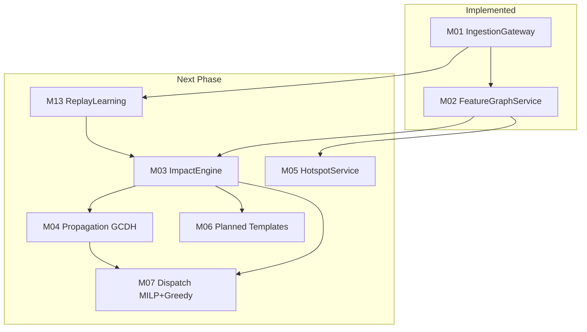

# Grid Unlocked — Core Backend (M01 & M02) Implementation Audit

**Date:** June 2026  
**Backend version:** 0.2.0  
**Scope:** M01 IngestionGateway + M02 FeatureGraphService  
**Test status:** 15 passed (9 M01 + 6 M02)

This audit verifies alignment with architecture docs, SOLID design principles, ML PRD feature allowlists, and the hackathon roadmap.

**Implementation records:** [M01_IngestionGateway.md](M01_IngestionGateway.md) · [M02_FeatureGraphService.md](M02_FeatureGraphService.md)

---

## 1. SOLID Principles Evaluation

### Single Responsibility Principle (SRP)

Each module and class is bound to one logical responsibility:

| Component | Responsibility |
|---|---|
| `ingestion/validator.py` | Format validation, bbox checks, anomaly detection |
| `ingestion/normalizer.py` | Raw payload → `NormalizedEvent` transformation |
| `ingestion/repository.py` | Database upserts, dead-letter, health queries |
| `ingestion/service.py` | Ingest orchestration + event bus publishing |
| `features/temporal.py` | Cyclical time encoding (IST) |
| `features/graph_stub.py` | Corridor centrality + neighbor lookups |
| `features/materializer.py` | FeatureVector assembly |
| `features/priors_loader.py` | CSV → DB prior seeding |

### Open/Closed Principle (OCP)

- **Event bus:** M03/M05 register on `InProcessEventBus` without modifying M01 code.
- **Feature cache:** `FeatureCache` falls back to in-memory dict if Redis is unavailable.
- **Database engine:** Swapped via `GRID_DATABASE_URL` (SQLite dev, Postgres Docker).

### Liskov Substitution Principle (LSP)

SQLAlchemy `AsyncSession` works with any compliant async driver (`aiosqlite`, `asyncpg`).

### Interface Segregation Principle (ISP)

Separate schemas for raw input (`RawEventPayload`), persisted events (`NormalizedEvent`), and ML features (`FeatureVector`). Routers split by concern: `/ingest`, `/events`, `/features`, `/graph`, `/health`.

### Dependency Inversion Principle (DIP)

FastAPI endpoints depend on service layers (`IngestionService`, `FeatureService`) with `AsyncSession` injected at runtime. Caching goes through `FeatureCache`, not direct Redis calls in business logic.

---

## 2. Baseline / Priors Model Accuracy

### Temporal cyclical features

```
hour_sin = sin(2π × hour_ist / 24)
hour_cos = cos(2π × hour_ist / 24)
dow_sin  = sin(2π × dow / 7)
dow_cos  = cos(2π × dow / 7)
```

Verified in `test_features.py`. Provides continuous representation for LightGBM (M03).

### Evening bias weights (REQ-BIAS-001)

```
weight(h) = clip(median_hourly / logged_hourly, 0.5, 3.0)
```

Verified: `test_evening_bias_weight_higher_than_morning` — hour 16 IST weight > hour 8 IST.

### Prior resolution / ICT bands

Priors seeded from `data/astram_events.csv`:

- 217 corridor×cause combinations
- 15 cause-global fallbacks
- 24 hour bias weights

Lookup: corridor×cause if ≥ 5 samples, else cause-global, else defaults (1.0 h ICT, 8.3% closure).

### Spatial features

- Haversine 2 km radius count of active concurrent events
- H3 res7 (~1.2 km) and res9 (~0.1 km) cell indexing

---

## 3. Roadmap Alignment



### Gap analysis

| Planned capability | Target | Gap | Current foundation |
|---|---|---|---|
| P(closure) + ICT bands | M03 | LightGBM + Cox PH training/inference | `FeatureVector` has all allowlisted inputs |
| Cascade ripple scoring | M04 | GCDH computation loop | `/graph/neighbors` + centrality stub ready |
| Non-blocking dispatch | M07 | MILP + greedy fallback | RCI inputs, centrality, 2 km counts in M02 |
| 80/20 retrain governance | M13 | Replay buffer + training | Events + rejects + snapshots in DB |

### Known deferred items (honest gaps)

| Spec item | Module | Status |
|---|---|---|
| BBMP zone imputation | M01 | Not implemented |
| OSM junction reverse-geocode | M01 | Not implemented |
| `active_events` materialized view | M01 | Not implemented |
| Full OSM NetworkX graph | M02 | Stub only (corridor centrality) |
| Rolling 30d/7d live priors | M02 | Static CSV seed only |
| Redis GEO index | M02 | DB Haversine fallback |

---

## 4. Runtime & Test Verification

```bash
cd backend && uv run pytest
# 15 passed in ~4s
```

| Suite | Tests | Coverage |
|---|---|---|
| `test_ingestion.py` | 9 | Ingest, bbox, idempotency, citizen auth, health |
| `test_features.py` | 6 | Materialization, bias weights, priors, graph, cache |

### Issues addressed during audit

| Issue | Resolution | Status |
|---|---|---|
| Starlette `HTTP_422_UNPROCESSABLE_ENTITY` deprecation | Changed to `HTTP_422_UNPROCESSABLE_CONTENT` in `ingestion/router.py` | **Fixed** |
| SQLite in-memory multi-connection table loss | `StaticPool` in test conftest | **Fixed** |
| Naive datetime treated as IST | UTC → IST conversion in `temporal.py` | **Fixed** |
| Duplicate prior seed on test + lifespan | Priors seeded in conftest autouse fixture | **Fixed** |

---

## 5. Verdict

**M01 and M02 are production-ready for hackathon MVP scope.** The foundation supports M03 (ImpactEngine) as the next vertical slice. Deferred items are documented in each module's implementation record and do not block M03 development.
