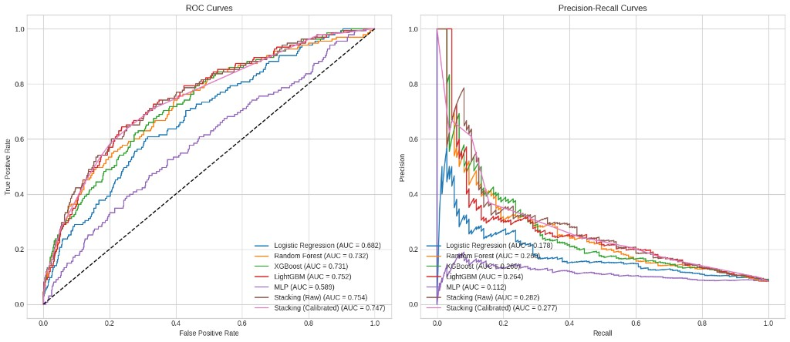

# Grid Unlocked

Intelligent event-driven traffic management layer for ASTraM (Bengaluru Traffic Police).

## Repository layout

```
Grid Unlocked/
├── docs/               # PRD, architecture, tech stack, assets
├── backend/            # Python API (uv) — M01–M18 modules (M12 stubbed per spec)
├── frontend/           # Next.js CommandDashboard (M15) — also hosts M16 field route, M18 report route
├── data/               # ASTraM corpus + cleaned feature dataset
├── Dockerfile          # API container
├── docker-compose.yml  # Local dev: Postgres + Redis + API + frontend
└── readme.md
```

## Tech stack (summary)

| Component | Local dev (Docker) | Production (planned) |
|---|---|---|
| API | FastAPI + Uvicorn | Same, behind load balancer |
| Database | PostgreSQL 16 + PostGIS | Managed Postgres + PostGIS |
| Cache | Redis 7 | ElastiCache / Memorystore |
| ML | LightGBM, lifelines, scikit-learn | MLflow + object storage |
| Optimization | OR-Tools | Same |
| Package mgr | uv | uv in container |

Full details: [docs/TECH_STACK.md](docs/TECH_STACK.md)

## Run locally with Docker (recommended)

```bash
cp .env.example .env   # shared by both api and frontend services
docker compose up --build
```

`frontend` waits for `api`'s healthcheck before starting, so the dashboard
never opens against a backend that isn't actually ready.

| Service | URL |
|---|---|
| Command Dashboard (M15) | http://localhost:3000/live |
| API + Swagger | http://localhost:8000/docs |
| Health | http://localhost:8000/health |
| Ingest metrics | http://localhost:8000/health/ingest |
| Postgres | `localhost:5432` — user `grid` / pass `grid` / db `grid_unlocked` |
| Redis | `localhost:6379` |

## Run without Docker (SQLite)

```bash
cd backend
uv sync
uv run uvicorn grid_unlocked.main:app --reload
```

Uses SQLite by default; Redis optional until M02.

### Run the dashboard locally (without Docker)

```bash
cd frontend
pnpm install
pnpm dev   # http://localhost:3000/live, expects the API at NEXT_PUBLIC_API_URL (.env)
```

## Deploying the frontend to Vercel

The backend is hosted separately (e.g. Render); the frontend is deployed to Vercel pointed at it.

1. In the Vercel dashboard, import this repo and set **Root Directory** to `frontend` (this is a monorepo — Vercel needs to know the Next.js app isn't at the repo root).
2. `frontend/vercel.json` and `frontend/.env.production` are already committed and pre-configured for `https://grid-docs.onrender.com`. `NEXT_PUBLIC_API_URL`/`NEXT_PUBLIC_WS_URL` are not secrets (they're inlined into the client bundle at build time), so `.env.production` ships as-is — no dashboard env vars needed for those two.
3. **`NEXT_PUBLIC_MAPPLS_KEY` must be set in the Vercel dashboard** (Project Settings → Environment Variables), not committed — Mappls whitelists keys per-domain, and that domain has to match your live Vercel URL. `NEXT_PUBLIC_MAPTILER_KEY` can go there too if you use it.
4. After your first deploy, copy the assigned Vercel URL (e.g. `https://your-project.vercel.app`) and set it as `GRID_CORS_ALLOW_ORIGINS=["https://your-project.vercel.app"]` on the **backend** host (Render) — the API's CORS allowlist defaults to `localhost:3000` only and will reject the deployed frontend's origin until this is set. Restart/redeploy the backend after setting it.
5. If you use Vercel preview deployments (one URL per PR/branch), add each preview origin to the same `GRID_CORS_ALLOW_ORIGINS` list, or switch to Vercel's stable production domain only for the allowlist.

## Documentation

| Document | Description |
|---|---|
| [docs/TECH_STACK.md](docs/TECH_STACK.md) | Stack, databases, dev vs prod |
| [docs/implementation/](docs/implementation/) | **Built modules** — M01–M18 implementation records (full coverage) |
| [docs/ARCHITECTURE.md](docs/ARCHITECTURE.md) | System design |
| [docs/PRD_Event_Driven_Traffic.md](docs/PRD_Event_Driven_Traffic.md) | Product requirements |
| [docs/IMPLEMENTATION_MODULES.md](docs/IMPLEMENTATION_MODULES.md) | Module contracts |

## Hackathon scope

Real-time hotspots, predicted hotspots, auto station assignment, diversion detection, AI recommendations, citizen reporting, and post-event learning — as an intelligence layer on ASTraM.

---

## ML research summary

We evaluated seven classifiers and two duration models on **8,173 anonymized ASTraM incidents** (Bengaluru). The target `requires_road_closure` is highly imbalanced — only **8.27%** of events need a closure — so **accuracy is misleading** (a model that always predicts “no closure” scores ~91.7%). We therefore report **PR-AUC**, **ROC-AUC**, **F1-macro**, and **ECE** (calibration error), and use only features knowable at incident creation time.

### Dataset & feature engineering

| Stage | Output |
|---|---|
| Raw corpus | `data/astram_events.csv` — 8,173 normalized events |
| Cleaned + engineered | `data/astram_events_cleaned.csv` — 22 modeling columns |
| Queryable store | `data/astram_events_cleaned.db` — table `astram_events_featured` |

Engineered features include: spatio-temporal density (2 km / 5 km Haversine overlap), KMeans region clusters, cyclical time encoding, NLP keyword flags from descriptions, corridor centrality, vehicle complexity, and ICT survival fields (`duration_h`, `event_observed` for 61.6% censored records).

### Task A — Road closure classification (test set)

Models were trained on a 60/20/20 train/validation/test split with stratification.

| Model | Accuracy | PR-AUC | ROC-AUC | F1-Macro | ECE |
|---|---:|---:|---:|---:|---:|
| Logistic Regression | 91.68% | 0.1777 | 0.6822 | 0.4783 | 0.00670 |
| Random Forest | 91.80% | 0.2596 | 0.7324 | 0.5067 | 0.00804 |
| XGBoost | 91.80% | 0.2600 | 0.7313 | 0.5133 | 0.01086 |
| LightGBM | 81.59% | 0.2640 | 0.7515 | 0.6009 | 0.19417 |
| MLP | 91.68% | 0.1121 | 0.5888 | 0.4783 | 0.04864 |
| **Stacking (Raw)** | **91.80%** | **0.2822** | **0.7536** | 0.5067 | 0.01112 |
| Stacking (Calibrated) | 88.93% | 0.2767 | 0.7471 | **0.6178** | **0.00456** |



**Key findings (Task A):**

- **Stacking (Raw)** achieved the best PR-AUC (0.282) and ROC-AUC (0.754) — ~3.4× better than random on the minority class (base rate 0.083).
- **Stacking (Calibrated)** achieved the best F1-macro (0.618) and calibration (ECE 0.005) — best for commander-facing probabilities.
- **LightGBM** ranked second on ROC-AUC (0.752) but was poorly calibrated without isotonic post-processing (ECE 0.19).
- **MLP** underperformed tree ensembles on this tabular, sparse-feature corpus.
- High accuracy (~92%) across most models confirms the imbalance trap — it must not be used for model selection.

### Task B — Incident clearance time (ICT)

| Model | Metric | Result |
|---|---|---|
| **Cox Proportional Hazards** | C-Index | **0.7307** |
| Cox Proportional Hazards | P80 coverage | **100%** |
| LightGBM Regressor | MAE (observed only) | 8,633 min (~6 days) |

**Key findings (Task B):**

- **61.6% of incidents are right-censored** (no observed end time). Cox PH handles censoring via partial likelihood; the point regressor chases imputed durations and is not deployable.
- Cox C-Index **0.73** exceeds our promotion threshold (≥ 0.68) for ranking clearance order and producing **P20 / P50 / P80** bands for field briefing.

### Production models (M03 ImpactEngine)

Artifacts live in `backend/models/v1/` and are loaded by the API at startup.

| Component | Deployed model | Why this choice |
|---|---|---|
| **P(closure)** | **LightGBM + isotonic calibrator** (`lgbm-v1`) | Meets the **≤200 ms** M03 inference SLA with a single serialized artifact. Offline evaluation showed LightGBM ROC-AUC 0.752 (within 0.002 of the stack). Isotonic calibration on the validation fold brings ECE in line with the stacked ensemble without multi-model inference overhead. Stacking wins marginally on PR-AUC (+0.02) but adds latency and deployment complexity inappropriate for hackathon MVP. |
| **ICT P20/P50/P80** | **Cox Proportional Hazards** (`cox-ph-v1`) | Only model that correctly handles censored ICT. C-Index 0.73 and conservative P80 bands. LightGBM regressor rejected (MAE ~6 days). |
| **RCI severity** | Weighted blend of prior duration, centrality, cascade risk, calibrated P(closure), vehicle complexity, and 2 km density | Replaces ASTraM structural `High` priority with an operational severity index. |

### Operational implications

- Closure prediction is **triage, not autopilot** — use calibrated P(closure) with M09 human approval (shadow mode by default).
- Thresholds: `p_closure > 0.35` triggers diversion auto-suggest; composite gates drive CRITICAL alerts on named corridors at peak hour.
- Planned events (36% closure rate) route to **M06** package generation rather than repeated live closure inference.
